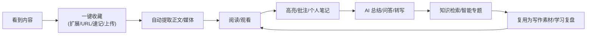
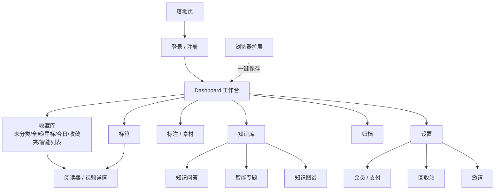
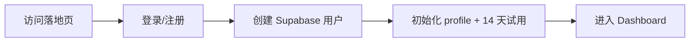

# NewsBox 功能说明文档 · 产品上手详解

> **文档定位**：面向**产品经理、运营、设计、测试、交付、售前/支持**等非研发角色，目标是让一个新同学**在不读代码的前提下**快速、准确地理解 NewsBox「现在到底做了什么、做到什么程度、边界在哪、怎么验收」。
>
> **生成日期**：2026-06-04　|　**特别说明**：本文的「功能成熟度」与「边界」结论来自对**真实代码的逐模块核对**，因此会明确指出哪些功能是「已闭环可用」、哪些是「已实现但需调优」、哪些是「探索/占位、不建议作为卖点」。这正是本文区别于一般功能介绍的价值所在。配套开发视角文档见 [TECHNICAL_REFERENCE.md](TECHNICAL_REFERENCE.md)。

---

## 目录

1. [产品定位与目标用户](#1-产品定位与目标用户)
2. [产品价值闭环](#2-产品价值闭环)
3. [信息架构与导航](#3-信息架构与导航)
4. [用户生命周期](#4-用户生命周期)
5. [功能模块详解](#5-功能模块详解)
6. [权限与角色](#6-权限与角色)
7. [内容类型](#7-内容类型)
8. [典型用户场景](#8-典型用户场景)
9. [产品验收清单](#9-产品验收清单)
10. [功能成熟度全景（必读）](#10-功能成熟度全景必读)
11. [产品术语表](#11-产品术语表)
12. [对产品团队的建议](#12-对产品团队的建议)

---

## 1. 产品定位与目标用户

### 1.1 一句话定位

> **NewsBox 让你收藏过的内容真正「读得懂、记得住、找得到、用得上」。**

它不是「保存链接的收藏夹」，而是一个围绕内容全生命周期设计的**个人 AI 阅读与知识工作台**：覆盖「收集 → 筛选 → 阅读 → 理解 → 批注 → 沉淀 → 检索 → 复用」整个链路，支持文章、网页、视频、音频、文件、速记多模态内容。

### 1.2 目标用户

| 用户类型 | 典型诉求 | NewsBox 提供的价值 |
|---|---|---|
| 新闻记者 / 编辑 | 快速筛选线索、保存事实依据、沉淀金句素材 | AI 快读、批注、金句库、知识检索 |
| 行业研究员 / 分析师 | 持续跟踪行业、按主题整理资料 | 智能专题、时间线、全库问答 |
| 内容创作者 | 收藏选题、提炼观点、积累表达素材 | 多端采集、AI 摘要、标签/收藏夹、批注复用 |
| 深度阅读用户 | 稍后阅读、避免收藏吃灰、重访历史 | 工作台筛选、沉浸阅读、AI 快照 |
| 视频信息消费者 | 检索视频观点，不想反复拖进度条 | 视频转写、章节、关键帧、视频问答 |

> **当前定位**：偏**个人知识库与个人效率工具**。**尚未实现**完整团队协作、共享空间或多角色协作（见 §10）。

### 1.3 与传统收藏夹的本质区别

| 传统收藏夹 | NewsBox |
|---|---|
| 保存链接 | 保存内容、正文、媒体、来源、元数据 |
| 靠手动分类 | 收藏夹/标签 + **智能专题自动聚类** |
| 打开仍要从头读 | AI 先给摘要、关键问题、时间线、快照 |
| 收藏后很难找回 | 全文检索 + RAG 问答 + 引用返回 |
| 无法处理视频 | 视频保存、转写、章节、关键帧、问答 |
| 读完即结束 | 高亮、批注、金句素材、长期复用 |

---

## 2. 产品价值闭环

NewsBox 的核心不是「保存」，而是把「保存 → 理解 → 整理 → 复用」串成闭环。用户每一次收藏、阅读、批注、提问，都让个人知识库更有价值——这是一个**长期积累型**的信息资产系统。

---

## 3. 信息架构与导航

**Dashboard 一级导航**（6 项）：收藏库 `collections` / 标签 `tags` / 标注 `annotations` / 归档 `archive` / 知识库 `knowledge` / 设置 `settings`。

**收藏库分类**（6 类）：未分类 / 全部 / 星标 / 今日 / 指定收藏夹 / 智能列表。

**列表视图**（5 种）：紧凑卡片 / 详情列表 / 紧凑列表 / 标题列表 / 详情卡片——分别面向「扫标题、看摘要、批量整理、深度管理」等不同场景。

---

## 4. 用户生命周期

### 4.1 注册与试用

- 新用户默认 **14 天试用期**，试用期内可用 **Pro + AI 全部能力**。
- ⚠️ **当前自助注册已关闭**，账号由管理员后台创建（创建即初始化试用）。落地页/登录页仍在，但注册入口受 Supabase 控制台配置约束。

### 4.2 四条收藏路径

1. **浏览器扩展**：在任意网页/视频页一键保存（高频主入口）。
2. **URL 输入**：Dashboard「添加笔记 → 链接」。
3. **速记**：Dashboard「添加笔记 → 速记」，记录临时灵感。
4. **文件上传**：Dashboard「添加笔记 → 上传」，本地文件/视频。

### 4.3 阅读与沉淀 → 复盘与复用

阅读（高亮/批注/写笔记/AI 速读）→ 内容积累后通过关键词搜索、知识问答、智能专题、素材库复用。

---

## 5. 功能模块详解

> 每个模块给出：**是什么 / 使用场景 / 解决的问题 / 用户价值 / 验收点 / ⚠️ 当前边界**。

### 5.1 内容采集

**是什么**：把不同平台的文章、网页、视频、文件、灵感统一保存到个人内容库的入口能力。

**四种方式**：

| 方式 | 适用 | 能力 |
|---|---|---|
| 浏览器扩展 | 高频收藏 | 一键保存当前网页/视频，带回标题/正文/站点/封面，选目录和标签 |
| URL 输入 | 网页/文章/视频链接 | 服务端抓取（平台爬虫 → Jina Reader → 基础抓取三级降级） |
| 速记 | 临时灵感/会议记录 | 直接输入文本，不依赖外部链接 |
| 文件上传 | 本地文件/视频 | 直传对象存储，视频自动进入处理流程 |

**抓取能力**：普通网页、文章站点、**腾讯新闻/微信公众号/今日头条**专用爬虫、Jina Reader 正文提取、**B站/YouTube/抖音/快手**视频链接识别。

**用户价值**：降低保存成本；多来源统一入库；为后续 AI、批注、搜索、聚类提供基础数据。

**验收点**：
- 四条路径最终都能产生 note；用户只能看到自己的 note。
- 同一 URL 重复保存应**复用/更新已有 note**（按 用户+链接 去重），而非制造重复（且能复活已删除的同链接 note）。
- 抓取失败时**保留基础链接不丢失**（用户后续可重试）。
- 扩展能正确拉取目录和标签。

**⚠️ 当前边界**：
- 抓取成功率受目标网站反爬策略影响（微信图片已做防盗链处理）。
- 服务端无法下载的视频（如 B 站需登录/防盗链）会提示「需要浏览器扩展上传」，扩展走「浏览器直传」路径。
- 视频上传有 **50KB 最小体积校验**，挡抓取失败的空占位文件。

### 5.2 Dashboard 工作台

**是什么**：用户进入系统后的主界面，集中管理所有收藏。相当于信息收件箱 + 资料库 + 内容清理台。

**核心能力**：查看收藏、按目录/标签/智能分类筛选、搜索、添加（URL/速记/上传）、批量操作、切换列表视图、进入标注/知识库/归档/设置。

**批量操作**：星标 / 移动收藏夹 / 打标签 / 归档 / 删除 / 复制内容（纯文本/Markdown/HTML）/ 导出（TXT/Markdown/HTML，多文件自动打包 ZIP）/ 复制链接。

**用户价值**：快速掌握收藏库状态，避免内容沉积；像处理任务一样批量整理。

**验收点**：切换导航后列表正确变化；搜索/筛选/排序不丢上下文；批量操作只作用于选中项；新增内容能在列表出现；图片不因防盗链而裂图（已加 `no-referrer`）。

**⚠️ 当前边界**：工作台主逻辑集中在单个巨型组件（技术债），功能迭代时需注意相互影响（不影响用户使用，但影响开发效率）。

### 5.3 目录、标签、归档与回收站

| 能力 | 说明 |
|---|---|
| **收藏夹（目录）** | 层级结构、图标、颜色、排序、归档、最近访问。适合按项目/主题/客户/课程组织 |
| **标签** | 层级结构、颜色、排序、归档、一个 note 多标签。适合横向属性（AI/产品/竞品/待阅读） |
| **归档** | 把不活跃但不想删的内容移出主视图（≠ 删除） |
| **回收站** | 删除的 note 进回收站，可查看/恢复/永久删除（永久删除前必须已在回收站） |

**用户价值**：长期资料沉淀；多角度复用；区分「处理完成」与「误删恢复」。

**⚠️ 当前边界**：
- 目录和标签都支持归档，交互上需明确「隐藏不用」与「删除」的区别。
- **已知缺陷**：标签拖拽排序在「非根层级（有父标签）」场景下，同级顺序计算可能串位（根层级拖拽正常）。测试需覆盖父子标签排序。

### 5.4 沉浸式阅读器（图文）

**是什么**：单篇图文/网页内容的消费与沉淀界面，三栏布局（左大纲 / 中正文 / 右 批注·AI·逐字稿）。

**能力**：文章视图、原网页（新标签打开）、AI 速览/快照、阅读样式、星标、移动、标签、编辑信息、高亮、批注、用户笔记。

**用户价值**：从「打开网页」升级为「专注阅读 + 知识沉淀」，把收藏链接变成可长期复用的知识资产。

**验收点**：未授权用户不能读他人 note；高亮可新增/查看/删除；批注能绑定到高亮；正文图片不裂图。

**⚠️ 当前边界（重要）**：
- **「网页存档」视图当前是空壳**（`web_archives` 表已建但未接入采集，永远显示「暂无存档」）。对外不应承诺「网页快照存档」能力。
- **阅读进度（断点续读）未落地**：数据库设施已建但阅读器未写入，刷新后不记忆阅读位置（仅记录「最近访问时间」与访问次数）。
- 阅读页内的「删除/归档」菜单当前是**占位**（点击只提示「即将上线」），真正的删除/归档在 Dashboard 完成。
- **图文高亮/批注没有导出通道**（导出功能以视频内容为中心，见 §5.7/§5.5）。

### 5.5 视频阅读与处理

**是什么**：视频内容不是简单播放，而是进入一个多阶段处理流程，最终转化为可阅读、可检索、可问答的信息资产。

**处理流程**（后台自动）：下载/扩展上传 → 媒体探测 → 封面 → 转码 → 音频转写 → 章节 → 关键词与摘要 → 抽关键帧 → 视觉分析。

**视频详情页可展示**：播放器、处理进度、转写全文（逐字稿，可按发言人/章节、点击跳转）、章节、关键词、关键帧、AI 问答、改写/翻译、我的笔记（富文本编辑器 + 摘录引用）、导出（Markdown/JSON/SRT）。

**典型状态**：

| 状态 | 用户理解 |
|---|---|
| processing | 正在处理 |
| media_ready | 媒体可播放，AI 结果未完全就绪 |
| fully_ready | 媒体和 AI 结果都已就绪 |
| need_browser_fallback | 服务端无法下载，需扩展上传 |
| failed | 处理失败，可重试（支持单步重试） |

**用户价值**：把视频变成可搜索的资料；基于逐字稿快速定位观点和时间点；适合发布会、访谈、短视频线索。

**验收点**：状态展示清晰；转写完成后能按章节浏览；SRT/Markdown 导出可用；服务端无法下载时提示用扩展；分析失败不影响已可播放的视频继续观看。

**⚠️ 当前边界**：
- 长视频处理耗时较长，依赖第三方服务（腾讯 COS、阿里听悟、DashScope/Qwen-VL）配置完整。
- **视觉分析（画面理解）失败不阻塞整体就绪**——属「锦上添花」能力。
- **视频 AI 能力当前未做会员门禁**（任何登录用户可触发，含试用过期）——这是产品计费策略需明确的点（见 §10）。
- 「我的笔记」自动保存（1.5 秒防抖 + 冲突检测 + 草稿兜底）较完善；支持把原文/关键帧「摘录」为可点击时间戳的引用块。

### 5.6 AI 阅读（文章侧）

**是什么**：面向单篇内容，帮用户快速理解核心信息。流式分阶段返回。

**输出**：
- **快读结论**：一句话直击（hook）+ 3-5 条要点 + 情绪标签 + 建议阅读时间。
- **关键问题**：文章试图回答的 3 个核心问题（带原文证据）+ 未回答的问题。
- **深度解读**：背景、利益相关方、影响、风险、观察点、事件时间线。

**会员边界**：试用期可用；**AI 计划**可用；Pro 计划不含 AI。

**用户价值**：先结构化判断价值，再选择性精读；从标题党/冗长叙述中提取事实和观点。

**验收点**：非会员/过期访问 AI 时提示正确（弹升级）；试用期可用；流式状态清晰；AI 失败不影响原文阅读；缓存复用（同内容不重复消耗）。

**⚠️ 当前边界**：
- AI 输出应被视为辅助理解，不替代原文（已在 UI 标注「仅供参考」）。
- **笔记内 AI 对话不持久化**（刷新即丢）。
- AI 请求**无超时/重试/限流**保护，第三方服务波动时可能直接报错（需用户重试）。
- 存在一个**旧的 AI 分析入口未做会员校验**（历史遗留，前端未使用，但接口仍在）。

### 5.7 AI 快照（分享卡）

**是什么**：把一篇长文压缩为一张适合快速浏览和分享的卡片，强调「5 秒理解核心」。

**能力**：一句话核心 + 3 条要点 + 情绪 emoji + 关键数据。提供 **3 种模板**（商务 business / 黑金 deep / 社交 social），渲染为 1200×1600 的图片（PNG）。

**用户价值**：快速复盘已收藏内容；把复杂内容转成可传播的摘要卡。

**⚠️ 当前边界**：
- 快照能力**需要 AI 会员**。
- 同内容会**复用缓存**（内容指纹去重），不重复消耗。
- **当前没有真正的「公开匿名分享链接」**：图片虽可通过 URL 访问，但产品未提供免登录分享端点。对外宣传「分享」前需确认链路。

### 5.8 高亮、批注与金句素材

| 能力 | 说明 |
|---|---|
| **高亮** | 划词选中文本，5 种颜色，记录引文/位置/颜色（视频场景可关联时间点和截图） |
| **批注** | 绑定在高亮上的文字笔记，记录理解/质疑/补充/行动项 |
| **金句素材库** | 把片段沉淀为可复用素材（金句/论据/数据/可引用观点），支持查看/新增/删除/AI 自动提取 |

**用户价值**：把阅读中的瞬间判断沉淀下来，让好句子、重要事实可被再次找到。

**验收点**：高亮可新增/查看/删除；批注绑定到高亮；金句去重（同一用户重复片段不重复入库）；AI 提取的金句必须是**原文逐字**（不改写、不编造）。

**⚠️ 当前边界**：高亮的「增」走服务端校验，「查/改/删」直连数据库（仅靠权限隔离）；金句去重依赖内容哈希。

### 5.9 知识搜索

**是什么**：跨多个来源的全库关键词检索——笔记正文、高亮、批注、视频转写、AI 输出。结果带证据片段和类型权重。

**用户价值**：不需记得资料在哪个目录，也不只按标题搜，凭关键词就能在全文/标注/转写/AI 总结中找回。

**⚠️ 当前边界（重要）**：
- 检索为**关键词匹配（非语义/向量）**，中文相关性一般。
- **该独立搜索接口目前没有接入 UI**（知识库走「问答」而非独立搜索面板）。即「全库检索」能力存在于后端但用户暂时摸不到独立入口——对外不应单列为已上线功能。

### 5.10 知识问答（RAG）

**是什么**：用自然语言向自己的收藏库提问，系统先检索证据再生成带引用的回答。

**适合问题**：「我收藏过哪些关于某主题的资料？」「某概念在哪些文章出现过？」「把我关于某主题的笔记整理成观点」。

**用户价值**：从历史收藏找回被遗忘的信息；回答带来源引用，适合研究和写作。

**验收点**：搜索结果只含当前用户数据；回答带 note 引用；强调来源避免编造。

**⚠️ 当前边界**：
- 回答质量依赖检索召回（关键词匹配的局限会传导到问答）。
- **对话历史可保存**（多会话、置顶、赞/踩反馈）。
- ⚠️ 知识问答当前**未做会员门禁**（产品计费策略需明确）。

### 5.11 智能专题（已闭环）

**是什么**：把收藏库中相关内容**自动聚合成主题**（某长期事件、行业方向、公司动态、政策议题）。每个主题含：名称、摘要、成员、时间线/事件、报告，支持置顶/归档/合并、成员确认/排除/补充。

**用户价值**：从「一堆收藏」中看到结构；自动发现长期关注方向；适合跟踪事件演进。

**能力成熟度**：**基础链路已闭环**——支持重建、定时刷新、成员管理、置顶归档、合并、报告生成、人工状态保留（置顶/归档/手动成员在重建时不被破坏）、自动归档 30 天无新增的专题。

**验收点**：用户可触发或等待系统重建；成员来自自己的 note；置顶/归档主题不被自动刷新破坏；合并后成员关系正确。

**⚠️ 当前边界**：聚类质量依赖 embedding 模型、聚类参数、命名模型和资料数量，需持续运营调优；单次重建处理上限约 400 篇近期笔记。

### 5.12 知识图谱（探索能力，不建议作为卖点）

**是什么**：从收藏中抽取人物、组织、地点、事件、技术等实体及其关系，可视化为关系网络。

**⚠️ 当前成熟度（最低）**：
- 实体/关系抽取脚本与重建接口存在，但**没有产品化的触发入口**（用户摸不到）。
- **图谱界面默认展示的是演示数据（mock）**，并非用户真实资料。
- 关系抽取无去重，重复运行会产生重复边。

**产品建议**：短期作为「知识库增强/探索视图」，**不建议作为核心卖点过度承诺**；待抽取准确率、图谱导航、引用回跳、更新策略稳定后再提为主功能。

### 5.13 设置中心

**包含**：数据统计、回收站、会员状态、邀请码、外观（主题/字体）、账户、关于。

**统计内容**：入驻天数、笔记/收藏夹/标签/批注/访问数、内容类型分布、字数、常用保存域名 Top10、常访问域名 Top10、**AI token 估算**。

**用户价值**：用户能管理自己的账号、数据、会员状态；回收站降低误删风险。

### 5.14 会员与支付

**计划与价格**：

| 计划 | 价格 | 能力 |
|---|---|---|
| 试用 | 14 天 | 试用期内可用 **Pro + AI** |
| Pro | ¥9.9 | Pro 能力（不含 AI） |
| AI | ¥19.9 | Pro + AI 能力 |

**支付链路**：选计划 → 创建订单 → 跳转 z-pay 支付（**目前仅微信支付**）→ 平台回调 → 验签/验金额/更新订单 → 延长会员有效期（**按现有到期顺延 1 年**，不覆盖剩余时间）。

**验收点**：创建订单金额正确；回调验签；**重复回调不重复加会员**；会员状态页及时更新。

**⚠️ 当前边界（重要）**：
- 支付回调的**幂等保护较弱**（理论上并发重复回调可能重复发卡），上线前需重点测试并加固。
- 支付相关配置（商户 ID/密钥/回调地址）**未在 `.env.example` 中**，上线前必须确认。
- ⚠️ **视频 AI 等最烧钱能力当前未纳入会员门禁**——计费边界需产品决策。

### 5.15 邀请

**能力**：获取我的邀请码、兑换邀请码、给被邀请人 +7 天、给邀请人奖励（**上限 49 天**）、每账号仅能被邀请兑换一次。

**用户价值**：适合冷启动增长/好友推荐。

**⚠️ 当前边界**：需配套风控规则避免刷邀请；多步发放无事务保护（极端情况可能部分发放）。

### 5.16 管理后台

**能力**：列出用户、创建用户、重置已存在用户密码并确认邮箱、删除用户；创建/更新后初始化 profile 和试用期。

**鉴权**：固定账号密码（Basic Auth），依赖 `ADMIN_USER`/`ADMIN_PASS` 环境变量；未配置则后台一律不可用。

**⚠️ 当前边界**：单组静态管理员凭据、无逐用户账号、无审计、无登录限流——内部后台够用，但不适合多管理员/对外开放。

### 5.17 浏览器扩展

**是什么**：让用户在离开 NewsBox 网站时也能保存内容的关键入口。

**能力**：登录/保存状态、一键保存当前网页、选择目录和标签、视频页面识别、视频直传、通知与快捷键（`Ctrl/Cmd+Shift+S`）、右键菜单（保存页面/链接/选中文本）。

**支持的视频平台提取**：B站、抖音、快手、微博（视频号识别但尚未实现抽取）。

**用户价值**：收藏动作发生在用户真实浏览内容的场景，而非复制 URL 回 Web。

**⚠️ 当前边界**：需按浏览器（Chrome/Edge/Firefox/Safari）分别打包验收；B 站等防盗链平台依赖扩展注入 Referer 才能下载。

---

## 6. 权限与角色

| 角色/状态 | 能力 |
|---|---|
| 未登录用户 | 落地页、登录、定价、扩展说明 |
| 已登录普通用户 | 基础收藏、阅读、目录、标签、部分设置 |
| 试用用户（14 天） | 试用期内使用 **Pro + AI** |
| Pro 用户（¥9.9） | Pro 能力（不含 AI） |
| AI 用户（¥19.9） | Pro + AI 能力 |
| 管理员 | 后台用户管理 |
| 后台任务 | 视频处理、支付回调、定时专题刷新 |

> ⚠️ **权限一致性提示**：文章侧 AI（AI 阅读/快照/金句提取/专题列表）已做会员门禁；但**视频 AI、知识问答、知识检索、专题重建当前仅校验登录、未校验会员**。这是产品计费策略需要统一明确的关键边界。

---

## 7. 内容类型

| 类型 | 产品含义 | 典型来源 |
|---|---|---|
| article | 文章/网页正文 | URL 收藏、扩展保存 |
| video | 视频 | 视频 URL、上传、扩展识别 |
| audio | 音频 | 数据库枚举支持，产品链路需继续确认 |
| （来源）url / manual / upload | 区分采集方式 | 链接 / 速记 / 上传 |

---

## 8. 典型用户场景

### 8.1 研究一个新主题
连续收藏相关文章和视频 → 用标签标记 → Reader 高亮关键段落 → AI 阅读快速理解 → 知识问答找回相关资料 → 等待/触发智能专题聚类 → 生成主题报告或整理素材。

### 8.2 处理一段长视频
URL/上传/扩展保存视频 → 系统进入处理 → 媒体可播放后先观看 → 转写完成后查看章节和全文 → 对某段提问/翻译/改写 → 摘录原文/关键帧到笔记 → 导出 SRT/Markdown。

### 8.3 写作素材沉淀
阅读文章并高亮金句 → 添加批注说明为何重要 → 从内容提取素材 → 在素材库检索 → 写作时回到原 note 核对上下文。

### 8.4 资料库问答
知识库输入问题 → 系统检索相关 note/标注/转写/AI 输出 → AI 基于证据回答 → 用户根据引用打开原资料。

---

## 9. 产品验收清单

| 域 | 验收点 |
|---|---|
| **收藏** | URL 收藏成功后能在 Dashboard 看到；抓取失败不丢链接；扩展能选目录和标签；视频上传后能看到处理状态 |
| **组织** | 目录树层级正确；标签可绑定多个 note；星标/归档/删除/恢复符合预期；批量操作只作用于选中项 |
| **阅读** | 未授权不能读他人 note；高亮可增/查/删；批注绑定到高亮；用户笔记能保存 |
| **AI** | 非会员/过期访问 AI 提示正确；试用期可用；流式状态清晰；AI 失败不影响原文 |
| **视频** | 各状态展示清楚；转写完成可按章节浏览；SRT 导出可用；无法下载时提示用扩展 |
| **知识库** | 搜索/问答结果只来自当前用户；问答带来源引用；专题成员相关；置顶/归档/合并后状态稳定 |
| **支付** | 创建订单金额正确；回调验签；**重复回调不重复加会员**；会员状态及时更新 |

---

## 10. 功能成熟度全景（必读）

> **这是本文最重要的一节**。对外承诺、Roadmap 排期、售前话术，请以此表为准。

| 能力 | 成熟度 | 说明 |
|---|---|---|
| Web 收藏工作台 | 🟢 已闭环 | 核心可用 |
| URL 抓取 | 🟢 已闭环 | 成功率受目标站影响 |
| 浏览器扩展 | 🟢 已闭环 | 需按浏览器分别打包验收 |
| 文件上传 | 🟢 已闭环 | 视频上传进入处理管线 |
| 目录/标签/星标/归档/回收站 | 🟢 已闭环 | 标签排序有一处已知缺陷待修 |
| 沉浸式阅读器（图文） | 🟢 已闭环 | 网页存档/断点续读未落地（见下） |
| 高亮/批注 | 🟢 已闭环 | 图文批注暂无导出通道 |
| 金句素材 | 🟢 已闭环 | LLM 抽取做了逐字校验防幻觉 |
| 视频转写/章节/关键帧/摘要 | 🟢 已闭环 | 依赖 COS/听悟/DashScope 配置 |
| 视频详情页（笔记/摘录/标记/问答/翻译） | 🟢 已闭环 | 自动保存 + 冲突检测较完善 |
| AI 阅读（文章侧） | 🟢 已闭环 | 有会员门禁；无超时/重试保护 |
| AI 快照卡 | 🟢 已闭环 | 需 AI 会员；无公开匿名分享 |
| 智能专题 | 🟡 已实现需调优 | 聚类质量需运营观察 |
| 知识问答（RAG） | 🟡 已实现需调优 | 检索为关键词匹配；未做会员门禁 |
| 会员/支付 | 🟡 已实现需加固 | 回调幂等较弱；配置未进 .env.example |
| 邀请 | 🟡 已实现 | 需风控；多步发放无事务 |
| 视频 AI（问答/改写/翻译/补全） | 🟡 已实现 | **未做会员门禁**（计费边界待定） |
| 全库检索（独立接口） | 🟠 后端就绪无 UI | 用户暂时摸不到独立入口 |
| 视觉分析（画面理解） | 🟠 锦上添花 | 失败不阻塞，可关闭 |
| 网页存档 | 🔴 未落地 | 表已建、视图为空壳 |
| 阅读进度/断点续读 | 🔴 未落地 | 设施已建、未接线 |
| 知识图谱 | 🔴 探索/占位 | 无 UI 入口、默认 mock 数据 |
| 团队协作 | 🔴 未实现 | 不建议作为当前卖点 |
| 公开分享 | 🔴 未形成主链路 | 有快照线索但无清晰公开分享 |

图例：🟢 已闭环可用｜🟡 已实现需调优/加固｜🟠 部分能力/边缘｜🔴 未落地/探索

---

## 11. 产品术语表

| 术语 | 解释 |
|---|---|
| note | 用户收藏或创建的一条内容，系统最核心的数据对象 |
| folder | 目录/收藏夹，层级化组织 note |
| tag | 标签，可跨目录横向标记 note |
| highlight | 用户在内容中标出的重点（划词高亮） |
| annotation | 用户对高亮/内容添加的批注 |
| quote material | 可复用素材（金句、论据、摘要片段） |
| AI output | AI 对 note 的分析结果（快读/问题/深度/时间线） |
| AI snapshot | AI 快照卡（分享用的摘要卡片图） |
| video job | 一个视频处理任务，含下载/转码/转写/抽帧/视觉等状态 |
| transcript | 视频/音频转写文本（逐字稿） |
| chapter | AI/转写服务生成的视频章节 |
| smart topic | 系统基于聚类生成的主题 |
| knowledge chat | 基于资料库检索增强的问答（RAG） |
| marker | 视频逐字稿/问答/发言人上的「重点/问题/待办」标记 |
| membership | 用户会员状态（试用/Pro/AI） |
| need_browser_fallback | 服务端无法下载视频，需扩展上传的状态 |

---

## 12. 对产品团队的建议

### 12.1 新人体验顺序
注册进 Dashboard → 保存一个普通网页 → 保存/上传一个视频 → Reader 高亮和批注 → 调用 AI 阅读 → 知识问答 → 查看设置/会员/回收站 → 安装扩展保存网页。

### 12.2 Roadmap 优先级建议
1. **统一 AI/视频会员门禁与计费边界**（当前视频 AI 等可被免费触发，影响成本与商业模式）。
2. **加固支付回调幂等**（资损向，上线前必修）。
3. 降低「首次收藏 → 成功阅读」失败率；提升视频处理状态反馈。
4. 优化 Dashboard 信息密度与批量整理效率。
5. 明确「网页存档 / 阅读进度 / 知识图谱 / 公开分享」是否进入主线，并据此对外措辞。
6. 为扩展建立浏览器兼容性验收清单。

### 12.3 短期不建议过度扩张
多人团队协作、复杂权限空间、大规模公开内容社区、过度依赖知识图谱作为核心入口——这些会显著增加数据权限、协作冲突、审核、分享与计费复杂度。当前更合理的路径是先把**个人收藏、阅读、AI 与知识整理闭环**打磨稳定。

### 12.4 对外措辞红线（基于真实实现）
- ❌ 不要宣传「网页快照存档」「断点续读」（未落地）。
- ❌ 不要把「知识图谱」作为核心卖点（默认 mock）。
- ❌ 不要承诺「公开分享链接」（无免登录分享链路）。
- ⚠️ 「全库检索」目前用户无独立入口，描述时归入「知识问答」。
- ✅ 可放心宣传：多端采集、AI 快读/深度解读、视频转写+章节+关键帧+视频问答、智能专题、高亮批注+金句库。

---

> **文档维护说明**：本文基于 2026-06-04 代码实现。功能成熟度（§10）随迭代变化，请定期校准。开发视角的实现细节、接口契约、数据模型与风险清单见 [TECHNICAL_REFERENCE.md](TECHNICAL_REFERENCE.md)。
