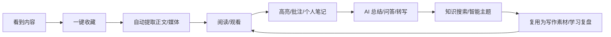
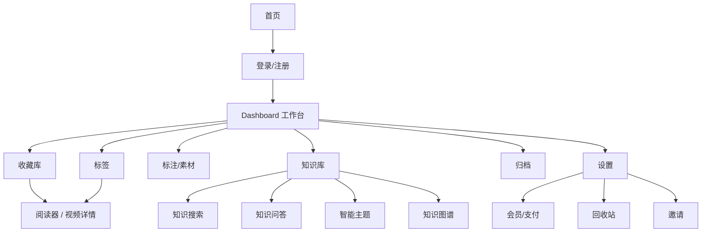

# NewsBox 功能说明与产品上手文档

生成日期：2026-06-04  
适用对象：产品经理、运营、测试、设计、交付、售前/支持人员  
文档目标：帮助非开发人员快速理解 NewsBox 当前已经实现的产品模块、用户路径、权限边界、关键术语和后续规划空间。

## 1. 产品一句话

NewsBox 是一个把网页、文章、视频、文件和个人灵感统一收藏到个人知识库里的 AI 阅读与知识管理产品。用户可以通过 Web 或浏览器扩展保存内容，随后在阅读器中高亮、批注、写笔记，并使用 AI 总结、问答、视频转写、知识搜索和智能主题来组织自己的长期知识。

## 2. 核心用户

| 用户类型 | 典型诉求 | NewsBox 提供的能力 |
| --- | --- | --- |
| 深度阅读用户 | 保存文章、做批注、复盘观点 | 收藏、阅读器、高亮、批注、AI 速读 |
| 视频学习用户 | 处理长视频、提取字幕、定位章节 | 视频上传、转写、章节、关键帧、视频问答 |
| 研究/写作用户 | 管理资料、找证据、整理主题 | 标签/目录、知识搜索、素材库、智能主题 |
| 产品/运营人员 | 快速理解资料库、提炼素材 | AI 总结、金句提取、知识问答 |
| 团队管理员 | 创建用户、管理订阅状态 | 管理员用户管理、会员/试用初始化 |

当前产品定位更偏个人知识库与个人效率工具，尚未体现完整团队协作、共享空间或多角色内容协作。

## 3. 产品价值闭环

NewsBox 的关键不是只保存链接，而是把「保存」「理解」「整理」「复用」串成一个闭环。

## 4. 信息架构

## 5. 用户生命周期

### 5.1 注册和试用

1. 用户访问首页。
2. 进入注册或登录。
3. 注册成功后创建 Supabase 用户。
4. 后端初始化 profile 和试用期。
5. 用户进入 Dashboard。

当前会员逻辑中，新用户有 14 天试用。试用期内可使用 Pro 与 AI 能力。

### 5.2 第一次收藏

用户可以通过三种主路径添加内容：

- 输入 URL：适合网页、文章、视频链接。
- 快速笔记：适合临时记录灵感。
- 上传文件：适合本地文件和视频。

浏览器扩展提供第四条路径：

- 在任意网页或视频页面点击扩展保存。

### 5.3 阅读和沉淀

内容保存后，用户进入 Reader：

- 阅读文章或查看视频。
- 高亮重点。
- 添加批注。
- 写个人笔记。
- 调用 AI 速读、问题、深度分析。
- 导出资料。

### 5.4 复盘和复用

当内容积累到一定数量，用户可以：

- 通过关键词搜索所有收藏。
- 通过知识问答跨资料找答案。
- 查看智能主题聚类。
- 从标注和素材库复用金句、片段、摘要。

## 6. 功能模块详解

## 6.1 首页与认证

### 功能说明

首页提供产品入口。认证模块支持：

- 登录。
- 注册。
- 注册成功页。
- 忘记密码。
- 更新密码。
- 邮件确认/OAuth callback。
- 认证错误页。

### 产品关注点

- 认证完全依赖 Supabase Auth。
- 注册后的试用期初始化对后续付费体验很重要。
- 管理员也可以在后台创建用户并初始化试用。

### 验收点

- 未登录用户访问 Dashboard 会被引导登录。
- 登录后可进入 Dashboard。
- 管理员创建的用户能直接用密码登录。
- 新用户能获得试用期。

## 6.2 Dashboard 工作台

### 功能说明

Dashboard 是用户的主工作区，当前承载以下能力：

- 查看收藏内容。
- 按目录、标签、智能分类筛选。
- 搜索内容。
- 添加 URL、快速笔记、上传文件。
- 批量操作。
- 切换列表视图。
- 进入标注、知识库、归档、设置。

### 主要导航

| 导航 | 用户理解 | 当前能力 |
| --- | --- | --- |
| 收藏库 | 所有已保存内容 | 列表、筛选、添加、批量操作 |
| 标签 | 按标签组织内容 | 标签树、标签筛选、标签管理 |
| 标注 | 查看高亮和批注 | 标注聚合入口 |
| 归档 | 查看已归档内容 | 归档内容管理 |
| 知识库 | AI 搜索和主题 | 搜索、问答、主题、图谱 |
| 设置 | 账户和系统设置 | 统计、回收站、会员、邀请等 |

### 列表视图

产品中存在多种内容展示方式：

- 紧凑卡片。
- 详情列表。
- 紧凑列表。
- 标题列表。
- 详情卡片。

这些视图面向不同使用场景：扫标题、看摘要、快速批量整理、深度管理。

### 验收点

- 切换导航后列表内容正确变化。
- 搜索、筛选、排序不会丢失用户上下文。
- 批量操作对选中项生效。
- 新添加内容能在列表中出现。

## 6.3 内容收藏

### 6.3.1 URL 收藏

用户输入 URL 后，系统会：

1. 创建一个基础 note。
2. 调用抓取接口提取网页或视频信息。
3. 更新标题、作者、站点、正文、摘要、封面、媒体地址等字段。
4. 在列表和详情页展示。

支持能力：

- 普通网页。
- 文章站点。
- 微信/腾讯/今日头条等平台 crawler。
- Jina Reader 网页正文提取。
- 视频平台链接识别。

### 产品关注点

- 抓取能力受目标网站反爬策略影响。
- 如果网页提取失败，仍应保留基础链接，避免用户丢失收藏动作。
- 视频链接可能需要浏览器扩展参与，尤其是服务端无法下载的场景。

### 6.3.2 快速笔记

快速笔记用于记录用户临时输入的文本。它不依赖外部 URL，适合作为：

- 灵感备忘。
- 会议摘记。
- 读书笔记。
- 后续整理的草稿。

### 6.3.3 文件上传

上传路径支持普通文件和视频文件：

- 普通文件：保存为文件 note。
- 视频文件：保存后初始化视频处理任务。

上传通常通过对象存储直传完成，降低 Web 服务压力。

### 6.3.4 浏览器扩展收藏

浏览器扩展适合高频收藏：

- 在网页上直接保存。
- 带回网页标题、正文、站点、URL。
- 选择目录和标签。
- 对视频页面进行识别和上传。
- 通过快捷键或右键菜单触发。

### 验收点

- URL、快速笔记、上传、扩展四条路径最终都能产生 note。
- 用户只能看到自己的 note。
- 同一 URL 重复保存应尽量复用或更新已有 note，而不是制造大量重复。
- 扩展能正确拉取目录和标签。

## 6.4 目录、标签、归档与回收站

### 目录

目录类似收藏夹，支持：

- 层级结构。
- 图标。
- 颜色。
- 排序。
- 归档。
- 最近访问时间。

适合按项目、主题、客户、课程、资料来源进行组织。

### 标签

标签支持：

- 层级结构。
- 颜色。
- 排序。
- 归档。
- 多标签绑定 note。

标签更适合横向属性，如「AI」「产品」「竞品」「待阅读」「写作素材」。

### 归档

归档用于把暂时不活跃但不想删除的内容移出主视图。归档状态不等于删除。

### 回收站

删除后的 note 进入回收站，支持：

- 查看已删除内容。
- 恢复。
- 永久删除。

永久删除前应确保 note 已在回收站中，避免误删。

### 产品关注点

- 目录和标签都支持归档，产品交互上应明确「隐藏不用」与「删除」的区别。
- 标签排序当前代码存在一个同级查询维护风险，后续测试要覆盖父子标签排序。

## 6.5 Reader 阅读器

### 功能说明

Reader 是单篇内容的消费和沉淀界面。根据内容类型不同，展示文章、网页、文件或视频详情。

文章类内容支持：

- 标题、作者、站点、发布时间。
- 正文展示。
- 阅读进度。
- 高亮。
- 批注。
- 用户笔记。
- AI 阅读结果。
- 导出。

### 用户价值

Reader 将「收藏链接」升级为「可长期复用的知识资产」。用户不仅能重新打开资料，还能记录自己的理解和判断。

### 验收点

- 未授权用户不能读取他人 note。
- 高亮和批注能正确保存。
- 阅读进度能更新。
- 导出内容包含核心信息。

## 6.6 视频阅读与处理

### 功能说明

视频内容不是简单播放，而是进入一个多阶段处理流程：

- 下载或扩展上传。
- 媒体探测。
- 封面生成。
- 转码。
- 音频转写。
- 章节识别。
- 关键词与摘要。
- 抽关键帧。
- 视觉分析。
- 视频问答、改写、翻译。

### 视频详情页可展示

- 视频播放器。
- 处理状态。
- 转写全文。
- 章节列表。
- 关键词。
- 关键帧。
- AI 问答。
- 我的笔记。
- 导出 Markdown、JSON、SRT。

### 典型状态

| 状态 | 用户理解 |
| --- | --- |
| processing | 正在处理 |
| media_ready | 媒体可以播放，但 AI 结果未完全就绪 |
| fully_ready | 媒体和 AI 结果都已就绪 |
| need_browser_fallback | 服务端无法下载，需要扩展上传 |
| failed | 处理失败，可尝试重试 |

### 产品关注点

- 长视频处理可能耗时较长，需要清晰进度反馈。
- 转写和视觉分析依赖第三方服务，失败时要允许用户继续播放或重试。
- 视频平台反爬导致的失败，应引导用户使用扩展上传。

## 6.7 AI 阅读

### 功能说明

AI 阅读面向单篇 note。当前主入口支持流式返回：

- 快速摘要。
- 关键问题。
- 深度分析。
- 缓存复用。

视频内容还支持：

- 基于转写的问答。
- 文本改写。
- 文本翻译。
- 关键词、QA、说话人摘要补全。

### 会员边界

AI 能力受会员控制：

- 试用期可用。
- AI 计划可用。
- 部分旧入口只校验登录，需要后续统一产品策略。

### 产品关注点

- AI 输出应被视为辅助理解，不应替代原文。
- 需要在 UI 中保留来源引用或跳回原文能力。
- 长内容需要分阶段处理，避免用户等待无反馈。

## 6.8 高亮、批注与素材库

### 高亮

用户可以在阅读过程中选择文本并高亮。高亮记录包括：

- 引文。
- 范围信息。
- 颜色。
- 时间码或截图信息。

视频场景下，高亮可以和时间点、关键帧关联。

### 批注

批注通常绑定在高亮上，用来记录用户自己的理解、质疑、补充和行动项。

### 素材库

素材库面向写作和复用，支持：

- 查看素材。
- 新增素材。
- 删除素材。
- 从内容中提取素材。

素材库适合沉淀：

- 金句。
- 论据。
- 数据片段。
- 可引用观点。

### 产品关注点

- 高亮是阅读动作，素材是复用动作，两者可以关联但不应完全混同。
- 素材去重依赖内容 hash，同一用户下重复片段应尽量避免重复入库。

## 6.9 知识搜索

### 功能说明

知识搜索跨多个来源检索：

- notes 正文。
- highlights。
- annotations。
- transcripts。
- ai_outputs。

搜索结果会带证据片段和类型权重。

### 用户价值

用户不需要记得资料在哪个目录，也不需要只按标题搜索。只要记得关键词，就可以在全文、标注、转写和 AI 总结中找回内容。

### 验收点

- 搜索结果必须只包含当前用户的数据。
- 搜索结果能跳转到对应 note。
- 不同类型证据要有清晰标识。

## 6.10 知识问答

### 功能说明

知识问答先检索用户资料库，再把证据交给 AI 生成回答。回答要求带 note 引用。

适合问题：

- 我收藏过哪些关于某主题的资料？
- 某个概念在哪些文章里出现过？
- 把我关于某主题的笔记整理成观点。
- 找出支持某个结论的资料。

### 产品关注点

- 回答质量依赖检索召回。
- 必须强调引用来源，避免 AI 编造。
- 对敏感或高风险结论，应提示用户回看原文。

## 6.11 智能主题

### 功能说明

智能主题会对用户的 note 做 embedding 和聚类，自动形成主题集合。每个主题可以包含：

- 主题名称。
- 摘要。
- 成员 note。
- 时间线/事件。
- 主题报告。
- 置顶、归档、合并。
- 成员确认、排除、补充等操作。

### 产品价值

智能主题帮助用户从「一堆收藏」中看到结构。例如用户连续收藏多篇 AI Agent、视频生成、竞品研究文章，系统可以自动聚成一个主题。

### 当前成熟度

智能主题的基础链路已经存在，包括 rebuild、nightly refresh、成员管理、置顶归档、合并和报告。但主题质量依赖 embedding 模型、聚类参数、命名模型和资料数量，需要持续调优。

### 验收点

- 用户可触发或等待系统重建主题。
- 主题成员来自自己的 note。
- 归档/置顶主题不会被自动刷新破坏。
- 合并主题后成员关系正确。

## 6.12 知识图谱

### 功能说明

知识图谱通过 AI 从 note 中抽取实体和关系，并存入：

- 实体表。
- 关系表。
- note-entity 关联表。

产品上可理解为「把资料里的关键人物、组织、概念、事件和它们之间的关系可视化」。

### 当前成熟度

代码中存在实体/关系抽取和重建 API，也存在图谱 UI 组件。但当前更像探索增强能力，重建范围和真实交互闭环需要继续产品化。

### 产品建议

短期可作为知识库增强视图，不建议作为核心卖点过度承诺。等抽取准确率、图谱导航、引用回跳和图谱更新策略稳定后，再提升为主功能。

## 6.13 AI 快照

### 功能说明

AI 快照用于把某次 AI 阅读或分析结果固化，便于后续展示和复用。相关接口包括：

- 获取快照。
- 确保快照存在。
- 快照 render 记录。

### 产品关注点

- 快照适合解决「AI 输出会变化」的问题。
- 可以用于分享、报告、复盘，但当前公开分享链路需要结合代码继续确认。

## 6.14 设置页

设置页当前包含多类用户侧管理能力：

- 数据统计。
- 回收站。
- 会员状态。
- 邀请码。
- 用户资料相关入口。

统计内容包括：

- note 数量。
- folder 数量。
- tag 数量。
- annotation 数量。
- 访问事件。
- 内容类型分布。
- 常见来源域名。
- AI token 估算。

## 6.15 会员与支付

### 计划

| 计划 | 价格 | 能力 |
| --- | --- | --- |
| 试用 | 14 天 | 试用期内可用 Pro + AI |
| Pro | 9.9 | Pro 能力 |
| AI | 19.9 | Pro + AI 能力 |

### 支付链路

1. 用户选择计划。
2. 创建订单。
3. 跳转 z-pay 支付。
4. 支付平台回调。
5. 后端验签、验金额、更新订单。
6. 延长会员有效期。

### 产品关注点

- 支付回调必须幂等。
- 金额必须和订单一致。
- 有效期按当前有效期顺延，不应覆盖掉用户已有剩余时间。

## 6.16 邀请

邀请码功能包括：

- 获取我的邀请码。
- 兑换邀请码。
- 给被邀请人增加会员天数。
- 给邀请人增加奖励天数。
- 邀请人奖励有上限。

产品上适合用于冷启动增长或好友推荐，但需要配套风控规则，避免刷邀请。

## 6.17 管理后台

管理员后台当前重点是用户管理：

- 列出用户。
- 创建用户。
- 已存在用户可更新密码并确认邮箱。
- 删除用户。
- 创建/更新用户后初始化 profile 和试用期。

鉴权方式为 Basic Auth，依赖 `ADMIN_USER` 和 `ADMIN_PASS`。

## 6.18 浏览器扩展

### 功能说明

浏览器扩展让用户在离开 NewsBox Web 站点时也能保存内容。

主要能力：

- 登录/保存状态。
- 一键保存当前网页。
- 选择目录和标签。
- 视频页面识别。
- 视频直传。
- 通知和快捷键。
- 上下文菜单。

### 支持价值

扩展是收藏类产品的关键入口。没有扩展时，用户需要复制 URL 回 Web；有扩展后，收藏动作可以发生在用户真实浏览内容的场景中。

## 7. 权限与角色

| 角色/状态 | 能力 |
| --- | --- |
| 未登录用户 | 访问首页、登录、注册、定价、扩展说明 |
| 已登录普通用户 | 使用基础收藏、阅读、目录、标签、部分设置 |
| 试用用户 | 试用期内使用 Pro + AI |
| Pro 用户 | 使用 Pro 计划能力 |
| AI 用户 | 使用 Pro + AI 能力 |
| 管理员 | 使用后台用户管理 API 和页面 |
| 后台任务 | 使用 Service Role 处理视频、支付、定时主题刷新 |

## 8. 内容类型

| 类型 | 产品含义 | 典型来源 |
| --- | --- | --- |
| article | 文章/网页正文 | URL 收藏、扩展保存 |
| video | 视频 | 视频 URL、上传、扩展识别 |
| audio | 音频 | 数据库枚举支持，当前产品链路需继续确认 |
| manual | 手动笔记 | 快速笔记 |
| upload | 上传文件 | 本地文件上传 |

数据库中 `content_type` 主要是 article/video/audio，`source_type` 用于进一步区分 url/manual/upload。

## 9. 典型用户场景

### 9.1 研究一个新主题

1. 用户连续收藏相关文章和视频。
2. 用标签标记主题。
3. 在 Reader 中高亮关键段落。
4. 调用 AI 阅读快速理解。
5. 用知识搜索找回相关资料。
6. 等待或触发智能主题聚类。
7. 生成主题报告或整理素材。

### 9.2 处理一段长视频

1. 用户通过 URL、上传或扩展保存视频。
2. 系统进入视频处理。
3. 媒体可播放后先观看。
4. 转写完成后查看章节和全文。
5. 对某段内容提问、翻译或改写。
6. 导出 SRT 或 Markdown。

### 9.3 写作素材沉淀

1. 阅读文章并高亮金句。
2. 添加批注说明为什么重要。
3. 从内容中提取素材。
4. 在素材库中检索。
5. 写作时回到原 note 核对上下文。

### 9.4 资料库问答

1. 用户在知识库输入问题。
2. 系统检索相关 note、标注、转写和 AI 输出。
3. AI 基于证据回答。
4. 用户根据引用打开原资料。

## 10. 产品验收清单

### 10.1 收藏

- URL 收藏成功后能在 Dashboard 看到。
- 抓取失败时不丢失用户输入的 URL。
- 扩展保存能选择目录和标签。
- 文件上传完成后能打开详情。
- 视频上传后能看到处理状态。

### 10.2 组织

- 目录树层级正确。
- 标签可绑定多个 note。
- 星标、归档、删除、恢复动作符合预期。
- 批量操作只作用于选中项。

### 10.3 阅读

- 文章正文显示正常。
- 高亮可新增、查看、删除。
- 批注能绑定到高亮。
- 用户笔记能保存。
- 导出结果包含标题、来源和核心内容。

### 10.4 AI

- 非会员或过期会员访问 AI 能力时提示正确。
- 试用期内 AI 能力可用。
- AI 阅读流式状态清晰。
- AI 失败时有错误反馈，不影响原文阅读。

### 10.5 视频

- `processing`、`media_ready`、`fully_ready`、`failed` 等状态展示清楚。
- 转写完成后能按章节浏览。
- SRT 导出格式可用。
- 服务端无法下载时能提示使用扩展。

### 10.6 知识库

- 搜索结果只来自当前用户。
- 问答结果带来源引用。
- 智能主题成员与用户资料相关。
- 置顶、归档、合并后状态稳定。

### 10.7 支付

- 创建订单金额正确。
- 支付回调验签。
- 重复回调不会重复加会员。
- 会员状态页更新及时。

## 11. 当前已实现与待确认边界

| 能力 | 当前状态 | 产品说明 |
| --- | --- | --- |
| Web 收藏工作台 | 已实现 | 核心可用 |
| URL 抓取 | 已实现 | 成功率受目标站影响 |
| 浏览器扩展 | 已实现 | 需要按浏览器打包验收 |
| 文件上传 | 已实现 | 视频上传会进入处理管线 |
| 视频转写/章节/关键帧 | 已实现 | 依赖 COS/听悟/DashScope 配置 |
| AI 阅读 | 已实现 | 主要入口有会员控制 |
| 知识搜索/问答 | 已实现 | 回答质量依赖检索召回 |
| 智能主题 | 已实现但需调优 | 聚类质量需要运营观察 |
| 知识图谱 | 部分实现 | 更适合作为增强/探索能力 |
| 会员/支付 | 已实现 | 上线前需核验支付配置 |
| 邀请 | 已实现 | 需要风控策略 |
| 团队协作 | 未见完整实现 | 不建议作为当前卖点 |
| 公开分享 | 需确认 | 有快照/分享相关文档线索，但当前代码未形成清晰公开分享主链路 |

## 12. 产品术语表

| 术语 | 解释 |
| --- | --- |
| note | 用户收藏或创建的一条内容，是系统最核心的数据对象 |
| folder | 目录/收藏夹，用于层级化组织 note |
| tag | 标签，可跨目录横向标记 note |
| highlight | 用户在内容中标出的重点 |
| annotation | 用户对高亮或内容添加的批注 |
| quote material | 可复用素材，如金句、论据、摘要片段 |
| AI output | AI 对 note 的分析结果 |
| video job | 一个视频处理任务，包含下载、转码、转写、抽帧等状态 |
| transcript | 视频或音频转写文本 |
| chapter | AI 或转写服务生成的视频章节 |
| smart topic | 系统基于 embedding 聚类生成的主题 |
| knowledge chat | 基于用户资料库检索增强的问答 |
| membership | 用户会员状态，包括试用、Pro、AI |

## 13. 对产品团队的建议

### 13.1 新人理解顺序

产品新人建议按这个顺序体验：

1. 注册并进入 Dashboard。
2. 保存一个普通网页。
3. 保存一个视频或上传视频。
4. 在 Reader 中高亮和批注。
5. 调用 AI 阅读。
6. 使用知识搜索。
7. 查看设置、会员、回收站。
8. 安装并使用扩展保存网页。

### 13.2 Roadmap 判断原则

当前产品已经有较多能力，后续排期应优先考虑：

- 降低首次收藏到成功阅读的失败率。
- 提升视频处理状态反馈。
- 优化 Dashboard 信息密度和批量整理效率。
- 统一 AI 会员权限。
- 明确知识图谱和公开分享是否进入主线。
- 为扩展建立浏览器兼容性验收清单。

### 13.3 不建议短期过度扩张的方向

- 多人团队协作。
- 复杂权限空间。
- 大规模公开内容社区。
- 过度依赖知识图谱作为核心入口。

这些方向会显著增加数据权限、协作冲突、审核、分享和计费复杂度。当前更合理的路径是先把个人收藏、阅读、AI 和知识整理闭环打磨稳定。

