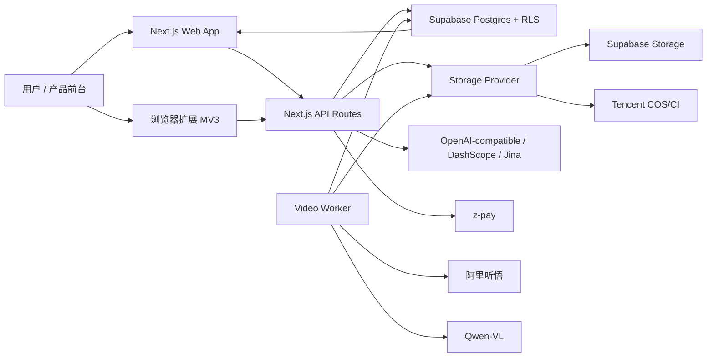
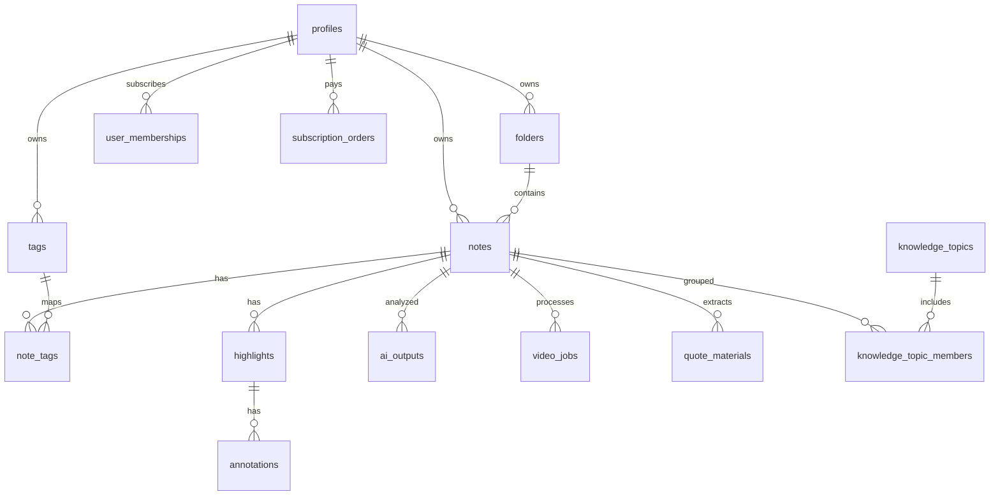
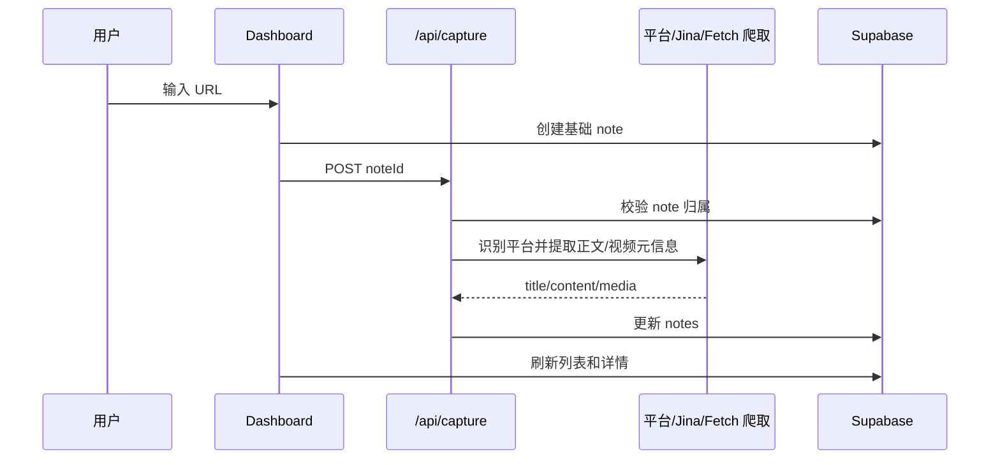
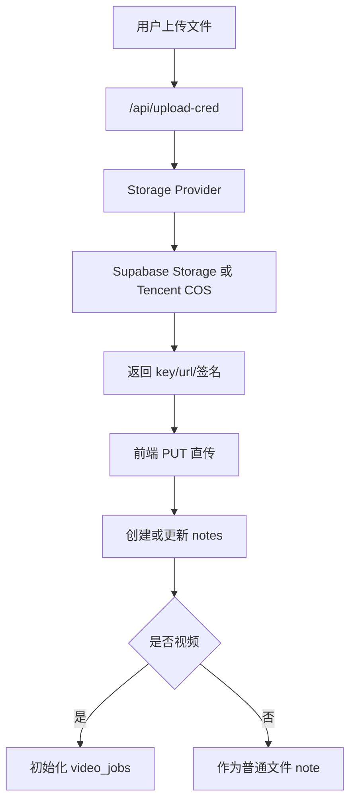
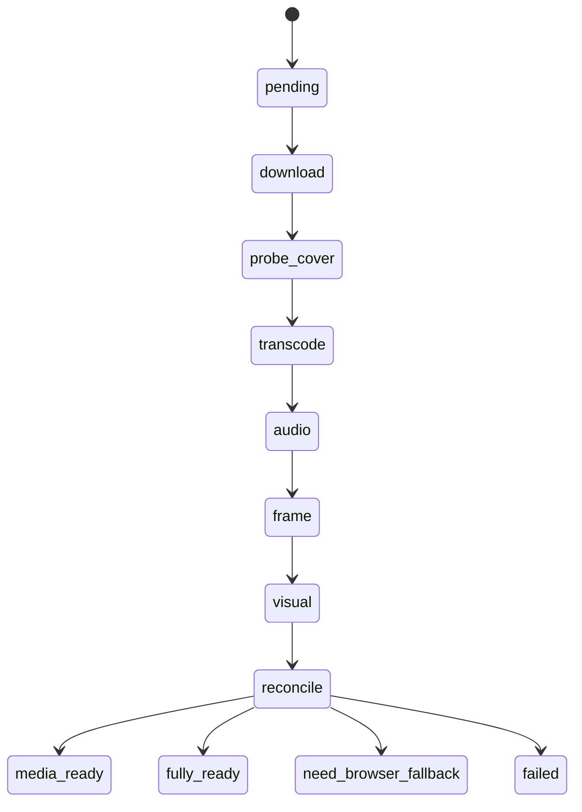
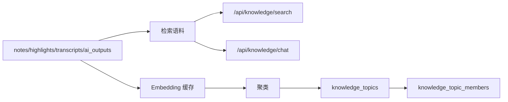
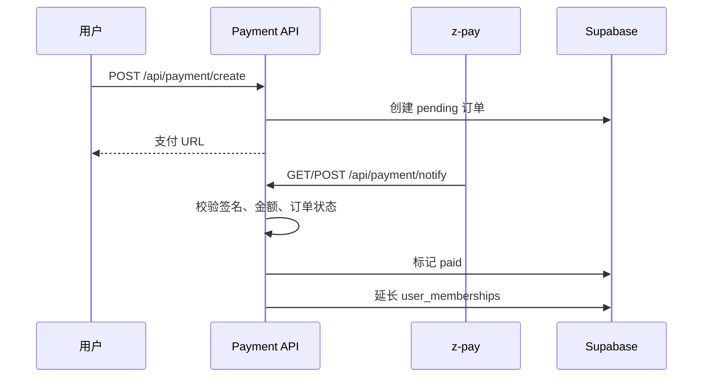

# NewsBox 项目技术说明文档

生成日期：2026-06-04  
适用对象：前端工程师、后端工程师、全栈工程师、测试工程师、运维/部署人员  
分析范围：当前仓库代码、`package.json`、Supabase migrations、Next.js App Router、API routes、extension、worker、现有 PRD/技术文档与 OpenSpec 目录。

## 1. 项目定位

NewsBox 是一个面向个人知识管理和内容收藏的 Web 应用，核心能力是把文章、网页、视频、手动笔记和上传文件统一沉淀为 `notes`，再围绕阅读、标注、AI 总结、视频转写、知识检索、智能主题、会员付费和浏览器扩展形成完整工作流。

当前工程不是一个纯前端项目，而是一个 Next.js 全栈应用：

- 前端：Next.js App Router + React 19 + Tailwind CSS + shadcn/Radix 组件。
- 后端：Next.js API routes + Supabase Auth/Postgres/RLS + Service Role 后台任务。
- AI：OpenAI-compatible 文本模型、DashScope/Qwen、阿里听悟、Jina Reader。
- 存储与媒体处理：Supabase Storage、腾讯云 COS/CI，另有火山 TOS 适配器雏形。
- 扩展：Manifest V3 浏览器扩展，用于网页收藏、视频抓取、直传和元数据同步。

## 2. 快速启动

### 2.1 本地前置条件

- Node.js：项目使用 Next.js 最新版本与 React 19，建议使用当前 LTS 或项目机器已配置版本。
- Supabase：需要可访问的 Supabase 项目、本地库或自托管实例。
- 环境变量：至少需要 Supabase URL、匿名 key、Service Role key。AI、视频、支付、知识聚类能力按需配置。

### 2.2 常用命令

```bash
npm install
npm run dev
npm run lint
npm run test
npm run build
```

`npm run dev` 会在 `127.0.0.1:3001` 启动，并显式清理 `OPENAI_API_KEY`、`OPENAI_API_BASE_URL`、`OPENAI_MODEL` 三个 shell 环境变量，避免开发机全局变量污染本地配置。

### 2.3 最小可运行环境变量

```dotenv
NEXT_PUBLIC_SUPABASE_URL=
NEXT_PUBLIC_SUPABASE_PUBLISHABLE_KEY=
SUPABASE_SERVICE_ROLE_KEY=
ADMIN_USER=
ADMIN_PASS=
DATABASE_URL=
```

如果要跑 AI、视频、知识主题、支付或扩展直传，还需要补充后文「环境变量」章节中的对应配置。

## 3. 仓库结构

```text
app/                    Next.js App Router 页面、布局、API routes、middleware proxy
components/             页面组件、Reader、Dashboard、Video、Knowledge、UI primitives
lib/                    Supabase 客户端、业务服务、AI、存储、worker、工具函数
extension/              Manifest V3 浏览器扩展
supabase/migrations/    数据库 schema、RLS、函数、索引与业务迁移
tests/                  Vitest 单元测试与集成测试
scripts/                数据库导出、迁移、数据修复与辅助脚本
docs/                   PRD、技术文档、计划与本交接文档
openspec/               OpenSpec 变更提案与能力规格
```

## 4. 技术栈

| 层级 | 技术/库 | 当前用途 |
| --- | --- | --- |
| Web 框架 | Next.js App Router | 页面、服务端组件、API routes、proxy middleware |
| UI | React 19、Tailwind CSS 3.4、Radix UI、shadcn/ui、lucide-react | Dashboard、Reader、设置、弹窗、导航、图标 |
| 状态/数据 | SWR、Zustand、React state | 客户端数据拉取、局部交互状态、Dashboard 大组件状态 |
| 数据库 | Supabase Postgres | 用户、笔记、标签、标注、AI 输出、视频任务、会员、知识主题 |
| 鉴权 | Supabase Auth、RLS、Basic Auth | 用户登录、API 用户隔离、后台管理保护 |
| 存储 | Supabase Storage、Tencent COS、Volcengine TOS adapter | 文件上传、视频源文件、封面、帧图、转码产物 |
| AI | OpenAI-compatible、DashScope、Qwen-VL、阿里听悟、Jina Reader | 阅读总结、聊天、视频问答、转写、视觉分析、网页正文提取 |
| 支付 | z-pay API | 订阅订单创建、异步回调、会员有效期更新 |
| 测试 | Vitest、Testing Library | 组件、worker、storage、AI adapter、API 逻辑 |
| 扩展 | Browser Extension MV3、Vite | 收藏网页、视频识别、直传、上下文菜单、快捷键 |

## 5. 总体架构



系统主要由三条主链路组成：

1. 内容入库链路：URL/扩展/上传/手动笔记进入 `notes`，再补齐正文、媒体、标签、文件、视频任务。
2. 阅读与知识链路：Reader 展示内容，用户高亮、批注、写笔记，AI 生成总结，知识模块检索和聚类。
3. 视频处理链路：视频 note 关联 `video_jobs`，worker 处理下载、探测、封面、转码、音频转写、抽帧、视觉分析。

## 6. 认证与权限

### 6.1 用户认证

认证基于 Supabase Auth。服务端请求使用 `lib/supabase/server.ts` 创建 request-scoped client，浏览器端使用 `lib/supabase/client.ts` 单例 client。

关键原则：

- 服务端 Supabase client 不可跨请求缓存，因为 cookies 和用户会话是请求级别。
- 浏览器 client 依赖 `NEXT_PUBLIC_SUPABASE_URL` 与 `NEXT_PUBLIC_SUPABASE_PUBLISHABLE_KEY`。
- 后台任务、管理员、支付回调使用 `lib/supabase/server-service.ts` 的 Service Role client。

### 6.2 Middleware / proxy

根目录 `proxy.ts` 调用 `lib/supabase/proxy.ts`：

- 刷新 Supabase session。
- 保护 `/dashboard`、`/protected` 页面。
- 保护 `/api/admin/*`，要求 Basic Auth。

注意：当前 `/notes/[id]` 没有在 proxy 层统一拦截，但页面通过 `NoteDetailAuthCheck` 和后续客户端加载按用户鉴权。API 层普遍使用 `eq("user_id", user.id)` 或 RLS 隔离。

### 6.3 管理员鉴权

`/api/admin/users` 使用双层防御：

- proxy 先校验 Basic Auth。
- route 内部再次调用 `verifyAdminAuth`。
- 实际用户创建、更新、删除通过 `SUPABASE_SERVICE_ROLE_KEY` 调用 `supabase.auth.admin.*`。

### 6.4 会员权限

会员判断集中在 `lib/services/membership.ts` 与 `lib/middleware/membership.ts`：

- 默认有 14 天试用。
- `pro` 计划支持 Pro 能力。
- `ai` 计划支持 Pro + AI 能力。
- 试用期内可访问 Pro + AI 能力。
- AI 新入口如 `/api/ai/read`、`/api/ai/chat` 使用 `requireAIMembership`。

维护风险：旧版 `/api/ai/analyze` 只要求登录，没有套用 AI 会员校验。是否保留为兼容入口需要产品和安全侧确认。

## 7. 核心数据模型

### 7.1 主体关系



### 7.2 关键表

| 表 | 用途 | 关键字段 |
| --- | --- | --- |
| `profiles` | 用户资料 | `id`, `email`, `full_name`, `avatar_url` |
| `folders` | 收藏夹/目录树 | `parent_id`, `position`, `icon`, `archived_at`, `last_accessed_at` |
| `notes` | 内容主表 | `content_type`, `source_url`, `content_html`, `content_text`, `folder_id`, `status`, `is_starred`, `deleted_at`, `video_job_id`, `user_notes` |
| `tags` | 标签树 | `parent_id`, `position`, `color`, `archived_at` |
| `note_tags` | note-tag 多对多 | `note_id`, `tag_id` |
| `highlights` | 高亮 | `quote`, `range_data`, `color`, `timecode`, `screenshot_url` |
| `annotations` | 批注 | `highlight_id`, `content` |
| `ai_outputs` | AI 阅读结果 | `summary`, `key_questions`, `transcript`, `journalist_view`, `timeline`, `visual_summary` |
| `video_jobs` | 视频处理任务 | `download_status`, `probe_status`, `transcode_status`, `audio_status`, `frame_status`, `visual_status`, `overall_status`, `audio_result`, `visual_result` |
| `quote_materials` | 金句/素材库 | `kind`, `content`, `source`, `content_hash` |
| `knowledge_topics` | 智能主题 | `name`, `summary`, `centroid`, `manual_state`, `pinned_at`, `archived_at` |
| `knowledge_topic_members` | 主题成员 | `topic_id`, `note_id`, `score`, `status`, `event_date` |
| `knowledge_entities` | 知识图谱实体 | `name`, `type`, `description` |
| `knowledge_relationships` | 知识图谱关系 | `source_entity_id`, `target_entity_id`, `relation_type`, `confidence` |
| `user_memberships` | 会员 | `plan`, `status`, `expires_at` |
| `subscription_orders` | 订阅订单 | `order_no`, `provider`, `amount`, `status`, `paid_at` |

### 7.3 RLS 与 Service Role

大部分业务表启用 RLS，用户请求应始终通过当前用户 client 访问。以下场景必须使用 Service Role：

- 管理员创建、重置、删除用户。
- 支付回调更新订单和会员。
- 视频 worker 扫描并推进任务。
- 定时知识主题刷新。
- 跨用户统计或后台修复脚本。

## 8. 页面与路由

| 页面 | 文件 | 用途 |
| --- | --- | --- |
| `/` | `app/page.tsx` | 产品首页/入口 |
| `/dashboard` | `app/dashboard/page.tsx` | 收藏、标签、知识、设置主工作台 |
| `/notes/[id]` | `app/notes/[id]/page.tsx` | Reader 与视频详情 |
| `/auth/login` | `app/auth/login/page.tsx` | 登录 |
| `/auth/sign-up` | `app/auth/sign-up/page.tsx` | 注册 |
| `/auth/forgot-password` | `app/auth/forgot-password/page.tsx` | 找回密码 |
| `/auth/update-password` | `app/auth/update-password/page.tsx` | 更新密码 |
| `/auth/callback` | `app/auth/callback/route.ts` | OAuth/邮件确认回调 |
| `/pricing` | `app/pricing/page.tsx` | 定价页 |
| `/extension` | `app/extension/page.tsx` | 扩展下载/说明页 |
| `/admin`、`/admin/users` | `app/admin/*` | 管理后台 |

## 9. API 入口总览

### 9.1 内容收藏与上传

| Method | Path | 说明 |
| --- | --- | --- |
| `POST` | `/api/capture` | 根据 noteId 拉取 URL 正文/视频元信息并更新 note |
| `POST` | `/api/upload-cred` | 生成文件上传凭证 |
| `POST` | `/api/upload` | 服务端上传接口 |
| `POST` | `/api/extension/save` | 扩展保存网页/文章 |
| `POST` | `/api/extension/save-video` | 扩展创建视频 note 和任务 |
| `GET` | `/api/extension/meta` | 扩展拉取用户、目录、标签 |
| `GET` | `/api/extension/download/[target]` | 扩展包下载 |
| `POST` | `/api/extension/video-upload-cred` | 扩展视频直传凭证与任务创建 |
| `POST` | `/api/extension/video-upload-done` | 扩展通知视频上传完成 |

### 9.2 阅读、标注、导出

| Method | Path | 说明 |
| --- | --- | --- |
| `GET/POST/PUT/DELETE` | `/api/highlights` | 高亮 CRUD |
| `GET` | `/api/notes/[id]/export` | 导出 Markdown、JSON、SRT |
| `GET/POST` | `/api/notes/[id]/markers` | 视频/阅读 marker |
| `DELETE` | `/api/notes/[id]/markers/[markerId]` | 删除 marker |
| `GET/POST/DELETE` | `/api/quote-materials` | 素材库管理 |
| `POST` | `/api/quote-materials/extract` | 从内容中提取素材 |

### 9.3 AI 阅读与视频 AI

| Method | Path | 说明 |
| --- | --- | --- |
| `POST` | `/api/ai/read` | SSE AI 阅读：速读、问题、深度分析 |
| `POST` | `/api/ai/analyze` | 旧版 AI 分析入口 |
| `POST` | `/api/ai/chat` | 笔记内 AI 对话 |
| `GET` | `/api/ai/snapshot` | 获取 AI 快照 |
| `POST` | `/api/ai/snapshot/ensure` | 确保快照存在 |
| `POST` | `/api/ai/video/ask` | 基于视频转写问答 |
| `POST` | `/api/ai/video/rewrite` | 视频文本改写 |
| `POST` | `/api/ai/video/translate` | 视频文本翻译 |
| `POST` | `/api/ai/video/[jobId]/enrich` | 补全视频关键词、QA、说话人摘要 |
| `GET` | `/api/ai/video/[jobId]/status` | 查询视频处理状态 |
| `POST` | `/api/ai/video/[jobId]/retry` | 重试视频处理任务 |
| `POST` | `/api/ai/video/note/[noteId]/init-pipeline` | 为 note 初始化视频管线 |

### 9.4 知识库

| Method | Path | 说明 |
| --- | --- | --- |
| `POST` | `/api/knowledge/search` | 跨笔记、标注、转写、AI 输出检索 |
| `POST` | `/api/knowledge/chat` | 知识库问答，返回引用 note |
| `GET` | `/api/knowledge/topics` | 智能主题列表 |
| `GET` | `/api/knowledge/topics/[id]` | 主题详情 |
| `POST` | `/api/knowledge/topics/[id]/members` | 主题成员操作 |
| `POST` | `/api/knowledge/topics/[id]/pin` | 置顶主题 |
| `POST` | `/api/knowledge/topics/[id]/archive` | 归档主题 |
| `POST` | `/api/knowledge/topics/[id]/merge` | 合并主题 |
| `POST` | `/api/knowledge/topics/[id]/report` | 生成主题报告 |
| `POST` | `/api/knowledge/topics/rebuild` | 重建智能主题 |
| `POST` | `/api/knowledge/topics/nightly-refresh` | 定时刷新主题 |
| `POST` | `/api/knowledge/graph/rebuild` | 重建知识图谱 |

### 9.5 标签、设置、支付、管理

| Method | Path | 说明 |
| --- | --- | --- |
| `GET/POST` | `/api/tags` | 标签列表/创建 |
| `PATCH/DELETE` | `/api/tags/[id]` | 标签更新/删除 |
| `POST` | `/api/tags/[id]/archive` | 归档标签 |
| `POST` | `/api/tags/reorder` | 标签排序 |
| `GET` | `/api/settings/stats` | 设置页统计 |
| `GET` | `/api/settings/trash` | 回收站列表 |
| `POST` | `/api/settings/trash/[id]/restore` | 恢复回收站 note |
| `DELETE` | `/api/settings/trash/[id]` | 永久删除 note |
| `GET` | `/api/settings/referral/me` | 我的邀请码 |
| `POST` | `/api/settings/referral/redeem` | 兑换邀请码 |
| `POST` | `/api/payment/create` | 创建订阅订单 |
| `GET/POST` | `/api/payment/notify` | 支付异步通知 |
| `GET` | `/api/payment/return` | 支付返回页 |
| `GET` | `/api/membership/status` | 当前会员状态 |
| `GET/POST/DELETE` | `/api/admin/users` | 管理员用户管理 |

## 10. 主要业务链路

### 10.1 URL 收藏链路



实现要点：

- `/api/capture` 先校验 note 归属，再标准化 URL。
- 视频平台会识别 Bilibili、YouTube、抖音、快手等，写入 `media_url` 或嵌入信息。
- 文章抓取优先使用平台 crawler，再用 Jina Reader，最后使用基础 fetch + Cheerio。
- 写入前会清理和格式化 HTML。

### 10.2 扩展收藏链路

浏览器扩展通过 Bearer token 调用后端：

- `/api/extension/meta` 获取用户、目录、标签。
- `/api/extension/save` 保存网页，按 `user_id + source_url` upsert。
- `/api/extension/save-video` 创建视频 note 和 `video_jobs`。
- `/api/extension/video-upload-cred` 获取视频直传凭证。
- `/api/extension/video-upload-done` 校验上传对象存在并推进下载状态。

扩展本身位于 `extension/`，使用 Manifest V3，包含 popup、content script、background service worker、视频上传器和平台提取器。

### 10.3 上传与存储链路



`lib/storage/provider.ts` 根据 `STORAGE_PROVIDER` 返回适配器。当前支持：

- `supabase`：默认后端，适合普通文件。
- `tencent-cos`：支持视频处理所需的 COS/CI 能力。
- `volcengine-tos`：已有适配器结构，生产能力需进一步确认。

### 10.4 视频处理链路



worker 启动入口：

- `instrumentation.ts` 在 Node runtime 下调用 `startVideoWorker`。
- `lib/workers/index.ts` 在 `VIDEO_WORKER_ENABLED=true` 时执行恢复和调度。
- `VIDEO_WORKER_INTERVAL_MS` 默认 10000ms。
- `VIDEO_WORKER_BATCH_SIZE` 默认 5。

处理阶段：

| 阶段 | 说明 |
| --- | --- |
| download | 服务端下载源视频或等待扩展直传完成 |
| probe + cover | 腾讯云 CI 获取媒体信息和封面 |
| transcode | 判断是否需要转 H264/MP4，必要时提交 COS CI 转码 |
| audio | 调用阿里听悟做转写、章节、摘要、关键词、QA |
| frame | 根据章节或固定间隔抽关键帧 |
| visual | 调用 Qwen-VL 分析帧图 |
| reconcile | 汇总状态，写回 `notes.video_overall_status` |

设计细节：

- 转码成功后不会覆盖原始 `cos_key`，而是写入 `transcoded_key`/`transcoded_url`，降低不可逆覆盖风险。
- 视觉分析失败不会阻塞最终可读状态，通常会进入 `fully_ready` 或保留 `visual_status=failed`。
- 服务端下载遇到 403 会进入 `need_browser_fallback`，提示使用扩展上传。

### 10.5 AI 阅读链路

`/api/ai/read` 是当前主要入口，使用 SSE 返回多阶段结果：

1. `meta`：返回 note 和上下文。
2. `cached`：若已有 AI 输出可复用，先返回缓存。
3. `progress`：阶段进度。
4. `fast_read`：快速摘要。
5. `key_questions`：关键问题。
6. `deep_analysis`：深度分析。

生成结果会写入 `ai_outputs`。`/api/ai/chat` 支持围绕单篇 note 的流式对话。视频侧还有 `/api/ai/video/ask`、`rewrite`、`translate` 和 `enrich`。

### 10.6 知识库链路

知识库包含三层：

- 检索：`/api/knowledge/search` 从 notes、highlights、annotations、transcripts、ai_outputs 聚合证据。
- 问答：`/api/knowledge/chat` 基于检索结果构造上下文，并要求输出 note 引用。
- 智能主题：`/api/knowledge/topics/rebuild` 对 note 做 embedding、聚类、命名、成员维护和事件更新。



智能主题重建要点：

- 最多读取 400 条 note。
- 支持 `recentDays` 参数。
- embedding provider 可独立于 OpenAI 主模型配置。
- 聚类支持 DBSCAN/KMeans。
- 通过 centroid 相似度尽量匹配已有主题，默认阈值由 `KNOWLEDGE_TOPIC_MATCH_THRESHOLD` 控制。
- 置顶、归档、手动编辑状态会尽量保留。

知识图谱也有实体与关系表，以及 `/api/knowledge/graph/rebuild`。当前实现更偏早期能力，重建范围和 UI 展示仍需要继续产品化。

### 10.7 会员与支付链路



会员计划：

- `pro`：9.9。
- `ai`：19.9。
- 有效会员按已存在到期时间顺延一年。
- 邀请码兑换可给被邀请人和邀请人增加有效期，邀请人奖励有上限。

## 11. 前端模块

### 11.1 Dashboard

核心文件：`components/dashboard/dashboard-content.tsx`。

这是当前最大的业务组件，承载：

- 收藏列表和多种视图模式。
- 目录树、标签树、智能分类。
- URL 添加、快速笔记、文件上传。
- 搜索、排序、筛选、批量操作。
- 归档、回收站、设置入口。
- 知识库、标注、素材相关视图跳转。

主要导航：

- `collections`
- `tags`
- `annotations`
- `archive`
- `knowledge`
- `settings`

主要列表分类：

- `all`
- `uncategorized`
- `folder`
- `starred`
- `today`
- `smart`

维护建议：Dashboard 状态和业务分支较多，后续大改时建议按「数据 hook」「左侧导航」「列表区域」「添加弹窗」「批量操作」「设置子页」逐步拆分，避免继续扩大单组件复杂度。

### 11.2 Reader / Note Detail

`/notes/[id]` 通过 `NoteDetailAuthCheck` 做用户校验，最终展示 `ReaderPageWrapper`。根据 note 类型展示文章、网页、文件或视频详情。

当前观察到一个性能/维护点：`NoteDetailAuthCheck` 服务端已经查询 note、folder、video job，但没有把这些初始数据实际传给 `ReaderPageWrapper`，因此客户端仍会再次拉取。后续可以考虑补齐 initial data 传递，减少首屏重复请求。

### 11.3 Video Detail

视频详情围绕 `video_jobs` 展示：

- 媒体播放。
- 转写文本。
- 章节。
- 关键词。
- 关键帧。
- AI 问答。
- 改写/翻译。
- 我的笔记。
- 导出 Markdown/JSON/SRT。

### 11.4 Knowledge UI

知识模块覆盖搜索、问答、主题、图谱、报告。代码中存在图谱组件和 mock 数据，真实图谱重建 API 已存在，但完整生产闭环仍需继续验证。

## 12. 浏览器扩展

扩展目录：`extension/`

### 12.1 构建命令

```bash
cd extension
npm install
npm run dev
npm run build
npm run build:zip
npm run build:safari-xcode
```

### 12.2 Manifest 能力

- Manifest V3。
- action popup。
- content script 覆盖所有 URL。
- background service worker。
- 权限：`activeTab`、`storage`、`contextMenus`、`notifications`、`alarms`、`declarativeNetRequestWithHostAccess`。
- 快捷键：`Ctrl/Cmd + Shift + S`。
- 支持本地、线上 API 与部分视频域名 host permissions。

### 12.3 主要代码域

| 目录 | 说明 |
| --- | --- |
| `extension/src/popup` | 登录、保存、视频保存、设置、成功态、目录/标签选择 |
| `extension/src/content` | 网页内容提取、平台识别 |
| `extension/src/background` | service worker、视频上传、DNR 规则 |
| `extension/src/shared` | API、认证、storage、主题等公共逻辑 |

## 13. 环境变量

### 13.1 Supabase 与数据库

| 变量 | 必需 | 说明 |
| --- | --- | --- |
| `NEXT_PUBLIC_SUPABASE_URL` | 是 | Supabase 项目 URL |
| `NEXT_PUBLIC_SUPABASE_PUBLISHABLE_KEY` | 是 | 浏览器匿名 key |
| `SUPABASE_SERVICE_ROLE_KEY` | 后台能力必需 | 后台任务、支付、管理员使用 |
| `DATABASE_URL` | 脚本/迁移需要 | Postgres 连接串 |
| `DB_EXPORT_DATABASE_URL` | 可选 | 数据导出连接串 |

### 13.2 管理员

| 变量 | 必需 | 说明 |
| --- | --- | --- |
| `ADMIN_USER` | 管理后台必需 | Basic Auth 用户名 |
| `ADMIN_PASS` | 管理后台必需 | Basic Auth 密码 |

### 13.3 OpenAI-compatible 文本 AI

| 变量 | 必需 | 说明 |
| --- | --- | --- |
| `OPENAI_API_KEY` | AI 必需 | API key |
| `OPENAI_API_BASE_URL` | 可选 | 兼容网关地址 |
| `OPENAI_MODEL` | 可选 | 默认文本模型 |

### 13.4 知识主题

| 变量 | 必需 | 说明 |
| --- | --- | --- |
| `KNOWLEDGE_EMBEDDING_API_KEY` | 可选 | 独立 embedding key |
| `KNOWLEDGE_EMBEDDING_BASE_URL` | 可选 | embedding base URL |
| `KNOWLEDGE_EMBEDDING_MODEL` | 可选 | embedding 模型 |
| `KNOWLEDGE_TOPIC_NAMING_API_KEY` | 可选 | 主题命名模型 key |
| `KNOWLEDGE_TOPIC_NAMING_BASE_URL` | 可选 | 主题命名 base URL |
| `KNOWLEDGE_TOPIC_NAMING_MODEL` | 可选 | 主题命名模型 |
| `KNOWLEDGE_TOPIC_MATCH_THRESHOLD` | 可选 | 新旧主题匹配阈值 |
| `KNOWLEDGE_CRON_SECRET` | 定时刷新必需 | nightly refresh 鉴权 |
| `SMART_TOPICS_REFRESH_URL` | 可选 | 外部定时触发 URL |

### 13.5 抓取与网页提取

| 变量 | 必需 | 说明 |
| --- | --- | --- |
| `JINA_API_KEY` | 可选 | Jina Reader 提取网页正文 |

### 13.6 存储与视频

| 变量 | 必需 | 说明 |
| --- | --- | --- |
| `NEXT_PUBLIC_SUPABASE_STORAGE_BUCKET` | 可选 | Supabase Storage bucket，默认 `user-files` |
| `STORAGE_PROVIDER` | 可选 | `supabase` / `tencent-cos` / `volcengine-tos` |
| `TENCENT_COS_SECRET_ID` | COS 必需 | 腾讯云 COS secret id |
| `TENCENT_COS_SECRET_KEY` | COS 必需 | 腾讯云 COS secret key |
| `TENCENT_COS_REGION` | COS 必需 | COS region |
| `TENCENT_COS_BUCKET` | COS 必需 | COS bucket |
| `TENCENT_COS_CUSTOM_DOMAIN` | 可选 | COS 自定义域名 |
| `VIDEO_WORKER_ENABLED` | 视频处理必需 | `true` 时启动 worker |
| `VIDEO_WORKER_INTERVAL_MS` | 可选 | worker 调度间隔 |
| `VIDEO_WORKER_BATCH_SIZE` | 可选 | 每轮处理任务数 |

### 13.7 音频/视觉 AI

| 变量 | 必需 | 说明 |
| --- | --- | --- |
| `AUDIO_ANALYSIS_PROVIDER` | 视频转写必需 | 当前主要为 `tingwu` |
| `ALI_TINGWU_APPKEY` | 听悟必需 | 应用 appkey |
| `ALIBABA_CLOUD_ACCESS_KEY_ID` | 听悟必需 | 阿里云 AK |
| `ALIBABA_CLOUD_ACCESS_KEY_SECRET` | 听悟必需 | 阿里云 SK |
| `ALIBABA_CLOUD_REGION` | 可选 | 区域 |
| `VISUAL_ANALYSIS_PROVIDER` | 可选 | `qwen-vl` 或 `none` |
| `DASHSCOPE_API_KEY` | 视觉/视频问答必需 | DashScope key |
| `DASHSCOPE_TEXT_MODEL` | 可选 | 视频问答文本模型 |
| `DASHSCOPE_VISION_MODEL` | 可选 | 视觉模型，默认类似 `qwen-vl-max` |

### 13.8 支付

支付相关变量没有全部集中在 `.env.example` 中展示，实际配置需结合 z-pay 文档和 `app/api/payment/*` 检查。上线前必须确认：

- 商户 ID。
- 商户 key。
- notify URL。
- return URL。
- 金额和币种。

## 14. 测试

当前测试主要覆盖：

- storage provider 与 object key。
- 腾讯 COS 适配器关键逻辑。
- 视频 worker pipeline。
- 阿里听悟、视觉分析 adapter。
- 设置统计。
- note marker。
- dashboard/video detail 组件。
- 扩展视频提取器。

建议开发流程：

```bash
npm run test
npm run lint
npm run build
```

针对视频和存储改动，优先跑：

```bash
npx vitest run tests/lib/storage tests/lib/workers/video-pipeline
```

针对 AI adapter 改动，优先跑：

```bash
npx vitest run tests/lib/ai-analysis
```

## 15. 部署与运维

### 15.1 部署形态

可按 Next.js 全栈服务部署，但要注意：

- API routes 需要能访问 Supabase、AI provider、对象存储、支付 provider。
- `VIDEO_WORKER_ENABLED=true` 的实例会启动视频 worker。若有多实例部署，需要确认是否会重复消费同一批任务。
- 视频 worker 更适合独立 worker 进程或受控单实例部署，避免多个 Web 实例同时处理同一任务。

### 15.2 定时任务

知识主题 nightly refresh 可通过外部 cron 触发：

- URL：`/api/knowledge/topics/nightly-refresh`
- 鉴权：Bearer token 或 `x-cron-secret`
- secret：`KNOWLEDGE_CRON_SECRET`

### 15.3 监控重点

建议重点监控：

- `/api/capture` 抓取失败率。
- `video_jobs.overall_status` 分布。
- `video_jobs.retry_count` 与 `need_browser_fallback` 数量。
- AI 接口耗时和失败率。
- Supabase RLS 错误和 Service Role 使用范围。
- 支付通知重复回调和金额校验失败。
- COS/CI 任务提交与轮询失败。

## 16. 已识别维护风险

| 风险 | 影响 | 建议 |
| --- | --- | --- |
| `components/dashboard/dashboard-content.tsx` 过大 | 后续功能迭代容易互相影响 | 按功能域拆 hook 和组件 |
| `/api/ai/analyze` 与新 AI 入口权限策略不一致 | 可能绕过 AI 会员限制 | 明确是否废弃或补 `requireAIMembership` |
| `/notes/[id]` 不在 proxy 保护列表 | 依赖页面和 API 内部鉴权 | 可考虑加入 proxy 保护，或保留并写明原因 |
| `NoteDetailAuthCheck` 未传递已查 initial data | 首屏重复请求 | 补齐 initialNote/initialFolder 传递 |
| `/api/tags/reorder` sibling 查询未选择 `parent_id` | 同级排序可能不准确 | 查询中加入 `parent_id` 并补测试 |
| 视频 worker 多实例风险 | 同一任务可能被重复推进 | 增加任务锁、lease 或部署单 worker |
| `knowledge/chat` dev helper 读取 `.env.local` | 生产日志/配置边界需确认 | 限定 dev 环境或移除调试逻辑 |
| 旧文档与当前代码不完全一致 | 新人容易被误导 | 以本文件和最新代码为准，逐步更新旧文档 |
| Volcengine TOS adapter 生产成熟度不明 | 误选 provider 可能导致上传/处理能力不完整 | 上线前做 provider 能力验收 |
| 知识图谱能力偏早期 | 产品预期可能超过当前实现 | 在产品文档中标注为探索/增强能力 |

## 17. 新人开发建议

### 17.1 前端工程师

推荐阅读顺序：

1. `app/dashboard/page.tsx`
2. `components/dashboard/dashboard-content.tsx`
3. `app/notes/[id]/page.tsx`
4. `components/reader/*`
5. `components/video-detail/*`
6. `components/knowledge/*`

先理解 Dashboard 的主导航、note 列表状态、添加弹窗和设置页，再进入 Reader 和视频详情。

### 17.2 后端工程师

推荐阅读顺序：

1. `lib/supabase/server.ts`
2. `lib/supabase/server-service.ts`
3. `supabase/migrations/*`
4. `app/api/capture/route.ts`
5. `app/api/ai/read/route.ts`
6. `app/api/knowledge/*`
7. `app/api/payment/*`
8. `lib/workers/video-pipeline/*`

先理解 RLS、Service Role 和 note 主表，再看各业务 API。

### 17.3 AI/视频工程师

推荐阅读顺序：

1. `lib/workers/index.ts`
2. `lib/workers/video-pipeline/*`
3. `lib/storage/*`
4. `lib/ai-analysis/*`
5. `app/api/ai/video/*`
6. `tests/lib/workers/video-pipeline/*`

视频管线的关键是状态机和幂等。任何阶段改动都要考虑失败重试、跳过策略、转码产物和原始文件保留策略。

### 17.4 测试工程师

重点覆盖：

- URL 收藏成功/失败/平台差异。
- 扩展保存、直传、上传完成回调。
- note 权限隔离。
- 标签/目录树排序、归档、恢复。
- AI 权限与试用期。
- 视频任务全状态流转。
- 支付回调幂等。
- 回收站恢复和永久删除。

## 18. 变更流程建议

仓库包含 OpenSpec 目录。涉及新增能力、架构调整、破坏性改动、大型性能/安全工作时，应先阅读 `openspec/AGENTS.md` 并创建 change proposal。普通 bugfix 或文档更新无需创建 proposal。

建议每次功能迭代保留以下材料：

- 需求说明或 OpenSpec proposal。
- 数据库 migration。
- API contract。
- 前端状态和空态说明。
- 测试用例。
- 回滚策略。

