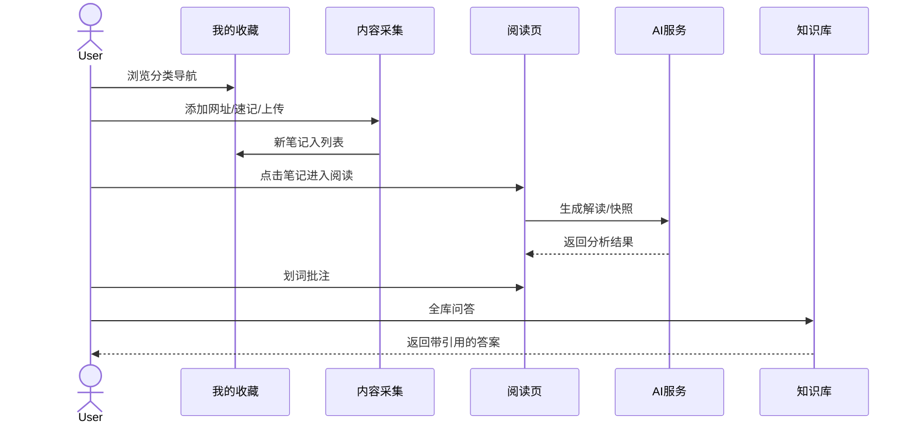
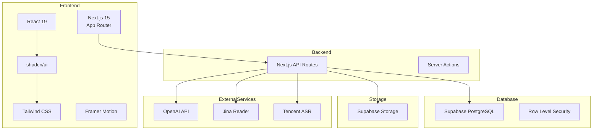
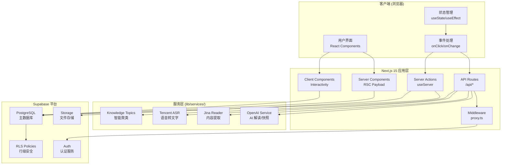
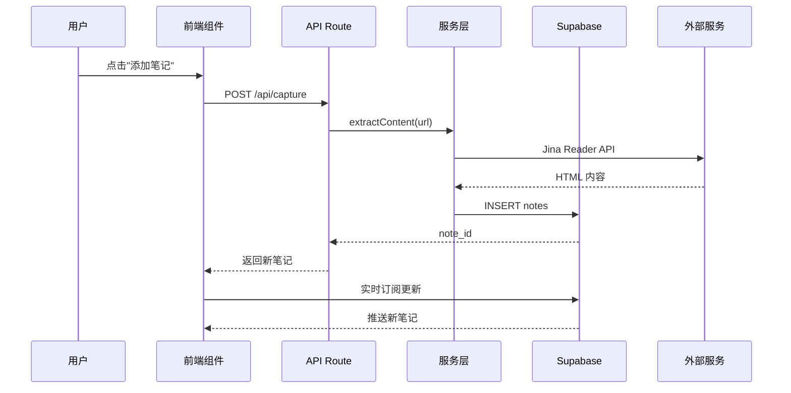
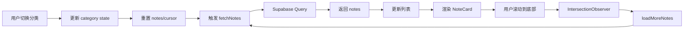
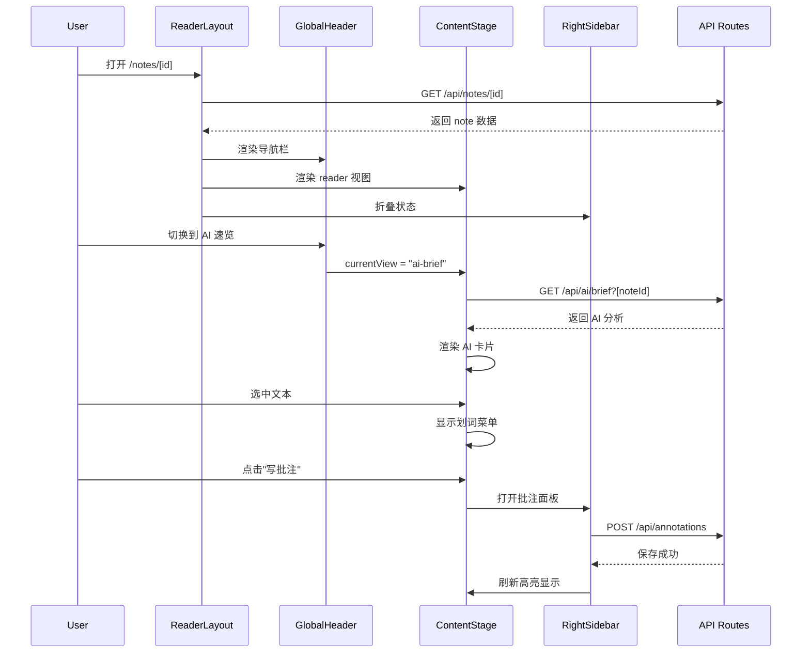
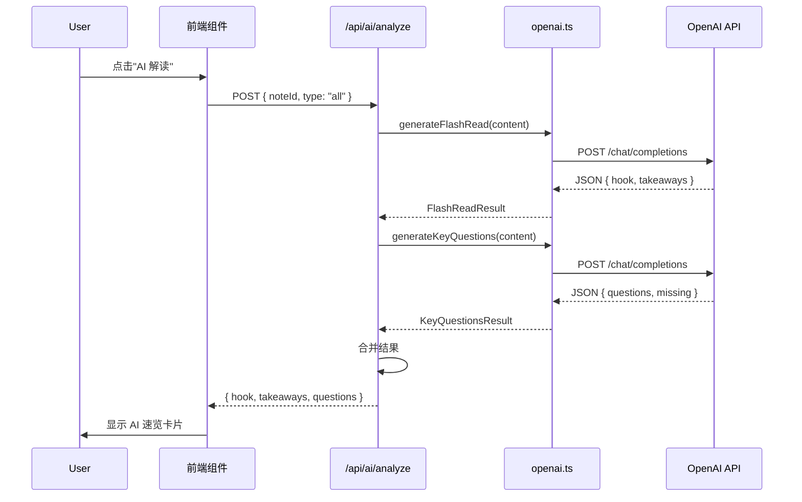
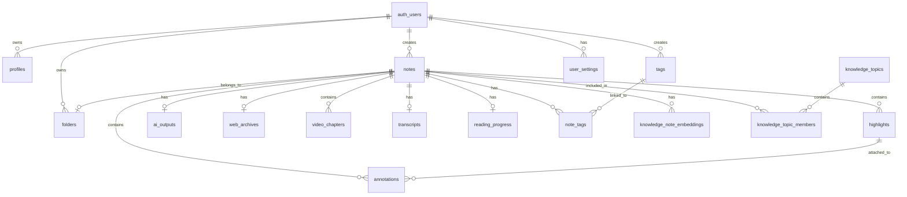
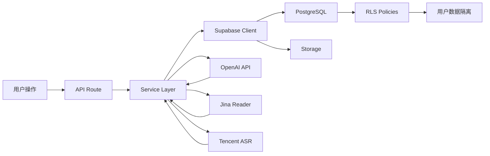

# NewsBox AI News Reading Assistant - 技术架构与实现文档

## 文档信息
- **项目名称**: NewsBox (AI 稍后阅读助手)
- **文档版本**: 1.0
- **编写日期**: 2026-01-04
- **架构师**: AI 分析生成

---

## 1. 项目概览 (Project Overview)

### 1.1 核心功能定位
NewsBox 是一款 **Cubox 风格的"稍后阅读"产品**，面向新闻记者、深度阅读者和知识工作者。它不仅仅是一个收藏工具，更是一个**"第二大脑"工作台**——支持多模态内容收集（文章、视频、音频）、AI 智能解读、深度批注和知识库构建。

### 1.2 业务价值
| 痛点 | 解决方案 |
|------|----------|
| 信息过载，来不及阅读 | AI 快读（30秒判断价值）|
| 收藏后找不到 | 智能专题聚类 + 全库 RAG 问答 |
| 视频内容难以检索 | ASR 逐字稿 + 时间戳锚点 |
| 研究写作需要证据留存 | 网页存档 + 浮顶批注 |
| 多平台内容分散 | 统一收藏 + 原文/快照/AI 三视图切换 |

### 1.3 核心用户旅程 (User Journey)



---

## 2. 技术栈与选型 (Tech Stack & Rationale)

### 2.1 技术栈总览



### 2.2 关键技术决策分析

| 技术选型 | 版本 | 选择理由 | 替代方案对比 |
|----------|------|----------|-------------|
| **Next.js** | 15 (App Router) | - SSR/SSG 支持<br/>- API Routes 集成<br/>- 服务端组件减少客户端 JS | React SPA: SEO 不友好，首屏加载慢<br/>Vue 3: 生态不如 React 成熟 |
| **Supabase** | Latest | - PostgreSQL + Auth + Storage 一体化<br/>- Row Level Security 天然支持多租户<br/>- 实时订阅能力 | Firebase: 数据库 NoSQL 不适合复杂查询<br/>自建后端: 开发成本高 |
| **Tailwind CSS** | 3.x | - 快速 UI 开发<br/>- 与 shadcn/ui 无缝集成<br/>- 响应式设计友好 | CSS Modules: 维护成本高<br/>Styled Components: 运行时开销 |
| **PostgreSQL** | Via Supabase | - JSONB 支持灵活 schema<br/>- 全文检索 (GIN 索引)<br/>- 复杂关联查询 | MongoDB: 事务支持弱<br/>MySQL: JSON 支持不如 PG |
| **OpenAI API** | Compatible | - 结构化输出 (json_object)<br/>- 流式响应<br/>- 生态成熟 | Claude: 价格更高<br/>本地模型: 部署复杂 |
| **Video.js** | 8.x | - 丰富的插件生态<br/>- 跨浏览器兼容性<br/>- 字幕支持 | Plyr: 功能较基础<br/>原生 video: 能力有限 |

### 2.3 开发命令

```bash
# 开发（自动剔除 OPENAI_* 环境变量，避免开发时误调用 AI API）
npm run dev

# 构建（生产模式）
npm run build

# 启动生产服务器
npm start

# 代码检查
npm run lint
```

---

## 3. 系统架构设计 (System Architecture)

### 3.1 架构模式

本项目采用 **单体应用 + 服务化分层架构**：

- **前端**: Next.js 15 App Router (Server Components + Client Components 混合)
- **后端**: Next.js API Routes + Server Actions
- **数据库**: Supabase PostgreSQL (托管)
- **存储**: Supabase Storage (S3 兼容)
- **架构特点**:
  - **MVC 模式**: Controller (API Routes) → Service (lib/services/) → Model (Supabase Client)
  - **领域驱动**: 按业务能力划分模块 (Dashboard, Reader, Knowledge, Capture)
  - **多租户隔离**: Row Level Security (RLS) 自动过滤用户数据

### 3.2 目录结构说明

```
cubox/
├── app/                                    # Next.js App Router
│   ├── auth/                              # 认证页面 (登录/注册/重置密码)
│   │   ├── login/page.tsx
│   │   ├── sign-up/page.tsx
│   │   └── update-password/page.tsx
│   ├── dashboard/                         # 主工作台
│   │   └── page.tsx                       # 分类导航 + 笔记列表
│   ├── notes/[id]/                        # 笔记详情页
│   │   └── page.tsx                       # 三栏阅读器布局
│   ├── api/                               # API Routes
│   │   ├── capture/route.ts               # URL 内容抓取
│   │   ├── tags/route.ts                  # 标签 CRUD
│   │   ├── ai/analyze/route.ts            # AI 多视角解读
│   │   ├── knowledge/chat/route.ts        # 知识库问答
│   │   └── ...
│   ├── layout.tsx                         # 根布局 (主题提供者)
│   └── page.tsx                           # 落地页
│
├── components/                             # React 组件
│   ├── dashboard/                         # 工作台组件
│   │   ├── dashboard-content.tsx          # 主逻辑 (无限滚动 + 批量操作)
│   │   └── dashboard-auth-check.tsx       # 认证包装器
│   ├── reader/                            # 阅读器核心组件库
│   │   ├── ReaderLayout.tsx               # 三栏布局容器
│   │   ├── GlobalHeader/                  # 顶部导航
│   │   │   ├── index.tsx
│   │   │   ├── ViewSwitcher.tsx           # 视图切换器
│   │   │   ├── ActionMenu.tsx             # 操作菜单
│   │   │   └── AppearanceMenu.tsx         # 外观设置
│   │   ├── LeftSidebar/                   # 左侧栏
│   │   │   ├── index.tsx
│   │   │   ├── ArticleOutline.tsx         # 图文大纲
│   │   │   └── VideoChapters.tsx          # 视频章节
│   │   ├── ContentStage/                  # 中间内容区
│   │   │   ├── index.tsx
│   │   │   ├── ArticleReader.tsx          # 图文阅读器
│   │   │   ├── VideoPlayer.tsx            # 视频播放器
│   │   │   ├── WebView.tsx                # 原始网页 iframe
│   │   │   ├── AIBriefView.tsx            # AI 速览
│   │   │   ├── ArchiveView.tsx            # 网页存档
│   │   │   └── AISnapshotView.tsx         # AI 快照
│   │   ├── RightSidebar/                  # 右侧栏
│   │   │   ├── index.tsx
│   │   │   ├── AnnotationList.tsx         # 批注列表
│   │   │   ├── AIAnalysisPanel.tsx        # AI 解析面板
│   │   │   └── TranscriptView.tsx         # 逐字稿
│   │   ├── SelectionMenu.tsx              # 划词气泡菜单
│   │   ├── AnnotationDialog.tsx           # 批注弹窗
│   │   └── ImageLightbox.tsx              # 图片灯箱
│   ├── settings/                          # 设置中心
│   │   └── sections/                      # 各设置面板
│   ├── ui/                                # shadcn/ui 基础组件
│   └── tutorial/                          # 新手引导
│
├── lib/                                    # 核心逻辑层
│   ├── supabase/                          # Supabase 客户端
│   │   ├── client.ts                      # 客户端实例
│   │   ├── server.ts                      # 服务端实例 (每次请求新建)
│   │   └── proxy.ts                       # 中间件 (认证 + 保护路由)
│   ├── services/                          # 外部服务集成
│   │   ├── openai.ts                      # OpenAI API (AI 解读/快照)
│   │   ├── jina.ts                        # Jina Reader (内容提取)
│   │   ├── tencent-asr.ts                 # 腾讯云 ASR (语音转文字)
│   │   ├── knowledge-topics.ts            # 智能专题聚类
│   │   ├── knowledge-graph.ts             # 知识图谱数据准备
│   │   └── snapshot.ts                    # AI 快照生成
│   ├── browse-history.ts                  # 浏览历史记录
│   └── utils.ts                           # 工具函数
│
├── supabase/                              # 数据库迁移
│   └── migrations/
│       ├── 001_initial_schema.sql         # 初始表结构
│       ├── 003_enhance_my_collections.sql  # 收藏增强
│       ├── 006_add_tag_management.sql      # 标签管理
│       ├── 008_add_reader_page_schema.sql  # 阅读页表
│       ├── 014_add_knowledge_smart_topics.sql # 知识库专题
│       └── 017_add_settings_center_schema.sql  # 设置中心
│
├── openspec/                               # OpenSpec 规格管理
│   ├── specs/                             # 当前能力规格
│   │   ├── ai-summaries/spec.md
│   │   ├── annotations/spec.md
│   │   ├── capture/spec.md
│   │   ├── dashboard/spec.md
│   │   └── ...
│   ├── changes/                           # 变更提案
│   └── project.md
│
├── docs/                                   # 产品文档
│   ├── prd-detail.md                      # 阅读页 PRD
│   ├── prd-ai-read.md                     # AI 解读 PRD
│   └── ...
│
├── public/                                 # 静态资源
│   └── icons/                             # 图标
│
├── .env.example                            # 环境变量模板
├── next.config.ts                          # Next.js 配置 (CSP)
├── tailwind.config.ts                      # Tailwind 配置
└── tsconfig.json                          # TypeScript 配置
```

### 3.3 系统架构图



### 3.4 数据流架构



---

## 4. 核心模块与实现逻辑 (Core Modules)

### 4.1 模块一：我的收藏 (Dashboard)

#### 4.1.1 功能描述
- **核心能力**: 展示用户所有笔记的列表视图，支持分类导航、无限滚动、批量操作
- **入口**: `/dashboard`
- **关键交互**:
  - 左侧导航切换 (未分类/所有/星标/今日/收藏夹/智能列表)
  - 无限滚动加载更多
  - 多选模式 + 批量操作
  - 添加笔记 (URL/速记/上传)

#### 4.1.2 关键类/文件
| 文件路径 | 职责 |
|----------|------|
| `app/dashboard/page.tsx` | Dashboard 页面入口 |
| `components/dashboard/dashboard-content.tsx` | 主逻辑组件 (~1200 行) |
| `components/dashboard/dashboard-auth-check.tsx` | 认证保护包装 |
| `components/dashboard/AddNoteModal.tsx` | 添加笔记弹窗 |
| `lib/browse-history.ts` | 浏览历史记录 |

#### 4.1.3 核心方法说明

```typescript
// dashboard-content.tsx 核心逻辑

// 1. 分类导航状态
type CategoryType =
  | 'uncategorized'  // 未分类 (folder_id IS NULL)
  | 'all'           // 所有笔记
  | 'starred'       // 星标 (is_starred = true)
  | 'today'         // 今日创建
  | 'folder'        // 指定收藏夹
  | 'smart-list';   // 智能列表 (标签聚类)

// 2. 无限滚动实现
const [notes, setNotes] = useState<Note[]>([]);
const [hasMore, setHasMore] = useState(true);
const [cursor, setCursor] = useState<string | null>(null);

useEffect(() => {
  const observer = new IntersectionObserver(
    (entries) => {
      if (entries[0].isIntersecting && hasMore && !loading) {
        loadMoreNotes();
      }
    },
    { threshold: 1.0 }
  );

  if (sentinelRef.current) {
    observer.observe(sentinelRef.current);
  }

  return () => observer.disconnect();
}, [hasMore, loading, cursor, category]);

// 3. 查询构建
async function fetchNotes(cursor?: string) {
  const supabase = createClient(); // 客户端实例

  let query = supabase
    .from('notes')
    .select('*, folders(*), tags(*)')
    .eq('user_id', user.id)
    .order('created_at', { ascending: false })
    .limit(20);

  // 应用分类过滤器
  if (category === 'uncategorized') {
    query = query.is('folder_id', null);
  } else if (category === 'starred') {
    query = query.eq('is_starred', true);
  } else if (category === 'today') {
    const today = new Date().toISOString().split('T')[0];
    query = query.gte('created_at', today);
  } else if (category.startsWith('folder:')) {
    const folderId = category.split(':')[1];
    query = query.eq('folder_id', folderId);
  } else if (category.startsWith('tag:')) {
    const tagName = category.split(':')[1];
    // 通过 note_tags 关联查询
    query = query.contains('tags', [{ name: tagName }]);
  }

  // 分页游标
  if (cursor) {
    query = query.lt('created_at', cursor);
  }

  const { data, error } = await query;
  return data;
}

// 4. 批量操作
async function handleBulkAction(action: BulkAction, noteIds: string[]) {
  const results = await Promise.allSettled(
    noteIds.map(id => {
      switch (action) {
        case 'star':
          return supabase.from('notes').update({ is_starred: true }).eq('id', id);
        case 'archive':
          return supabase.from('notes').update({ status: 'archived' }).eq('id', id);
        case 'delete':
          return supabase.from('notes').delete().eq('id', id);
        // ...
      }
    })
  );

  // 处理部分失败
  const failed = results.filter(r => r.status === 'rejected');
  if (failed.length > 0) {
    toast.error(`${failed.length} 条操作失败`);
  }
}
```

#### 4.1.4 数据流向



### 4.2 模块二：沉浸式阅读页 (Reader Page)

#### 4.2.1 功能描述
- **核心能力**: 三栏布局的沉浸式阅读体验，支持图文/视频双模式
- **入口**: `/notes/[id]`
- **关键交互**:
  - 视图切换 (阅读/原始网页/AI 速览/网页存档)
  - 划词批注 (高亮 + 笔记)
  - AI 解读 (摘要/记者视角/时间线)
  - 视频章节 + ASR 逐字稿

#### 4.2.2 关键类/文件
| 文件路径 | 职责 |
|----------|------|
| `app/notes/[id]/page.tsx` | 阅读页入口 (数据加载) |
| `components/reader/ReaderLayout.tsx` | 三栏布局容器 (~220 行) |
| `components/reader/GlobalHeader/index.tsx` | 顶部导航栏 |
| `components/reader/ContentStage/index.tsx` | 内容舞台 (视图路由) |
| `components/reader/ContentStage/ArticleReader.tsx` | 图文阅读器 |
| `components/reader/ContentStage/VideoPlayer.tsx` | 视频播放器 |
| `components/reader/RightSidebar/index.tsx` | 右侧面板 (批注/AI/逐字稿) |
| `components/reader/SelectionMenu.tsx` | 划词气泡菜单 |
| `components/reader/AnnotationDialog.tsx` | 批注弹窗 |

#### 4.2.3 核心方法说明

```typescript
// ReaderLayout.tsx 三栏布局核心

export type ViewType = "reader" | "web" | "ai-brief" | "archive";
export type RightPanelTab = "annotations" | "ai-analysis" | "transcript";

export function ReaderLayout({ note, folder }: ReaderLayoutProps) {
  // 状态管理
  const [currentView, setCurrentView] = useState<ViewType>("reader");
  const [isZenMode, setIsZenMode] = useState(false);
  const [leftSidebarCollapsed, setLeftSidebarCollapsed] = useState(false);
  const [rightSidebarCollapsed, setRightSidebarCollapsed] = useState(true);
  const [scrollProgress, setScrollProgress] = useState(0);

  // 滚动进度追踪
  useEffect(() => {
    const handleScroll = () => {
      const scrollTop = window.scrollY;
      const docHeight = document.documentElement.scrollHeight - window.innerHeight;
      const progress = docHeight > 0 ? (scrollTop / docHeight) * 100 : 0;
      setScrollProgress(Math.min(100, Math.max(0, progress)));
    };
    window.addEventListener("scroll", handleScroll);
    return () => window.removeEventListener("scroll", handleScroll);
  }, []);

  // 禅模式快捷键
  useEffect(() => {
    const handleKeyDown = (e: KeyboardEvent) => {
      if (e.key === "Escape" && isZenMode) {
        setIsZenMode(false);
      }
    };
    window.addEventListener("keydown", handleKeyDown);
    return () => window.removeEventListener("keydown", handleKeyDown);
  }, [isZenMode]);

  return (
    <div className="min-h-screen bg-white flex flex-col">
      {/* 全局顶部导航栏 */}
      <GlobalHeader {...props} />

      {/* 三栏主容器 */}
      <div className="flex-1 flex overflow-hidden">
        {/* 左侧栏 - 大纲/章节 */}
        {!isZenMode && !leftSidebarCollapsed && (
          <aside className="absolute left-0 top-0 bottom-0 w-[240px]">
            <LeftSidebar note={note} />
          </aside>
        )}

        {/* 中间内容区 */}
        <main className="flex-1 overflow-y-auto">
          <ContentStage note={note} currentView={currentView} />
        </main>

        {/* 右侧栏 - 批注/AI/逐字稿 */}
        <aside className={rightSidebarCollapsed ? "w-0" : "w-[380px]"}>
          <RightSidebar note={note} activeTab={activeRightTab} />
        </aside>
      </div>
    </div>
  );
}
```

```typescript
// ArticleReader.tsx 图文阅读器核心

export function ArticleReader({ note }: { note: Note }) {
  const contentRef = useRef<HTMLDivElement>(null);

  // 划词菜单状态
  const [selection, setSelection] = useState<{
    text: string;
    range: Range;
    rect: DOMRect;
  } | null>(null);

  // 监听文本选择
  useEffect(() => {
    const handleSelection = () => {
      const sel = window.getSelection();
      if (!sel || sel.isCollapsed || !contentRef.current) {
        setSelection(null);
        return;
      }

      const range = sel.getRangeAt(0);
      const text = sel.toString().trim();

      // 确保选择在内容区域内
      if (!contentRef.current.contains(range.commonAncestorContainer)) {
        return;
      }

      const rect = range.getBoundingClientRect();
      setSelection({ text, range, rect });
    };

    document.addEventListener('mouseup', handleSelection);
    document.addEventListener('keyup', handleSelection);
    return () => {
      document.removeEventListener('mouseup', handleSelection);
      document.removeEventListener('keyup', handleSelection);
    };
  }, []);

  // 创建高亮批注
  async function createHighlight(color: string, note?: string) {
    if (!selection) return;

    const { text, range } = selection;

    // 提取位置信息
    const rangeData = extractRangeInfo(range);

    // 保存到数据库
    const { data } = await supabase
      .from('highlights')
      .insert({
        note_id: note.id,
        quote: text,
        range_start: rangeData.start,
        range_end: rangeData.end,
        range_data: rangeData,
        color,
      })
      .select()
      .single();

    // 如果有批注内容
    if (note) {
      await supabase.from('annotations').insert({
        highlight_id: data.id,
        note_id: note.id,
        content: note,
      });
    }

    // 刷新页面显示高亮
    window.location.reload();
  }

  return (
    <div ref={contentRef} className="prose prose-lg max-w-none">
      {/* 渲染 HTML 内容 */}
      <div dangerouslySetInnerHTML={{ __html: note.content_html || '' }} />

      {/* 划词菜单 */}
      {selection && (
        <SelectionMenu
          rect={selection.rect}
          onHighlight={(color) => createHighlight(color)}
          onAnnotate={() => setAnnotationDialogOpen(true)}
        />
      )}
    </div>
  );
}
```

#### 4.2.4 时序图



### 4.3 模块三：内容采集 (Capture)

#### 4.3.1 功能描述
- **核心能力**: 支持多种方式采集内容（URL 抓取/速记/文件上传）
- **入口**: Dashboard "添加笔记" 按钮
- **关键交互**:
  - URL 自动识别内容类型 (文章/视频/音频)
  - 异步抓取元数据
  - 文件上传到 Supabase Storage

#### 4.3.2 关键类/文件
| 文件路径 | 职责 |
|----------|------|
| `app/api/capture/route.ts` | 内容抓取 API |
| `lib/services/jina.ts` | Jina Reader 集成 |
| `lib/services/html-sanitizer.ts` | HTML 清理 |

#### 4.3.3 核心方法说明

```typescript
// app/api/capture/route.ts

export async function POST(request: Request) {
  const supabase = createClient(); // 服务端实例
  const { data: { user } } = await supabase.auth.getUser();

  if (!user) {
    return NextResponse.json({ error: 'Unauthorized' }, { status: 401 });
  }

  const body = await request.json();
  const { source_type, url, content, file } = body;

  try {
    // URL 抓取模式
    if (source_type === 'url' && url) {
      // 1. 检测内容类型
      const contentType = detectContentType(url);

      // 2. 创建占位笔记
      const { data: note } = await supabase
        .from('notes')
        .insert({
          user_id: user.id,
          source_url: url,
          content_type: contentType,
          status: 'processing',
        })
        .select()
        .single();

      // 3. 异步抓取内容 (不阻塞响应)
      fetchContent(url, note.id).catch(console.error);

      return NextResponse.json({ note });
    }

    // 速记模式
    if (source_type === 'manual' && content) {
      const { data: note } = await supabase
        .from('notes')
        .insert({
          user_id: user.id,
          source_url: `manual://${Date.now()}`,
          content_type: 'article',
          title: extractTitle(content),
          content_text: content,
          status: 'unread',
        })
        .select()
        .single();

      return NextResponse.json({ note });
    }

    // 上传模式
    if (source_type === 'upload' && file) {
      // 上传到 Supabase Storage
      const fileName = `${user.id}/${Date.now()}-${file.name}`;
      const { data: uploadData } = await supabase.storage
        .from('user-files')
        .upload(fileName, file);

      const { data: note } = await supabase
        .from('notes')
        .insert({
          user_id: user.id,
          source_url: uploadData.path,
          content_type: detectFileContentType(file.type),
          title: file.name,
          status: 'unread',
        })
        .select()
        .single();

      return NextResponse.json({ note });
    }
  } catch (error) {
    console.error('Capture error:', error);
    return NextResponse.json(
      { error: 'Failed to capture content' },
      { status: 500 }
    );
  }
}

// 内容抓取函数
async function fetchContent(url: string, noteId: string) {
  const supabase = createClient();

  try {
    // 优先使用 Jina Reader
    const jinaResult = await jinaExtract(url);

    // 生成 AI 摘要
    const aiSummary = await generateFlashRead({
      title: jinaResult.title,
      content: jinaResult.content,
    });

    // 更新笔记
    await supabase
      .from('notes')
      .update({
        title: jinaResult.title,
        content_html: jinaResult.html,
        content_text: jinaResult.content,
        excerpt: aiSummary.hook,
        site_name: jinaResult.siteName,
        author: jinaResult.author,
        cover_image_url: jinaResult.image,
        status: 'unread',
        updated_at: new Date().toISOString(),
      })
      .eq('id', noteId);

    // 保存 AI 输出
    await supabase
      .from('ai_outputs')
      .insert({
        note_id: noteId,
        user_id: (await supabase.auth.getUser()).data.user!.id,
        summary: aiSummary.hook,
        key_questions: aiSummary.takeaways,
      });
  } catch (error) {
    // 失败则标记为 failed，允许用户重试
    await supabase
      .from('notes')
      .update({ status: 'failed' })
      .eq('id', noteId);
  }
}
```

### 4.4 模块四：AI 服务 (AI Services)

#### 4.4.1 功能描述
- **核心能力**: 提供 AI 解读、AI 快照、关键词问答、知识库对话
- **服务层**: `lib/services/openai.ts`
- **关键功能**:
  - 结构化输出 (`response_format: { type: "json_object" }`)
  - 流式响应 (用于聊天)
  - 成本控制 (截断内容、缓存结果)

#### 4.4.2 关键类/文件
| 文件路径 | 职责 |
|----------|------|
| `lib/services/openai.ts` | OpenAI API 封装 |
| `lib/services/snapshot.ts` | AI 快照生成 |
| `lib/services/knowledge-topics.ts` | 智能专题聚类 |
| `app/api/ai/analyze/route.ts` | AI 分析 API |
| `app/api/snapshot/route.ts` | 快照生成 API |

#### 4.4.3 核心方法说明

```typescript
// lib/services/openai.ts

// 1. AI 快读 (Flash Read)
export async function generateFlashRead(args: {
  title?: string | null;
  content: string;
  estimatedReadTimeMinutes?: number | null;
}): Promise<FlashReadResult> {
  const clipped = args.content.substring(0, 15000); // 截断避免超限

  const system = `你是一位资深媒体主编。输出 JSON：
  - hook: string (<= 50 字，一句话直击)
  - takeaways: string[] (3-5 条要点)
  - sentiment: string (客观中立/偏看涨/偏看跌/批判性)
  - read_time_minutes: number (建议阅读时间)`;

  const user = `标题：${args.title || "无"}
内容：\n${clipped}`;

  const raw = await callOpenAIJson({ system, user, temperature: 0.2 });

  return {
    hook: String(raw.hook || "").trim(),
    takeaways: Array.isArray(raw.takeaways) ? raw.takeaways.slice(0, 6) : [],
    sentiment: String(raw.sentiment || "客观中立"),
    read_time_minutes: raw.read_time_minutes,
  };
}

// 2. 关键问题 (Key Questions)
export async function generateKeyQuestions(args: {
  title?: string | null;
  content: string;
}): Promise<KeyQuestionsResult> {
  const clipped = args.content.substring(0, 15000);

  const system = `你是引导式阅读教练。输出 JSON：
  - questions: { q: string, a: string, evidence?: string }[] (3 个核心问题)
  - missing: string[] (文章未回答的问题)`;

  const raw = await callOpenAIJson({ system, user: args.content, temperature: 0.3 });

  return {
    questions: raw.questions || [],
    missing: raw.missing || [],
  };
}

// 3. AI 追问 (流式)
export async function chatWithAI(
  content: string,
  messages: { role: 'user' | 'assistant', content: string }[]
) {
  const systemPrompt = `你是专业助手。基于文章内容回答：
  ${content.substring(0, 10000)}`;

  return fetch(`${baseUrl}/chat/completions`, {
    method: 'POST',
    headers: {
      'Content-Type': 'application/json',
      'Authorization': `Bearer ${apiKey}`,
    },
    body: JSON.stringify({
      model,
      messages: [
        { role: 'system', content: systemPrompt },
        ...messages
      ],
      stream: true, // 启用流式
      temperature: 0.5,
    }),
  });
}

// 4. 通用 JSON 调用封装
async function callOpenAIJson(args: {
  system: string;
  user: string;
  temperature?: number;
}): Promise<any> {
  const response = await fetch(`${baseUrl}/chat/completions`, {
    method: 'POST',
    headers: {
      'Content-Type': 'application/json',
      'Authorization': `Bearer ${apiKey}`,
    },
    body: JSON.stringify({
      model,
      messages: [
        { role: 'system', content: args.system },
        { role: 'user', content: args.user },
      ],
      response_format: { type: 'json_object' }, // 强制 JSON
      temperature: args.temperature ?? 0.2,
    }),
  });

  if (!response.ok) {
    throw new Error(`OpenAI API failed: ${response.status}`);
  }

  const data = await response.json();
  return JSON.parse(data.choices[0].message.content);
}
```

#### 4.4.4 时序图



### 4.5 模块五：知识库 (Knowledge Base)

#### 4.5.1 功能描述
- **核心能力**: 全库 RAG 问答，支持引用溯源
- **入口**: Dashboard "知识库" Tab
- **关键交互**:
  - 自然语言提问
  - 检索相关笔记
  - LLM 生成答案 (带引用)
  - 追问对话

#### 4.5.2 关键类/文件
| 文件路径 | 职责 |
|----------|------|
| `app/api/knowledge/chat/route.ts` | 知识库问答 API |
| `lib/services/knowledge-topics.ts` | 智能专题聚类 |
| `lib/services/knowledge-graph.ts` | 知识图谱数据 |

#### 4.5.3 核心方法说明

```typescript
// app/api/knowledge/chat/route.ts

export async function POST(request: Request) {
  const supabase = createClient();
  const { data: { user } } = await supabase.auth.getUser();

  const { query, conversationHistory } = await request.json();

  // 1. 检索相关笔记 (全文搜索)
  const { data: relevantNotes } = await supabase
    .from('notes')
    .select('id, title, content_text, source_url')
    .eq('user_id', user.id)
    .textSearch('content_text_fts', query) // 使用 GIN 索引
    .limit(5);

  // 2. 构建 RAG 提示词
  const context = relevantNotes?.map(note =>
    `【${note.title}】\n${note.content_text?.substring(0, 500)}...`
  ).join('\n\n') || '';

  const systemPrompt = `你是知识助手。基于以下笔记回答问题：
${context}

要求：
1. 只基于提供的笔记内容回答
2. 引用来源时使用 [笔记标题](链接) 格式
3. 如果笔记中没有答案，如实告知
`;

  // 3. 调用 LLM (流式)
  const response = await fetch(`${baseUrl}/chat/completions`, {
    method: 'POST',
    headers: {
      'Content-Type': 'application/json',
      'Authorization': `Bearer ${apiKey}`,
    },
    body: JSON.stringify({
      model,
      messages: [
        { role: 'system', content: systemPrompt },
        ...conversationHistory,
        { role: 'user', content: query },
      ],
      stream: true,
      temperature: 0.3,
    }),
  });

  // 4. 流式返回
  return new Response(response.body, {
    headers: {
      'Content-Type': 'text/event-stream',
      'Cache-Control': 'no-cache',
    },
  });
}
```

---

## 5. 数据模型设计 (Data Models)

### 5.1 核心实体关系图



### 5.2 核心表结构

#### 5.2.1 notes (笔记表)
| 字段 | 类型 | 说明 | 约束 |
|------|------|------|------|
| id | UUID | 主键 | PRIMARY KEY |
| user_id | UUID | 所属用户 | NOT NULL, FK → auth.users |
| folder_id | UUID | 收藏夹 | FK → folders (nullable) |
| source_url | TEXT | 原始 URL | NOT NULL |
| content_type | ENUM | 内容类型 | 'article'/'video'/'audio' |
| title | TEXT | 标题 | |
| author | TEXT | 作者 | |
| site_name | TEXT | 来源站点 | |
| published_at | TIMESTAMPTZ | 发布时间 | |
| content_html | TEXT | HTML 内容 | |
| content_text | TEXT | 纯文本内容 | 用于搜索 |
| excerpt | TEXT | 摘要 | |
| cover_image_url | TEXT | 封面图 | |
| media_url | TEXT | 媒体 URL | 视频/音频 |
| media_duration | INTEGER | 媒体时长 | 秒 |
| status | ENUM | 阅读状态 | 'unread'/'reading'/'archived' |
| reading_position | INTEGER | 阅读位置 | px |
| read_percentage | REAL | 阅读百分比 | 0-100 |
| estimated_read_time | INTEGER | 预估阅读时间 | 分钟 |
| is_starred | BOOLEAN | 星标 | |
| deleted_at | TIMESTAMPTZ | 软删除时间戳 | |
| created_at | TIMESTAMPTZ | 创建时间 | DEFAULT NOW() |
| updated_at | TIMESTAMPTZ | 更新时间 | DEFAULT NOW() |

**索引**:
- `idx_notes_user_id`: (user_id)
- `idx_notes_folder_id`: (folder_id)
- `idx_notes_user_id_status`: (user_id, status)
- `idx_notes_user_id_created_at`: (user_id, created_at DESC)
- `idx_notes_content_text_fts`: USING gin(to_tsvector('english', content))

**唯一约束**:
- `(user_id, source_url)` - 防止重复收藏

#### 5.2.2 highlights (高亮表)
| 字段 | 类型 | 说明 | 约束 |
|------|------|------|------|
| id | UUID | 主键 | PRIMARY KEY |
| user_id | UUID | 所属用户 | NOT NULL, FK → auth.users |
| note_id | UUID | 所属笔记 | NOT NULL, FK → notes |
| quote | TEXT | 引用文本 | NOT NULL |
| range_start | INTEGER | 起始位置 | |
| range_end | INTEGER | 结束位置 | |
| range_data | JSONB | 位置详情 | |
| color | TEXT | 高亮颜色 | 默认 '#FFEB3B' |
| timecode | INTEGER | 视频时间戳 | 秒 |
| screenshot_url | TEXT | 截帧 URL | |
| created_at | TIMESTAMPTZ | 创建时间 | |
| updated_at | TIMESTAMPTZ | 更新时间 | |

**range_data 结构**:
```json
{
  "startContainer": "div#content > p:nth-child(3)",
  "startOffset": 10,
  "endContainer": "div#content > p:nth-child(3)",
  "endOffset": 50
}
```

#### 5.2.3 annotations (批注表)
| 字段 | 类型 | 说明 | 约束 |
|------|------|------|------|
| id | UUID | 主键 | PRIMARY KEY |
| user_id | UUID | 所属用户 | NOT NULL |
| note_id | UUID | 所属笔记 | NOT NULL, FK → notes |
| highlight_id | UUID | 关联高亮 | FK → highlights (nullable) |
| content | TEXT | 批注内容 | NOT NULL |
| timecode | INTEGER | 视频时间戳 | |
| screenshot_url | TEXT | 截帧 URL | |
| is_floating | BOOLEAN | 是否浮顶 | |
| created_at | TIMESTAMPTZ | 创建时间 | |
| updated_at | TIMESTAMPTZ | 更新时间 | |

#### 5.2.4 ai_outputs (AI 输出表)
| 字段 | 类型 | 说明 | 约束 |
|------|------|------|------|
| id | UUID | 主键 | PRIMARY KEY |
| user_id | UUID | 所属用户 | NOT NULL |
| note_id | UUID | 所属笔记 | UNIQUE, FK → notes |
| summary | TEXT | 摘要 | NOT NULL |
| key_questions | JSONB | 关键问题 | 默认 '[]' |
| transcript | TEXT | 逐字稿 | |
| journalist_view | JSONB | 记者视角 | |
| timeline | JSONB | 时间线 | |
| visual_summary | JSONB | 视觉摘要 | |
| deepfake_warning | JSONB | Deepfake 预警 | |
| model_name | TEXT | 模型名称 | 审计用 |
| provider | TEXT | 提供商 | |
| model_version | TEXT | 模型版本 | |
| created_at | TIMESTAMPTZ | 创建时间 | |
| updated_at | TIMESTAMPTZ | 更新时间 | |

**key_questions 结构**:
```json
[
  {
    "q": "OpenAI Sora 的核心创新是什么？",
    "a": "能够生成长达 60 秒的视频...",
    "evidence": "Sora can generate videos up to 60 seconds..."
  }
]
```

#### 5.2.5 transcripts (逐字稿表)
| 字段 | 类型 | 说明 | 约束 |
|------|------|------|------|
| id | UUID | 主键 | PRIMARY KEY |
| note_id | UUID | 所属笔记 | UNIQUE, FK → notes |
| user_id | UUID | 所属用户 | NOT NULL |
| full_text | TEXT | 完整文本 | NOT NULL |
| segments | JSONB | 分段时间戳 | NOT NULL |
| language | TEXT | 语言代码 | 默认 'zh-CN' |
| provider | TEXT | ASR 提供商 | 默认 'tencent' |
| audio_duration | INTEGER | 音频时长 | 秒 |
| status | TEXT | 处理状态 | 'pending'/'processing'/'completed'/'failed' |
| error_message | TEXT | 错误信息 | |
| created_at | TIMESTAMPTZ | 创建时间 | |
| updated_at | TIMESTAMPTZ | 更新时间 | |

**segments 结构**:
```json
[
  {
    "start": 0.5,
    "end": 3.2,
    "text": "大家好，今天我们来讨论...",
    "speaker": "主持人"
  },
  {
    "start": 3.5,
    "end": 8.1,
    "text": "很高兴能参与这个节目...",
    "speaker": "嘉宾"
  }
]
```

#### 5.2.6 knowledge_topics (智能专题表)
| 字段 | 类型 | 说明 | 约束 |
|------|------|------|------|
| id | UUID | 主键 | PRIMARY KEY |
| user_id | UUID | 所属用户 | NOT NULL |
| title | TEXT | 专题标题 | |
| keywords | TEXT[] | 关键词数组 | NOT NULL |
| summary_markdown | TEXT | 专题摘要 | |
| member_count | INTEGER | 成员数量 | 默认 0 |
| config | JSONB | 配置信息 | |
| created_at | TIMESTAMPTZ | 创建时间 | |
| updated_at | TIMESTAMPTZ | 更新时间 | |

#### 5.2.7 reading_progress (阅读进度表)
| 字段 | 类型 | 说明 | 约束 |
|------|------|------|------|
| id | UUID | 主键 | PRIMARY KEY |
| user_id | UUID | 所属用户 | NOT NULL |
| note_id | UUID | 所属笔记 | NOT NULL |
| scroll_position | INTEGER | 滚动位置 | 默认 0 |
| scroll_percentage | REAL | 阅读百分比 | 默认 0 |
| video_position | INTEGER | 视频位置 | 秒 |
| last_read_at | TIMESTAMPTZ | 最后阅读时间 | |
| read_count | INTEGER | 阅读次数 | 默认 1 |
| total_read_time | INTEGER | 累计阅读时长 | 秒 |
| created_at | TIMESTAMPTZ | 创建时间 | |
| updated_at | TIMESTAMPTZ | 更新时间 | |

**唯一约束**: `(user_id, note_id)`

### 5.3 数据流向



---

## 6. 关键配置与环境 (Configuration & Setup)

### 6.1 环境变量说明

| 变量名 | 必填 | 说明 | 示例值 |
|--------|------|------|--------|
| `NEXT_PUBLIC_SUPABASE_URL` | ✅ | Supabase 项目 URL | `https://xxx.supabase.co` |
| `NEXT_PUBLIC_SUPABASE_PUBLISHABLE_KEY` | ✅ | Supabase 公钥 | `sb_publishable_xxx` |
| `SUPABASE_SERVICE_ROLE_KEY` | ⚠️ | 服务端密钥 (后台任务) | `eyJxxx...` |
| `OPENAI_API_KEY` | ⚠️ | OpenAI API 密钥 | `sk-xxx...` |
| `OPENAI_API_BASE_URL` | ❌ | OpenAI 兼容端点 | `https://api.openai.com/v1` |
| `OPENAI_MODEL` | ❌ | 默认模型 | `gpt-4o-mini` |
| `KNOWLEDGE_EMBEDDING_API_KEY` | ❌ | Embedding 密钥 | |
| `KNOWLEDGE_EMBEDDING_BASE_URL` | ❌ | Embedding 端点 | |
| `KNOWLEDGE_EMBEDDING_MODEL` | ❌ | Embedding 模型 | `text-embedding-3-small` |
| `KNOWLEDGE_TOPIC_NAMING_API_KEY` | ❌ | 专题命名密钥 | |
| `TENCENT_SECRET_ID` | ❌ | 腾讯云 Secret ID | |
| `TENCENT_SECRET_KEY` | ❌ | 腾讯云 Secret Key | |
| `JINA_API_KEY` | ❌ | Jina Reader 密钥 | |
| `NEXT_PUBLIC_SUPABASE_STORAGE_BUCKET` | ❌ | Storage 桶名 | `user-files` |

### 6.2 核心配置文件

#### 6.2.1 next.config.ts
```typescript
const nextConfig: NextConfig = {
  cacheComponents: true,
  async headers() {
    const csp = [
      "default-src 'self'",
      "script-src 'self' 'unsafe-inline' 'unsafe-eval' 'wasm-unsafe-eval'",
      "style-src 'self' 'unsafe-inline'",
      "img-src 'self' blob: data: https: http:",
      "font-src 'self' data: https:",
      "connect-src 'self' https: http: ws: wss:",
      "frame-src 'self' https: http:",
      "worker-src 'self' blob:",
    ].join("; ");

    return [{
      source: "/:path*",
      headers: [{
        key: "Content-Security-Policy",
        value: csp,
      }],
    }];
  },
};
```

#### 6.2.2 package.json (scripts)
```json
{
  "scripts": {
    "dev": "env -u OPENAI_API_KEY -u OPENAI_API_BASE_URL -u OPENAI_MODEL next dev",
    "build": "NODE_ENV=production next build",
    "start": "next start",
    "lint": "eslint ."
  }
}
```

**注意**: `dev` 脚本会自动剔除 OpenAI 环境变量，防止开发时误调用 AI API。

#### 6.2.3 components.json (shadcn/ui)
```json
{
  "style": "new-york",
  "rsc": true,
  "tsx": true,
  "tailwind": {
    "config": "",
    "css": "app/globals.css",
    "baseColor": "neutral",
    "cssVariables": true
  },
  "aliases": {
    "components": "@/components",
    "utils": "@/lib/utils",
    "ui": "@/components/ui"
  }
}
```

---

## 7. 潜在改进与建议 (Recommendations)

### 7.1 代码质量

| 问题 | 建议 | 优先级 |
|------|------|--------|
| `dashboard-content.tsx` 文件过大 (~1200 行) | 拆分为子组件 (NoteCard, FilterSidebar, BulkActionBar) | 高 |
| 缺少单元测试 | 添加 Vitest + Testing Library | 中 |
| 缺少 E2E 测试 | 添加 Playwright | 中 |
| 错误处理不统一 | 封装 `handleApiError` 工具函数 | 高 |

### 7.2 性能优化

| 问题 | 建议 | 预期收益 |
|------|------|----------|
| 长列表渲染卡顿 | 使用 `react-window` 虚拟滚动 | 60fps |
| 图片加载慢 | 添加懒加载 + 占位符 | 减少 LCP |
| AI 分析重复调用 | 实现结果缓存 (Redis/Supabase) | 节省 80% Token |
| 大文件上传超时 | 使用分片上传 | 支持大文件 |

### 7.3 安全性

| 问题 | 建议 | 优先级 |
|------|------|--------|
| XSS 风险 (dangerouslySetInnerHTML) | 使用 DOMPurify 清理 HTML | 高 |
| CSRF 风险 | 验证 Referer/Origin | 中 |
| API 限流缺失 | 添加用户级速率限制 | 高 |
| 敏感信息泄露 | 确保 .env 在 .gitignore 中 | 高 |

### 7.4 成本控制

| 问题 | 建议 | 预期节省 |
|------|------|----------|
| ASR 成本高 | 实现去重缓存 | 50% |
| OpenAI Token 消耗大 | 使用更便宜的模型 (DeepSeek) | 70% |
| Storage 成本 | 定期清理过期快照 | 30% |

---

## 8. 接口文档 (API Documentation)

### 8.1 认证方式
- **Cookie-based Sessions**: 使用 `@supabase/ssr`
- **保护路由**: Middleware 自动验证 `auth.uid()`

### 8.2 核心接口

#### 8.2.1 POST /api/capture
**功能**: 采集内容

| 参数 | 类型 | 必填 | 说明 |
|------|------|------|------|
| source_type | string | ✅ | 'url' / 'manual' / 'upload' |
| url | string | ⚠️ | URL (source_type='url' 时必填) |
| content | string | ⚠️ | 文本内容 (source_type='manual' 时必填) |
| file | File | ⚠️ | 文件 (source_type='upload' 时必填) |

**响应**:
```json
{
  "note": {
    "id": "uuid",
    "title": "标题",
    "status": "processing",
    "created_at": "2026-01-04T10:00:00Z"
  }
}
```

#### 8.2.2 POST /api/ai/analyze
**功能**: 生成 AI 分析

| 参数 | 类型 | 必填 | 说明 |
|------|------|------|------|
| noteId | string | ✅ | 笔记 ID |
| type | string | ✅ | 'summary' / 'journalist' / 'timeline' / 'all' |

**响应**:
```json
{
  "summary": "摘要文本",
  "keyQuestions": [
    { "q": "问题", "a": "答案", "evidence": "证据" }
  ],
  "journalistView": { ... },
  "timeline": [ ... ]
}
```

#### 8.2.3 POST /api/annotations
**功能**: 创建批注

| 参数 | 类型 | 必填 | 说明 |
|------|------|------|------|
| note_id | string | ✅ | 笔记 ID |
| highlight_id | string | ❌ | 高亮 ID |
| content | string | ✅ | 批注内容 |
| quote | string | ⚠️ | 引用文本 |
| color | string | ❌ | 高亮颜色 |

**响应**:
```json
{
  "id": "uuid",
  "content": "批注内容",
  "created_at": "2026-01-04T10:00:00Z"
}
```

#### 8.2.4 POST /api/knowledge/chat
**功能**: 知识库问答 (流式)

| 参数 | 类型 | 必填 | 说明 |
|------|------|------|------|
| query | string | ✅ | 问题 |
| conversationHistory | array | ❌ | 对话历史 |

**响应**: `text/event-stream` 流式 JSON

---

## 9. 测试文档

### 9.1 单元测试 (计划中)

```typescript
// lib/services/openai.test.ts
import { describe, it, expect, vi } from 'vitest';
import { generateFlashRead } from './openai';

describe('generateFlashRead', () => {
  it('should generate flash read with valid content', async () => {
    const result = await generateFlashRead({
      title: '测试文章',
      content: '这是一篇测试文章...',
    });

    expect(result.hook).toBeDefined();
    expect(result.takeaways).toBeInstanceOf(Array);
    expect(result.takeaways.length).toBeGreaterThan(0);
  });

  it('should handle empty content gracefully', async () => {
    await expect(generateFlashRead({
      title: '',
      content: '',
    })).rejects.toThrow();
  });
});
```

### 9.2 边界条件

| 场景 | 预期行为 | 当前状态 |
|------|----------|----------|
| URL 重复提交 | 返回已存在的笔记 | ✅ 已实现 (唯一约束) |
| AI API 超时 | 显示重试按钮 | ✅ 已实现 |
| 大文件上传 (>50MB) | 拒绝上传 | ⚠️ 部分实现 |
| 离线模式 | 显示缓存内容 | ❌ 未实现 |
| 并发批注 | 最后写入胜 | ⚠️ 可能冲突 |

### 9.3 风险点处理

| 风险 | 处理逻辑 |
|------|----------|
| OpenAI API 限流 | 捕获 429 错误，显示"请稍后重试" |
| ASR 失败 | 降级为使用视频元数据生成摘要 |
| 原链接失效 | 显示网页存档视图 |
| 存储配额超限 | 提示用户升级会员 |

---

## 附录

### A. 数据库迁移顺序
1. `001_initial_schema.sql` - 基础表结构
2. `003_enhance_my_collections.sql` - 收藏夹增强
3. `004_enhance_folder_management.sql` - 文件夹层级
4. `006_add_tag_management.sql` - 标签系统
5. `008_add_reader_page_schema.sql` - 阅读页表
6. `014_add_knowledge_smart_topics.sql` - 知识库专题
7. `017_add_settings_center_schema.sql` - 设置中心

### B. 关键文件映射表
| 功能模块 | 核心文件 | 行数估算 |
|----------|----------|----------|
| Dashboard | `components/dashboard/dashboard-content.tsx` | ~1200 |
| Reader | `components/reader/ReaderLayout.tsx` | ~220 |
| OpenAI | `lib/services/openai.ts` | ~240 |
| ASR | `lib/services/tencent-asr.ts` | ~180 |
| Jina | `lib/services/jina.ts` | ~120 |

### C. 外部依赖清单
| 依赖 | 版本 | 用途 |
|------|------|------|
| `@supabase/ssr` | latest | Cookie 认证 |
| `@supabase/supabase-js` | latest | Supabase 客户端 |
| `next` | latest | 框架 |
| `react` | 19.0.0 | UI 库 |
| `framer-motion` | 12.x | 动画 |
| `video.js` | 8.x | 视频播放 |
| `turndown` | 7.x | HTML → Markdown |
| `cheerio` | 1.x | HTML 解析 |

---

**文档结束**

> 本文档由 AI 自动生成，基于对项目代码和文档的分析。如有疑问，请参考源代码或联系开发团队。
