# NewsBox 技术说明文档 · 开发上手详解

> **文档定位**：面向**开发人员**（前端 / 后端 / 全栈 / AI / 视频 / 测试 / 运维）的深度技术参考手册，目标是让一个新同学**仅凭本文 + 源码**就能看懂系统的实现逻辑、数据流、接口契约与风险点，独立上手开发。
>
> **生成日期**：2026-06-04　|　**分析基线**：当前仓库 `main` 分支全量代码 + `supabase/migrations/001–029` + `lib/**` + `app/**` + `components/**` + `extension/**` + `tests/**`。
>
> **与已有文档的关系**：本文是在 `docs/PROJECT_TECHNICAL_HANDOVER.md`、`docs/system-core-technical-parameters.md`、`docs/TECHNICAL_ARCHITECTURE.md` 基础上，经过对**真实代码逐文件核对**后产出的「加深版」。凡与旧文档/`CLAUDE.md` 不一致处，均以本文实测结论为准，并用 **⚠️ 偏差** 标注。配套的产品视角文档见 [PRODUCT_FUNCTIONAL_REFERENCE.md](PRODUCT_FUNCTIONAL_REFERENCE.md)。

---

## 目录

1. [项目概览](#1-项目概览)
2. [技术栈与选型分析](#2-技术栈与选型分析)
3. [系统架构设计](#3-系统架构设计)
4. [核心模块与实现逻辑](#4-核心模块与实现逻辑)
   - 4.1 认证、会话与权限
   - 4.2 内容采集（URL / 速记 / 上传 / 平台爬虫）
   - 4.3 浏览器扩展与扩展后端
   - 4.4 存储抽象层
   - 4.5 沉浸式阅读器（图文）+ 高亮批注
   - 4.6 视频处理流水线（Worker 状态机）⭐
   - 4.7 视频详情页（VideoDetailLayout）
   - 4.8 AI 文本能力（阅读 / 快照 / 对话）
   - 4.9 知识库（检索 / 问答 / 智能专题 / 图谱 / 金句）
   - 4.10 Dashboard 工作台与内容库
   - 4.11 设置中心、会员与支付、管理后台
5. [数据模型设计](#5-数据模型设计)
6. [关键配置与环境](#6-关键配置与环境)
7. [潜在改进与风险清单](#7-潜在改进与风险清单)
8. [接口文档（API Reference）](#8-接口文档api-reference)
9. [测试与质量保障](#9-测试与质量保障)
10. [新人上手路线图](#10-新人上手路线图)
11. [代码注释与命名规范](#11-代码注释与命名规范)
12. [编译、部署与运维](#12-编译部署与运维)
13. [第三方依赖与 License 风险](#13-第三方依赖与-license-风险)
14. [版本与分支策略](#14-版本与分支策略)
15. [FAQ / 开发者指南](#15-faq--开发者指南)
16. [交付总结与整体评价](#16-交付总结与整体评价)

---

## 1. 项目概览

### 1.1 一句话定义

**NewsBox 是一个 Next.js 全栈的「AI 稍后阅读 + 个人知识库」应用**：把网页文章、视频、音频、上传文件和手写速记统一沉淀为 `notes`，再围绕**采集 → 阅读 → 批注 → AI 理解 → 知识沉淀 → 检索复用**形成闭环。它不是一个纯前端项目，而是一个集成了浏览器扩展、后台视频处理 Worker、多家 AI 服务和支付会员体系的完整产品。

### 1.2 业务价值（它解决什么）

| 用户痛点 | 系统能力 |
|---|---|
| 信息过载、收藏即遗忘 | AI 快读（30 秒判断价值）+ 关键问题 + 深度解读 |
| 收藏后找不到 | 全库关键词检索 + RAG 知识问答（带引用）+ 智能专题聚类 |
| 视频信息密度高、检索难 | 视频转写（逐字稿）+ 章节 + 关键帧 + 视觉分析 + 视频问答 |
| 研究写作需要证据与素材 | 划词高亮 + 批注 + 金句素材库 + 导出 |
| 多平台内容分散 | 浏览器扩展一键保存 + 平台爬虫 + 文件直传 |

### 1.3 核心用户旅程（User Journey）

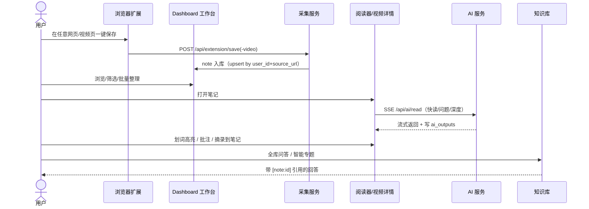

### 1.4 系统能力地图（五层）

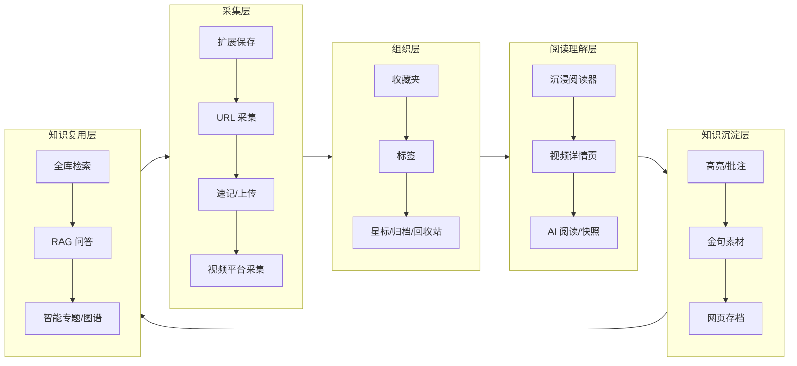

---

## 2. 技术栈与选型分析

### 2.1 实测版本总表

> ⚠️ **偏差提示**：`package.json` 把 `next` / `@supabase/*` 声明为 `"latest"`，实际锁定版本以 lockfile 为准。下表「实测」列来自 `package-lock.json` 与代码特征核对。

| 分层 | 技术 / 库 | 实测版本 | 用途 | 代码依据 |
|---|---|---|---|---|
| Web 框架 | **Next.js**（App Router） | **16.1.1** | 页面、RSC、API Routes、Proxy 中间件 | `package-lock.json`、根 `proxy.ts`（Next 16 用 `proxy.ts` 取代 `middleware.ts`） |
| UI 运行时 | React / React DOM | 19.x | 组件、并发特性 | `package.json` |
| 语言 | TypeScript | 5.x（`strict:true`） | 全栈类型约束 | `tsconfig.json` |
| 样式 | Tailwind CSS | 3.4.x | 原子化样式 + 暗黑模式（class 策略） | `tailwind.config.ts` |
| 组件库 | shadcn/ui（new-york）+ Radix UI | — | 基础组件、无障碍原语 | `components.json` |
| 图标 | lucide-react | 0.511 | 图标 | — |
| 动效 | framer-motion | 12.x | 卡片/弹层/拖拽动画 | — |
| 客户端状态 | **Zustand** | 5.x | 视频详情页全局状态 | `components/video-detail/store.ts` |
| 数据请求 | **SWR** | 2.4 | 轮询（视频状态/marker）、缓存 | hooks 多处 |
| 富文本 | **Tiptap** | 3.24 | 视频详情页「我的笔记」编辑器 + 4 个自定义节点 | `components/video-detail/notes/*` |
| 视频播放 | video.js | 8.23 | 阅读器/视频详情播放器 | `components/reader/ContentStage/VideoPlayer.tsx` |
| 图谱可视化 | @antv/g6 / react-force-graph-2d | 5.0.51 / 1.29 | 知识图谱 | `components/dashboard/knowledge-graph/*` |
| 数据库/认证 | @supabase/supabase-js + @supabase/ssr | 2.89 | Postgres + Auth + RLS + Storage | `lib/supabase/*` |
| 对象存储 | cos-nodejs-sdk-v5（腾讯 COS） | 2.15 | 视频源/封面/帧/转码产物 | `lib/storage/adapters/tencent-cos.ts` |
| 音频分析 | @alicloud/tingwu20230930（阿里听悟） | 2.0 | 视频 ASR / 章节 / 摘要 / QA | `lib/ai-analysis/adapters/tingwu.ts` |
| 语音识别（旧） | tencentcloud-sdk-nodejs-asr | 4.1 | 旧 ASR（逐步被听悟替代） | `lib/services/tencent-asr.ts` |
| 内容抽取 | cheerio / turndown / marked | — | HTML 解析 / HTML→MD / MD→HTML | `lib/services/*` |
| 打包/导出 | jszip / nanoid | — | 批量导出 / 短 ID | — |
| OG 图渲染 | @vercel/og | 0.8 | AI 快照卡片 PNG（1200×1600） | `lib/ai-snapshot/render.tsx` |
| 测试 | **Vitest** | 4.1.6 | 单元 / 行为 / 源码护栏测试（41 文件） | `vitest.config.ts` |
| 扩展 | Vite 6 + Manifest V3 | — | 浏览器扩展（独立子工程） | `extension/` |

### 2.2 关键选型决策

| 决策 | 选择 | 理由（基于代码特征推断） |
|---|---|---|
| 全栈框架 | Next.js App Router 单体 | 页面、API、Server Action、中间件一体；RSC 减少客户端 JS；Vercel 友好。视频 Worker 借 `instrumentation.ts` 同进程启动，省去独立服务。 |
| BaaS | Supabase（Postgres + Auth + RLS + Storage） | **RLS 天然多租户隔离**（`auth.uid() = user_id`）是整个数据安全的基石；Auth cookie 会话由 `@supabase/ssr` 管；避免自建后端。 |
| 数据库 | PostgreSQL（非 NoSQL） | 大量 JSONB（灵活 schema）+ 关系外键 + 全文/GIN 索引 + 生成列（md5 去重）+ 复合唯一约束；复杂关联查询（notes 被 ~15 张表引用）。 |
| 向量检索 | **JSONB 存向量 + 应用层算相似度**（**未用 pgvector**） | `knowledge_note_embeddings.embedding` 为 JSONB 数组，相似度在 Node 层计算。降低部署依赖，代价是规模受限（rebuild 硬上限 400 篇）。 |
| AI 接入 | **OpenAI 兼容 Chat Completions（裸 fetch，非 Vercel AI SDK）** | 统一 `${OPENAI_API_BASE_URL}/chat/completions` + `response_format:json_object`；可切换任意兼容网关（DeepSeek/智谱等）。视频侧另接 DashScope/Qwen-VL、阿里听悟。 |
| 存储 | 抽象层 + 多后端 | `getStorageProvider()` 按 `STORAGE_PROVIDER` 切换 supabase / tencent-cos；视频处理必须用 COS（数据万象 CI 能力）。 |
| 客户端状态 | 阅读器用 `useState`+window 事件总线；视频详情用 Zustand | 阅读器历史上以事件解耦；视频详情页状态复杂（播放/Tab/翻译/标记）故引入 Zustand。 |

> ⚠️ **偏差**：`OPENAI_MODEL` 在代码里的兜底默认值是 **`gpt-4o`**（`lib/services/openai.ts`），而 `.env.example`/`CLAUDE.md` 示例写 `gpt-4o-mini`；`npm run dev` 实际端口是 **3001 / 127.0.0.1**（非 3000）。

---

## 3. 系统架构设计

### 3.1 架构风格

**模块化单体 + BaaS + 同进程后台 Worker + 浏览器扩展**：

- **Web 主体**：Next.js 单体，页面 / API / 服务层 / UI 组件同仓。
- **数据/认证/隔离**：交给 Supabase（Postgres / Auth / RLS / Storage）。
- **长任务**：视频处理以 Node 进程内 `setInterval` 状态机 Worker 调度，入口 `instrumentation.ts`。
- **扩展**：独立 Vite + MV3 子工程，复用主应用 `/api/extension/*`。
- **分层**：Controller（API Routes）→ Service（`lib/services/`、`lib/ai-analysis/`）→ Data（`lib/supabase/`、`lib/storage/`）；前端按业务域分 Dashboard / Reader / VideoDetail / Knowledge / Settings。

### 3.2 顶层架构图

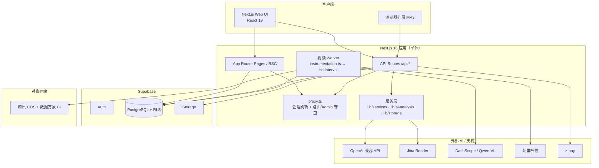

### 3.3 三条主链路

1. **内容入库链路**：URL / 扩展 / 上传 / 速记 → `notes`，再补正文、媒体、标签、文件、`video_jobs`。
2. **阅读与知识链路**：Reader/VideoDetail 展示 → 高亮/批注/笔记 → AI 生成 → 知识检索/聚类。
3. **视频处理链路**：视频 note 关联 `video_jobs` → Worker 状态机推进 download → probe → cover → transcode → audio → frame → visual → reconcile。

### 3.4 关键目录结构（职责说明）

```text
app/
├── page.tsx                      # 落地页
├── auth/                         # 登录/注册/找回/改密/邮件确认/OAuth callback
├── dashboard/page.tsx            # 工作台入口（Server 鉴权 + 会员门禁）
├── notes/[id]/page.tsx           # 阅读页入口（按 content_type 分流到 Reader / VideoDetail）
├── admin/                        # 管理后台（Basic Auth）
├── pricing/ · extension/         # 定价页 / 扩展下载说明页
└── api/                          # 60+ REST/SSE 接口（见 §8）
    ├── capture · upload · upload-cred           # 采集与上传
    ├── extension/*                              # 扩展后端（save/save-video/meta/video-upload-*）
    ├── ai/{read,analyze,chat,snapshot,video/*}  # 文本与视频 AI
    ├── knowledge/{search,chat,topics/*,graph}   # 知识库
    ├── highlights · notes/[id]/{markers,export} # 批注 / 标记 / 导出
    ├── tags/* · settings/* · membership · payment/* · admin/*
    └── ...
components/
├── dashboard/dashboard-content.tsx   # ⚠️ 巨型组件（~6000 行，承载全部工作台逻辑）
├── reader/                           # 图文阅读器（ReaderLayout 三栏 + ContentStage 多视图）
├── video-detail/                     # 视频详情页（Zustand + Tiptap + 事件总线）
├── settings/sections/                # 设置中心 6 个面板
└── ui/                               # shadcn/ui 基础组件
lib/
├── supabase/{client,server,server-service,proxy}.ts  # 4 类 client + 中间件
├── storage/                          # 存储抽象（provider/adapters/keys/url）
├── services/                         # openai/jina-reader/platform-crawlers/html-sanitizer/zpay/membership/knowledge-*
├── ai-analysis/                      # 听悟 + Qwen-VL adapter + provider 接口
├── ai-snapshot/                      # 快照卡渲染（@vercel/og）
├── workers/video-pipeline/           # 视频状态机（scheduler/steps/reconcile/recovery/db）
└── middleware/membership.ts          # requireAIMembership 等门禁
supabase/migrations/                  # 001–029 DDL（schema/RLS/函数/索引）
extension/                            # MV3 浏览器扩展（Vite 子工程）
tests/                                # Vitest 41 文件 / 260 用例
scripts/                              # DB 导出/迁移/视频调试/admin 脚本
```

---

## 4. 核心模块与实现逻辑

> 本章是文档主体。按「认证 → 采集 → 扩展 → 存储 → 阅读 → 视频 → AI → 知识库 → 工作台 → 商业化」的依赖顺序拆解 11 个核心子系统，每个给出**关键文件、核心逻辑、数据流、时序图、风险点**。

### 4.1 认证、会话与权限

#### 4.1.1 四类 Supabase Client（务必区分）

| Client | 文件 | 创建函数 | 用的 Key | 能否缓存 | 使用场景 |
|---|---|---|---|---|---|
| 浏览器 | `lib/supabase/client.ts` | `createClient()` → `createBrowserClient` | publishable | 可（内部单例） | Client Components、事件处理、`useEffect` |
| 请求级服务端 | `lib/supabase/server.ts` | `async createClient()` → `createServerClient` | publishable | **禁止跨请求缓存** | Server Components / Server Actions / API Routes |
| Service-Role | `lib/supabase/server-service.ts` | `createServiceClient()` | `SUPABASE_SERVICE_ROLE_KEY` | 每次 new | **绕过 RLS**：Worker / Admin / 支付回调 / 定时任务 |
| 扩展 Bearer | `lib/auth/verify-extension-auth.ts` | `verifyAuth(request)` | publishable + 注入 `Authorization: Bearer` | 每次 new | 浏览器扩展（Bearer，回退 cookie） |

**为什么服务端 client 不能跨请求缓存**：Vercel Fluid Compute / 无服务器容器会复用进程，缓存实例会保留上一次请求的 cookie store，导致**用户 A 看到用户 B 的数据**（越权）。因此每个请求都重新 `await cookies()` 绑定 cookie 适配器。Server Component 是只读上下文，`server.ts` 的 `setAll()` 用 `try/catch` 静默吞掉写 cookie 的报错，依赖中间件 `getClaims()` 刷新 token。

#### 4.1.2 中间件 / proxy（Next.js 16）

> ⚠️ Next 16 用根目录 **`proxy.ts`** 取代 `middleware.ts`。根 `proxy.ts` 只是薄封装 `return await updateSession(request)`，真正逻辑在 `lib/supabase/proxy.ts`。

`updateSession()` 执行顺序：

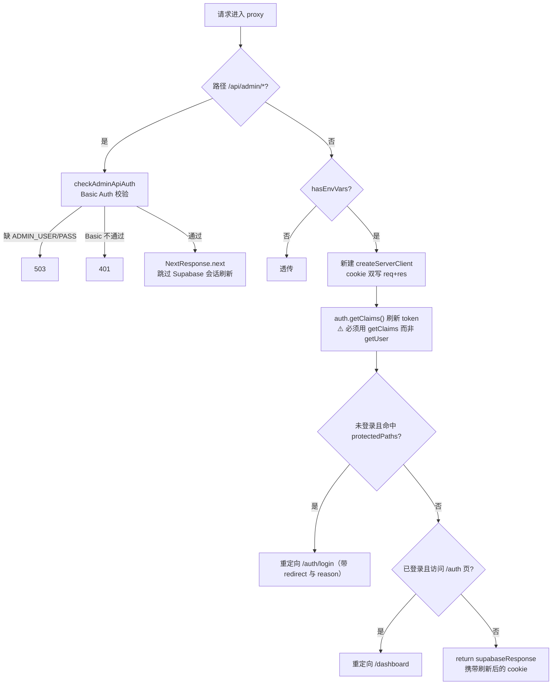

- **`protectedPaths = ["/dashboard", "/protected"]`**（`lib/supabase/proxy.ts`）。
- ⚠️ **关键风险**：`/notes/[id]`、`/knowledge` **不在** `protectedPaths`，中间件层不拦截未登录访问——数据安全**完全依赖 RLS**（按 `user_id` 过滤）。这与 `CLAUDE.md` 宣称「middleware 保护 `/notes/*`」**不一致**。`/protected` 在保护列表但**无对应页面**（改密成功后 `push('/protected')` 会 404）。

#### 4.1.3 Admin 双层鉴权（防御纵深）

`/api/admin/*` 两层校验：① 中间件 `checkAdminApiAuth`；② 路由内部 `verifyAdminAuth` 再校一次。注释明确目的是**防御 CVE-2025-29927（中间件被绕过类漏洞）**。凭据来自单组静态环境变量 `ADMIN_USER`/`ADMIN_PASS`，明文等值比较；前端把 `base64(user:pass)` 存 `sessionStorage`，每个请求显式带 `Authorization` 头。实际用户增删走 `createServiceClient().auth.admin.*`。

#### 4.1.4 会员权限体系

会员判定在 `lib/services/membership.ts`，门禁在 `lib/middleware/membership.ts`：

- `PlanType = "trial" | "pro" | "ai" | "expired" | "none"`；`TRIAL_DAYS = 14`；`PLAN_PRICES = {pro:9.9, ai:19.9}`。
- 数据表 `user_memberships`（`plan_type / expires_at / trial_started_at / last_payment_at / invite_rewarded_days`）。
- `calculateMembershipStatus()` 判定优先级：**已付费优先于试用** → 14 天试用窗口内（试用期 `canAccessPro` 与 `canAccessAI` **均 true**）→ `expired` → 无记录 `none`。

| 门禁函数 | 判据 | 失败响应 |
|---|---|---|
| `requireProMembership()` | `!canAccessPro` | 403 `PRO_MEMBERSHIP_REQUIRED` |
| `requireAIMembership()` | `!canAccessAI` | 403 `AI_MEMBERSHIP_REQUIRED`, `requiredPlan:"ai"` |
| `requireActiveMembership()` | `!isActive` | 403 `MEMBERSHIP_EXPIRED` |

⚠️ **重大权限不一致（强烈建议收口）**：
- **已套 `requireAIMembership` 的端点**（仅文章侧 AI）：`/api/ai/chat`、`/api/ai/read`、`/api/ai/snapshot(/ensure)`、`/api/knowledge/topics`(GET)、`/api/quote-materials/extract`。
- **仅登录、未套会员校验的 AI 端点**：整条**视频 AI 链路**（`/api/ai/video/*` 的 ask/rewrite/translate/enrich/retry/status/init-pipeline）、`/api/ai/analyze`（旧）、`/api/knowledge/chat`、`/api/knowledge/search`、`/api/knowledge/topics/rebuild`、`/api/knowledge/graph/rebuild`、扩展上传链路。这意味着任何登录用户（含试用过期）都能触发**最烧钱的视频下载→转码→听悟 ASR→Qwen-VL** 链路。
- `requireProMembership` / `requireActiveMembership` 与 HOF 包装器 `with*Membership` **定义了但零调用方**。

### 4.2 内容采集（URL / 速记 / 上传 / 平台爬虫）

#### 4.2.1 `POST /api/capture` 统一抓取入口

被两个调用方触发：(a) Dashboard 手动添加 URL；(b) 扩展 `save` 在内容缺失时 fire-and-forget 回调。

- **入参**：`{ noteId, url }`，缺一 `400`。
- **鉴权**：cookie `createClient()` + `getUser()`（无 user `401`）。⚠️ 该路由**只走 cookie，不解析 Bearer**——扩展回调时即使透传 `Authorization` 也不生效，靠请求恰好带 cookie 兜底，否则静默 401（但 note 已存，用户无感）。
- **归属校验**：`notes` 按 `id == noteId AND user_id == user.id` `.single()`，查不到 `404`。

**URL 标准化 + 视频平台识别**（先于抓取，基于 hostname）：

| 平台 | 识别 | 产物 |
|---|---|---|
| B 站 | `bilibili.com` + 正则 `BV[\w]+` / `av(\d+)` | `media_url = https://player.bilibili.com/player.html?bvid=...` |
| YouTube | `youtube.com`/`youtu.be` 取 `?v=` | `media_url = https://www.youtube.com/embed/{id}` |
| 抖音/快手 | `douyin.com`/`kuaishou.com` | `media_url = 原 URL`（不转 embed） |

命中任一 → `content_type = 'video'`。请求头固定 Chrome UA + `Accept-Language: zh-CN`，B 站额外 `Referer`。

**抓取三级降级**（仅 `article`）：

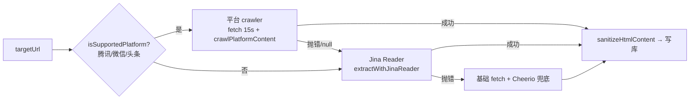

- 写库 `update notes`：`title, excerpt, cover_image_url, site_name, content_text(截5000), content_html, author, published_at, captured_at`，视频补 `media_url`。
- **失败策略**：抓取异常返回 `500 {success:false}`，**note 行不删**（链接保留，可重试），`status` 维持 `unread`。

#### 4.2.2 平台爬虫 `lib/services/platform-crawlers.ts`

`detectPlatform()` 仅识别 **3 个图文平台**（视频平台不在此模块）：

| 平台 | 标题选择器 | 正文选择器 | 防盗链 |
|---|---|---|---|
| 腾讯新闻 `news.qq.com` | `#article-title` | `#article-content`（移除 script/style/.ad） | — |
| 微信公众号 `mp.weixin.qq.com` | `#activity-name` / `h1.rich_media_title` | `#js_content` | **`#js_content img` 全部加 `referrerpolicy="no-referrer"`，`data-src`→`src`** |
| 今日头条 `toutiao.com` | 首个 `h1` | `article.syl-article-base` 等 | — |

`crawlPlatformContent(url, html)` 按平台分发，任一步失败返回 `null` 触发 Jina 降级。时间解析 `parsePublishTime` 支持多种中文日期格式并统一 `+08:00`。

#### 4.2.3 Jina Reader 与 HTML 清理

- **`lib/services/jina-reader.ts`** `extractWithJinaReader(url)`：`GET https://r.jina.ai/{url}`，Header `Authorization: Bearer ${JINA_API_KEY}` + `X-Return-Format: markdown` + `X-Timeout: 15`。返回 `{title, description, content(MD), url, siteName?, author?, publishedTime?}`。错误码映射 401/403/429/5xx/超时。`JINA_API_KEY` 缺失直接 throw。
- **`lib/services/html-sanitizer.ts`** `sanitizeHtmlContent(html)` 五阶段（cheerio，无 JS 执行环境天然防 XSS）：① 移除非内容标签 → ② 移除重复元数据/首个 h1 → ③ 正文定位 `article>main>body` → ④ **属性白名单**（`img` 仅留 `src/alt/title`、`a` 仅留 `href/target/rel`，其余全删，杜绝 `onclick/style/data-*`）→ ⑤ 图片清 class。`formatNewsContent(md)` = `marked.parse(gfm,breaks)` → 再过 sanitize（双重防 XSS）。

### 4.3 浏览器扩展与扩展后端

#### 4.3.1 扩展后端 API 契约

| 端点 | 方法 | 鉴权 | 写库 client | upsert by (user_id,source_url) | 建 video_jobs |
|---|---|---|---|---|---|
| `/api/extension/save` | POST | `verifyAuth`（Bearer/cookie） | RLS client | 是（复活 `deleted_at`） | 否 |
| `/api/extension/meta` | GET | `verifyAuth` | 只读 | — | — |
| `/api/extension/save-video` | POST | cookie `getUser` | **service role** | 是 | **是**（总是新建） |
| `/api/extension/video-upload-cred` | POST | cookie `getUser` | service role | 是 | **是**（含 audio key） |
| `/api/extension/video-upload-done` | POST | cookie `getUser` | service role | 否 | 否（更新现有 job） |
| `/api/extension/download/[target]` | GET | **无鉴权（公开）** | — | — | — |

**鉴权双轨**：`save`/`meta` 用 `lib/auth/verify-extension-auth.ts::verifyAuth`（先 Bearer 后 cookie，返回带 RLS 上下文的 supabase 实例）；视频三路由用 cookie `getUser` + service role 写库。⚠️ 视频三路由**不解析 Bearer**，依赖浏览器同时携带站点 cookie（manifest host_permissions 覆盖 `huasheng.cloud`）。

- **`save`**：按 `(user_id, source_url)` upsert（命中 UPDATE 并 `deleted_at:null` 复活软删），`needsCapture = !content_html || length<100` 时 fire-and-forget 调 `/api/capture`。响应 `{success, noteId, isNew, needsCapture}`。
- **`save-video`（A 路径，服务端下载）**：upsert note（`video_overall_status:'processing'`）+ **总是 INSERT 新 video_jobs**（`download_strategy: recommendedStrategy`）+ 反写 `notes.video_job_id`。
- **`video-upload-cred`（B 路径第 1 步）**：upsert note → `buildStorageKey(videos)` 生成 `cos_key`（DASH 时另签 `audio_cos_key`）→ INSERT video_jobs（`download_strategy:'browser', download_status:'in_progress'`）→ `createUploadCredential` 双轨签发 PUT 凭证（`expiresIn:3600`）。
- **`video-upload-done`（B 路径第 3 步）**：`sizeBytes < 50KB` → `400 video too small`（挡空占位文件）；`provider.exists(cosKey)` 校验 → 置 `download_status:'done'` + 回填 `cos_url`/`notes.media_url`。
- **`download/[target]`**：公开端点，`target ∈ {chrome,edge,firefox,safari}`，**edge 复用 chrome 包**改下载名。

#### 4.3.2 上传与直传链路

| 端点 | 模式 | 说明 |
|---|---|---|
| `/api/upload` | 服务端中转 | 小文件 `multipart`，`getStorageProvider().upload()`，按 MIME `inferKind` |
| `/api/upload-cred` | 签名直传 | 大文件**只签名，浏览器直 PUT COS**（Next 16 + Turbopack `formData()` 对 ~24MB body 会崩） |

`buildStorageKey` 结构：`{userId}/{kind}/{YYYY}/{MM}/{DD}/{nanoid(12)}.{ext}`（`userId` 须匹配 `/^[A-Za-z0-9_-]+$/` 防注入）。MIME 兜底 `resolveContentType`：空或 `octet-stream` 时按扩展名映射，**防 COS 把视频存成 octet-stream 导致只下载不内嵌播放**。

视频 B 路径完整时序：popup 拿双轨凭证 → `sendMessage('video:browser-upload')` 移交 background（popup 可关）→ `fetch(videoUrl)` PUT COS（B 站用 DNR 临时规则注入 Referer）→ `reportUploadDone` 触发 pipeline → COS CI `<AudioMix>` 合流 DASH 音视频。

#### 4.3.3 扩展工程概览（`extension/`）

- **构建**：Vite 6 + MV3，三入口 `popup / background(service-worker) / content`，`closeBundle` 生成 `dist-chrome/firefox/safari` 三套；`host_permissions` 按 `VITE_SUPABASE_URL` 动态 patch（支持自托管）。
- **目录**：`popup/`（6 视图：Login/Save/VideoSave/Success/Settings + Folder/Tag Picker）、`background/`（contextMenus + 快捷键 `Ctrl/Cmd+Shift+S` + 消息路由 + B 路径上传 + DNR）、`content/`（图文 DOM 抽取 + 5 个视频提取器）、`shared/`（api/auth/storage/constants/theme）。
- **图文抽取** `content/extractor.ts` 三级：语义标签 → 内容 class（含中文站）→ 文本密度打分。图片加 `referrerpolicy=no-referrer`。
- **视频提取器**（`video-extractors/`）：`bilibili / douyin / kuaishou / weibo / weixin-channel`（视频号未实现，占位）。B 站最复杂，三级抽链（`__playinfo__` → `__INITIAL_STATE__` + playurl API → URL 解析），DASH 分轨，`recommendedStrategy:'browser'`。
- **DNR 防盗链**：常驻规则给 `*.hdslb.com`（B 站图床）注入 Referer；临时规则 `withRefererRule` 在视频直链下载期间注入 Referer，完成后撤销。

### 4.4 存储抽象层

`lib/storage/` 把所有对象存储写入统一到 `getStorageProvider()`，按 `STORAGE_PROVIDER`（默认 `supabase`）切换后端，单例缓存。

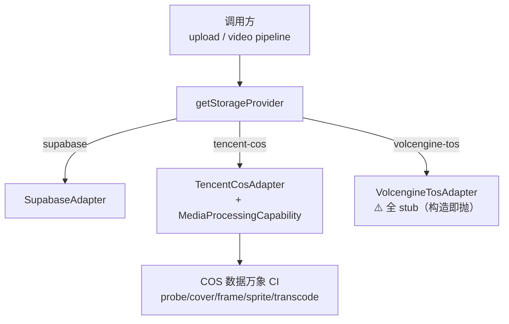

- **统一接口** `StorageProvider`：`upload / createUploadCredential / getPublicUrl / delete / exists`。
- **媒体处理能力** `MediaProcessingCapability`（**仅 COS 实现**）：`probe / generateSmartCover / extractFrames / generateSpriteSheet / submitTranscode / getTranscodeStatus`。运行时 `hasMediaProcessing(p)` 鸭子类型探测。
- **三后端差异**：Supabase（基础 CRUD，无 CI）/ Tencent COS（全功能 + CI 媒体处理）/ Volcengine TOS（**全 stub，选用会直接抛错**）。
- **老链接兼容** `identifyStorageBackend(url)`：按 hostname 严格判定 `supabase` / `tencent-cos` / `external`，防路径注入。
- ⚠️ **公开 vs 私有**：对象**一律 public-read + nanoid 不可猜路径**，暂不支持私有签名读 URL（设计有意，敏感内容需注意）。上传走 1h 签名 PUT 凭证。
- ✅ 抽象层迁移彻底：全仓除 adapter 自身外**无任何** `supabase.storage.from(...)` 直调。

### 4.5 沉浸式阅读器（图文）+ 高亮批注

> 适用 `content_type ∈ {article, audio}`；`video` 在 `ReaderPageWrapper` 分流到 `VideoDetailLayout`（见 4.7）。

#### 4.5.1 入口与鉴权链路

```
app/notes/[id]/page.tsx                       （Server Component，仅透传 params）
  └─ NoteDetailAuthCheck                       （Server，getUser + 取 note/folder/video_job + 软删拦截）
       └─ ReaderPageWrapper                    （Client，按 content_type 分流）
            ├─ video → VideoDetailLayout
            └─ 其它 → ReaderLayout
```

⚠️ **确认的性能问题（双重取数）**：`NoteDetailAuthCheck`（Server）已查完整 `note + folder + video_job`，但 **return 体只渲染 `children`，把查询结果丢弃**；`page.tsx` 也未把 `initialNote` 传给 `ReaderPageWrapper`，于是 wrapper 客户端 `loadNote()` **再次执行完全相同的大查询**（含整篇 `content_html`、视频大 JSONB）。每次进入 `/notes/[id]` 至少 2 次相同大查询 + 2 次 `getUser()`。`ReaderPageWrapper` 已预留 `initialNote/initialFolder/userId` props 与优化分支，但调用方从未传入（死代码）。修复成本极低。

#### 4.5.2 三栏布局与视图

- `ViewType = "reader" | "web" | "ai-brief" | "archive"`；`RightPanelTab = "annotations" | "ai-analysis" | "transcript"`。⚠️ 命名错位：`ai-brief` 在 UI 显示「AI快照」，`ContentStage` 把它渲染成 `AISnapshotView`（同一东西三套叫法）。
- 状态全用 `useState`（无 Zustand）+ **window 事件总线**解耦。左栏大纲 `< lg` 隐藏；右栏三态宽度（折叠 `w-0` / 紧凑 `60px` / 展开 `380px`）；禅模式 `Esc` 退出。
- `ContentStage` 子视图：`ArticleReader`（`dangerouslySetInnerHTML` + 注入高亮 `<mark>`）/ `WebView`（iframe，但 ViewSwitcher 对 `web` 实际 `window.open` 新标签）/ `AISnapshotView`（AI 快照卡轮询）/ `ArchiveView`（⚠️ **空壳 TODO**，`web_archives` 表已建未接 API）。

#### 4.5.3 划词 → 高亮 → 批注（核心：全局字符偏移方案）

`ArticleReader` 不依赖浏览器 Range 序列化，而是自研「全局字符偏移」：

1. `getNormalizedTextEndpoints(range)` 规整端点到 Text 节点。
2. `getGlobalOffset()` 用 `TreeWalker(SHOW_TEXT)` 累加算出整篇正文纯文本中的 `globalStart/globalEnd`。
3. `createHighlightRecord()`：若偏移无法计算 → **直接中止**（避免「列表有、正文渲染不出」的坏数据）；乐观插入临时高亮 → `POST /api/highlights`（`range_data:{globalStart,globalEnd,...}` + 冗余 `range_start/range_end` 列）。
4. 回显 `buildHighlightedHtml()`：`DOMParser` 离屏解析，按全局偏移在每个 Text 节点上算 overlap，**从后往前**逐段包 `<mark id="highlight-{id}">`；偏移失效时用 `quote` 在全文 `indexOf` 兜底。

⚠️ 风险：每次 `highlights` 变化都对整篇 `content_html` 重新 `DOMParser` + TreeWalker（长文 O(n·m)）；正文被重新抓取/改写会导致高亮整体漂移。

**highlight ≠ annotation**：高亮是选区+颜色（`highlights` 表）；批注是挂在高亮上的文字（`annotations` 表，`highlight_id` FK CASCADE）。⚠️ **架构不一致**：高亮「增」走 `/api/highlights`（服务端校验归属，403），但「查/改/删」与批注 CRUD 在组件里**直接 client 直连 Supabase**（仅靠 RLS），同一资源两套访问方式。

#### 4.5.4 导出 API

`GET /api/notes/[id]/export?format=md|srt|json`：

| format | 内容 |
|---|---|
| `srt` | **纯字幕**（`audio.transcript[]` → `HH:MM:SS,mmm`），无 transcript 则空 |
| `json` | **完整备份**：整行 notes（含 `content_html`、`user_notes`、关联 `video_job.*`） |
| `md`（默认） | 标题 → 链接 → 关键词 → 概要 → 章节 → 逐字稿 → **`## 我的笔记`（`user_notes` Tiptap JSON 转 MD）** |

⚠️ **导出以视频为中心**：md/srt 主体来自 `video_job.audio_result`。纯图文 article 的 **`content_html` 正文与 highlights/annotations 高亮批注没有任何导出通道**（json 含正文但不含批注关联表）。

> ⚠️ **`app/api/notes/[id]/route.ts` 不存在**：note 的星标/移动/改信息/删除全走 **client 直连 Supabase**（依赖 RLS）。阅读页 ActionMenu 的「删除/归档」是 TODO 桩（只 toast「即将上线」），真正软删除（`deleted_at`）在 Dashboard。`reading_progress` 表与 `upsert_reading_progress` RPC **已建未用**（图文阅读器不写进度，只写 `note_visit_events` + `last_accessed_at`）。

### 4.6 视频处理流水线（Worker 状态机）⭐

> 本系统最复杂的子系统：Next.js **同进程** `setInterval` 状态机 Worker，驱动 `video_jobs` 表，调用腾讯云 COS CI（下载/探测/封面/抽帧/转码）、阿里听悟（音频 ASR）、Qwen-VL（视觉）。代码在 `lib/workers/video-pipeline/`。

#### 4.6.1 状态机全貌

每条视频笔记 = 一行 `video_jobs`，各 step 独立 `*_status` 列（取值见 §5）。**`overall_status` 不在 `video_jobs`**，而是聚合写在 `notes.video_overall_status`。

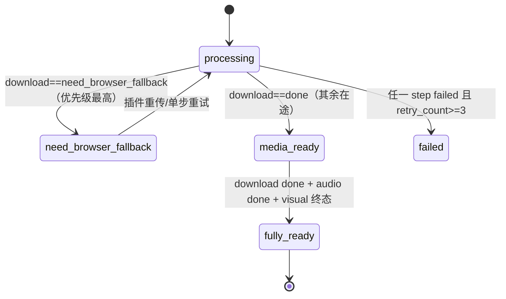

`computeOverall()`（`reconcile.ts`）优先级：① `download==need_browser_fallback` → `need_browser_fallback`（**最高，即使 retry≥3**）→ ② `retry_count>=3 && 任一 step failed` → `failed` → ③ `download done && audio done && visual∈{done,failed,skipped}` → `fully_ready`（写 `video_ready_at`）→ ④ `download done` → `media_ready` → ⑤ `processing`。**关键设计：visual 的 failed/skipped 永不阻塞 `fully_ready`**。

#### 4.6.2 调度与并发

- **入口**：`instrumentation.ts` 的 `register()` 在 `NEXT_RUNTIME==='nodejs'` 时 `startVideoWorker()` → `runRecovery()` → `startScheduler()`。
- **调度** `scheduler.ts`：`setInterval(tick, VIDEO_WORKER_INTERVAL_MS||10000)`，`BATCH_SIZE = VIDEO_WORKER_BATCH_SIZE||5`，`running` 布尔防重入。`processJob` 顺序跑 download → probe+cover → transcode → audio → frame → visual，**每步独立 try/catch（错误隔离）+ 步间 `refetchJob`**，末尾 `reconcileJob`。
- **恢复** `recovery.ts`：启动时把 `in_progress` 超 30min 的 step 重置 `pending`；**audio 特殊**（30min 不重置，避免丢听悟 `task_id`，超 24h 才标 failed）。
- ⚠️ **多实例无强锁**：仅「进程内 `running` 串行 + staleness 软锁（download 30min / probe 10min）」，**无 `SELECT FOR UPDATE SKIP LOCKED` / 无 lease 列**。多副本部署会并发处理同一 job（重复上传/抽帧/提交 ASR 浪费配额）。**单实例场景无虞**。
- ⚠️ **`retry_count` 是 job 级全局计数（非 per-step）**：任一 step 失败共享自增，3 次后整 job 判 `failed`；单步 `?step=` 重试会清零全局 `retry_count`，影响其他 step 退避基数。指数退避 `next_retry_at = now + 2^retry_count 分钟`。

#### 4.6.3 各 step 实现要点

| step | 文件 | 前置 | 核心逻辑 | 写回 |
|---|---|---|---|---|
| download | `step-download.ts` | `download_strategy != browser` | `fetch(source_video_url, headers)` → 上传 COS。**HTTP 403 → `need_browser_fallback`（不计 retry）** | `cos_key/cos_url/size_bytes` |
| probe+cover | `step-probe-and-cover.ts` | download done | COS CI `?ci-process=videoinfo` 探测 + `snapshot` 封面（cover 独立于 probe 成败）。无 CI → `skipped` | `probe_data`、`notes.media_duration`、`cover_url` |
| transcode | `step-transcode.ts` | probe done | **仅当 `isH264 && isMp4容器 && !needsAudioMix` 才 `skipped`**；否则 COS CI 转 H.264/mp4（DASH 时 `<AudioMix>` 合流）。**只写 `transcoded_key/url`，绝不覆盖 `cos_key`** | `transcode_*`、done 时 `notes.media_url=transcoded_url` |
| audio | `step-analyze-audio.ts` | download done **且 `transcode_status ∈ {done,skipped}`** | 阿里听悟两阶段（submit → poll）。必须等转码终态（DASH 原始 m4s 无音轨，提前提交会被听悟永久打回） | `audio_task_id`、`audio_result`(JSONB) |
| frame | `step-extract-frames.ts` | download done + probe done + transcode 终态 | 优先按 `audio_result.chapters` 中点抽帧（≤20），兜底等间隔；逐帧容错 | `frames`(JSONB) |
| visual | `step-analyze-visual.ts` | frame done | Qwen-VL 分析所有帧。`VISUAL_ANALYSIS_PROVIDER=none` → `skipped`。**失败不抛、不计 retry、不阻塞 fully_ready** | `visual_result`(JSONB) |

**transcode 防腐三重保护**（done 时）：① 守卫 `transcoded_key` 仍存在 → ② `storage.exists()` HEAD 校验产物真实可访问（CI 偶发「返回 Success 但产物缺失」）→ ③ 只写 `transcoded_url`，**不覆盖原始 `cos_key`**（否则 CI 假成功会导致原始可用文件丢失、整 job 不可逆自损）。下游 step 一律「优先 `transcoded_*`，缺失回退 `cos_*`」。

#### 4.6.4 听悟音频适配器（`lib/ai-analysis/adapters/tingwu.ts`）

- ROA 风格 OpenAPI 签名调用（`@alicloud/openapi-client`），`CreateTask`（offline）→ `GetTaskInfo` 轮询。
- `capabilities → 听悟参数`：`transcript→DiarizationEnabled`、`chapters→AutoChaptersEnabled`、`summary→Summarization.Types+=Paragraph`、`key_points→MaxKeywords=10`、`qa→Summarization.Types+=QuestionsAnswering`。
- **Format 必须显式声明**（`inferTingwuFormat` 按 URL 后缀），否则 COS AudioMix 合流的 mp4 会被听悟误判 `TSC.AudioSampleRate`。
- 结果映射 → `AudioAnalysisResult`：`{transcript[], chapters[], summary, keyPoints[], qaPairs[], speakers?, keywords?, speakerSummaries?}`。`keyPoints` 同时映射到 `keywords`；真实 API 把结果字段写成指向 OSS 的 URL，`resolveResultField` 会 fetch 解包；时间 ms→s。
- env：`AUDIO_ANALYSIS_PROVIDER(默认tingwu)`、`ALI_TINGWU_APPKEY`、`ALIBABA_CLOUD_ACCESS_KEY_ID/SECRET/REGION`。

#### 4.6.5 视觉分析（`lib/ai-analysis/adapters/qwen-vl.ts`）

DashScope multimodal-generation，一次请求把所有帧作为多模态数组送入，model `DASHSCOPE_VISION_MODEL(默认qwen-vl-max)`。prompt 要求每帧返回 `{sceneDescription, entities[], onScreenText?}` JSON。三级容错解析（直接 parse → 正则抓数组 → 回退「画面理解暂不可用」）。env：`VISUAL_ANALYSIS_PROVIDER`、`DASHSCOPE_API_KEY`。

#### 4.6.6 视频 AI 接口（`/api/ai/video/*`）

均「cookie `getUser` 鉴权 + service role 读写」，⚠️ **无会员门禁**。

| 接口 | 作用 |
|---|---|
| `GET [jobId]/status` | 7 step 状态 + cover + errors + retryCount（⚠️ 未透出 transcode_error/frame_error） |
| `POST [jobId]/retry[?step=]` | 单步/批量重置 failed step 为 pending，清零 retry_count |
| `POST [jobId]/enrich[?fields=keywords,qa,speakers]` | **LLM 兜底补全**听悟没给的字段（`qaPairs` 含 `anchorTime`，`speakerSummaries` 听悟完全不产出），写回 `audio_result` |
| `POST ask` | 基于 transcript 的 QA（超长先 `summarizeTranscript` 压缩），DashScope text-generation，不落库 |
| `POST rewrite` | 笔记文字改写（4 风格） |
| `POST translate` | 字幕批量翻译（每批 30 段，编号保序，失败回退原文） |
| `POST note/[noteId]/init-pipeline` | 补建/修复流水线（文件已在 COS 但无 job），从 probe 起跑 |

⚠️ **`audio_status` CHECK 缺 `skipped`**：migration 023 的 CHECK 仅 `pending/in_progress/done/failed`，但 `step-analyze-audio.ts` 无音频流时会写 `skipped` → **触发 DB CHECK 约束违反**（其他 step 都含 skipped，唯独 audio 漏了）。属潜在 bug。

### 4.7 视频详情页（VideoDetailLayout）

> `ReaderPageWrapper` 在 `content_type==='video'` 时分流到 `components/video-detail/VideoDetailLayout.tsx`，完全脱离 `ReaderLayout`。这是近期重点开发的功能，用 **Zustand + Tiptap + window 事件总线**。

#### 4.7.1 布局

CSS Grid 三栏 + 底部 MiniPlayer，响应式：

```
grid-cols-1                          // 移动端单列
lg:grid-cols-[56px_1fr_420px]        // 桌面
2xl:grid-cols-[64px_1fr_480px]       // 超宽
```

- 左 `LeftToolbar`（返回/收藏/导出，`< lg` 隐藏）
- 中 `TopBar`（标题编辑 + 搜索/翻译/音频模式/标记筛选/摘取/发言人/分析进度）+ `MainStage`（VideoPlayerCard + KeyframesGallery）
- 右 `RightPanel` 4 Tab（速览/原文/问答/笔记，**全部常驻挂载**，靠 `hidden` 切换以保留 Tiptap 实例与滚动状态）
- `< lg`：`MobileTabBar` 底部 5 tab + `MobileSheet` 抽屉复用同一批面板组件

#### 4.7.2 Zustand store（`store.ts`）

无 persist，但 `activeTab` 手动同步 `sessionStorage`。核心 state：`currentTime / isPlaying / activeTab('brief'|'transcript'|'qa'|'notes') / activeBriefSubTab / miniPlayerVisible / audioMode / audioOverrides(enrich 临时覆盖) / selectedSpeakers(Set) / notesEditor(Tiptap 实例引用) / showMarkedTranscriptOnly / selectedTranscriptMarkerKinds / search* / translation* / mobileSheetOpen`。

#### 4.7.3 视频事件总线（window CustomEvent）

store 不直接持有 player，全部走 window 事件解耦。唯一消费方是 `components/reader/ContentStage/VideoPlayer.tsx`（Video.js）。

| 事件 | payload | 作用 |
|---|---|---|
| `video:seek` | `{time, autoplay:'preserve'\|'force'\|'none'}` | 跳转（force 必播 / preserve 维持 / none 必停） |
| `video:timeupdate` | `{time}` | VideoPlayer **250ms 节流**广播 → 写 `store.currentTime` |
| `video:state` | `{paused}` | play/pause → 写 `store.isPlaying` |
| `video:toggle-play` / `video:set-rate` | — / `{rate}` | MiniPlayer → VideoPlayer |

`useVideoSeek` 封装 `seek`(preserve)/`seekAndPlay`(force)/`seekOnly`(none)。

#### 4.7.4 Tiptap 笔记编辑器

- `notes/editor-config.ts`：StarterKit + Underline + Highlight + TextStyle + Color + Image + Table + Placeholder + CharacterCount + **4 个自定义节点**。
- ⚠️ **实为 4 个自定义节点**（CLAUDE.md 写「3 个」已过时）：`TimeReference`（块级原文摘录引用，时间戳可点击 seek）、`KeyframeReference`（关键帧缩略图引用）、**`AnnotationReference`（已实现，唯一用 React NodeView + SWR 拉 annotations 表，CLAUDE.md 标「P1 未实现」过时）**、`Timestamp`（行内时间戳，`insertTimestamp` 命令）。
- SSR 安全：`useEditor({ immediatelyRender: false })`。时间戳点击委托：容器 `onClick` → `closest('[data-time-jump]')` → `seekAndPlay`。

#### 4.7.5 笔记自动保存（`hooks/useAutoSave.ts`）

- `onUpdate` → 立刻写 localStorage 草稿 → 防抖 **1500ms** → `persist()`。
- **乐观锁冲突检测**：保存前比对远端 `user_notes_updated_at`，若别处改过 → `conflict` 态弹 `ConflictDialog`（覆盖/重载/取消）。
- **指数退避重试** 3 次（1s/2s/4s），超过标 `failed`。⚠️ **绕过 API 路由，直接 client `createClient()` 读写 `notes.user_notes`**（依赖 RLS）。

#### 4.7.6 摘录链路与标记

- **摘录**：原文 Tab 选中文字 → `shared/SelectionMenu`（选区落在 `[data-marker-target=transcript]` 段内才显示）→「摘录到笔记」→ `useExcerpt` 切笔记 Tab → 插入 `TimeReference` 节点 → `animate-excerpt-pulse-once` 闪烁。
- **标记**：`hooks/useMarkers.ts`（SWR `/api/notes/[id]/markers`）。**表缺失降级 localStorage 兜底**。乐观增删 + 失败回滚。`transcript_markers` 三类（重点/问题/待办）× 三目标（transcript/qa/speaker）。

#### 4.7.7 各 Tab

- **速览 `BriefPanel`**：关键词 chip + 概要 + 子 Tab（章节 `ChaptersTab` 当前章节高亮 / 发言人总结 `SpeakerSummaryTab`，可 enrich）。
- **原文 `TranscriptPanel`**（最复杂）：逐字稿 + 当前播放高亮 + 自动滚动（用户手动滚 5s 内暂停跟随）+ 发言人/标记筛选 + 搜索高亮 + 选段 inline 标记 + 双语翻译。
- **问答 `QATab`**：Q/A 卡片，`anchorTime` 可点击 seek，可 enrich 生成。
- **笔记 `NotesPanel`**：Tiptap + 工具栏 + SaveIndicator + AIRewriteDialog。

#### 4.7.8 分析进度（`hooks/useAnalysisProgress.ts`）

SWR 轮询 `/api/ai/video/{jobId}/status`，**全部 7 step 终态（done/failed/skipped）后返回 0 停止轮询**，否则 5s。`overallPercent` 把 failed 计入（否则卡 ~83%）。`isComplete` 后只触发一次 `reader:refresh-content` 让外层重拉落库数据。

**设计语言**：全程项目 token（`bg-card/40 backdrop-blur-xl` 玻璃 / `border-border/50`）+ 蓝色 accent（`text-blue-600 dark:text-blue-400`）+ 标记三色（sky/rose/amber）+ 说话人五色渐变，亮/暗全覆盖，无紫色。

### 4.8 AI 文本能力（阅读 / 快照 / 对话）

> 统一底座：所有文本 AI 走 **OpenAI 兼容 Chat Completions（裸 `fetch`，非 Vercel AI SDK）**，`response_format:json_object`（流式除外），单模型 `OPENAI_MODEL`（代码兜底 `gpt-4o`）。

#### 4.8.1 `/api/ai/read`（主入口，SSE）

`POST {noteId, force?}` → `text/event-stream`。`requireAIMembership` 门禁。

| 顺序 | event | data |
|---|---|---|
| 1 | `meta` | `{noteId, estimatedReadTimeMinutes}` |
| 2（条件） | `cached` | DB 命中先回 `{summary, key_questions, journalist_view, timeline}` |
| 2.5 | `done {cached:true}` | `!force && 完整` → 零 AI 调用直接结束 |
| 3-8 | `progress` / `fast_read` / `key_questions` / `deep_analysis` | 三阶段串行生成 |
| 9 | `warn` / `done` | 写库失败仅 warn 不阻断 |

`hasCompleteAnalysis()` 判定：`summary` + `key_questions[]` + `journalist_view.deep_read.overview` + `timeline[]` 同时非空。⚠️ 前端 `applyStreamEvent` **只处理** `cached/fast_read/key_questions/deep_analysis/warn/error`，`meta/progress` 被忽略（进度提示未落地 UI）。

**写 `ai_outputs`（upsert onConflict note_id）**：`summary`、`key_questions`、`journalist_view`（合并 `{fast_read, deep_read, key_questions_missing}` 嵌进同一 JSONB）、`timeline`。⚠️ **`model_name/provider/model_version` 审计列从不填充**（始终 NULL）。

#### 4.8.2 `openai.ts` 函数

| 函数 | 截断 | temp | 输出 |
|---|---|---|---|
| `generateFlashRead` | 15000 | 0.2 | `{hook(<=50字), takeaways[3-5], sentiment, read_time_minutes}` |
| `generateKeyQuestions` | 15000 | 0.3 | `{questions:{q,a,evidence?}[3], missing[]}` |
| `generateDeepAnalysis` | 15000 | 0.25 | `{overview, background[], stakeholders[], implications[], risks[], watchpoints[], timeline[]}` |
| `chatWithAI`（流式） | 10000 | 0.5 | 透传 OpenAI 原生 SSE |
| `generateAIAnalysis`（`@deprecated`） | 15000 | 0.3 | 旧 summary/journalist/timeline |

私有底座 `callOpenAIJson`：`baseUrl` 去尾斜杠、`model` 默认 `gpt-4o`、缺 key 抛错、`!ok` 抛错。

#### 4.8.3 旧入口与对话

- ⚠️ **`/api/ai/analyze`（旧）**：只 `getUser` 登录校验，**缺 `requireAIMembership`**；`journalist_view` 结构与 read 不兼容（`onConflict:note_id` 互相覆盖风险）；**无前端调用方（死代码）**，但仍可被直接 POST 命中绕过会员门禁。
- **`/api/ai/chat`**：`requireAIMembership` + 透传 OpenAI 原生 SSE，**对话零持久化**（刷新即丢，仅前端 state）。

#### 4.8.4 AI 快照

- 两表 `ai_snapshots`（`content_hash` SHA-256 去重，状态 generating/ready/failed）+ `ai_snapshot_renders`（`(snapshot_id, template)` 唯一）。
- `GET /api/ai/snapshot`（只查不生成）+ `POST /api/ai/snapshot/ensure`（**三步状态机**：ensure row → ensure card_data（202 让客户端轮询防重复调 AI）→ ensure renders（首次插入者一次性渲染 business/deep/social **三张 1200×1600 PNG**））。均 `requireAIMembership`。
- `generateSnapshotData`（`lib/services/snapshot.ts`，独立 `callOpenAIJson` 副本）→ `{one_liner, bullet_points[3], sentiment(emoji), key_stat?}`。
- ⚠️ 旧 `/api/snapshot/route.tsx` 缺会员门禁（孤儿路由，前端未引用，但可被直接 POST 绕过）。**无真正的公开匿名分享路由**。

#### 4.8.5 成本与降级

- 截断（15000/10000）+ 缓存（`ai_outputs` 四要素 / `content_hash` 指纹）。
- ⚠️ **429/超时无专门处理**：`callOpenAIJson` 对所有 `!ok` 一律抛错，`fetch` **无 AbortController/timeout/重试/退避**。AI 失败不影响原文阅读（右栏独立面板与正文解耦）。
- ⚠️ `/api/ai/read` 顶部有 env-probe `console.log` 打印 key 长度等信息，上线前应移除。

### 4.9 知识库（检索 / 问答 / 智能专题 / 图谱 / 金句）

> 成熟度梯度：**金句素材 / 智能专题（已闭环）> 问答（可用，但持久化在前端 + dev 风险）> 检索 API（后端可用但无 UI 接入）> 知识图谱（最低，UI 默认 mock）**。

#### 4.9.1 检索 `/api/knowledge/search`

跨 5 源**并发 ilike 关键词匹配**（⚠️ 非全文检索、非向量召回）：`notes`(12) / `highlights`(16) / `annotations`(16) / `transcripts`(6) / `ai_outputs`(10)，均 `.eq(user_id)`。评分 = `kindWeight × (1+命中次数)`（annotation 1.4 > highlight 1.3 > transcript 1.15 > ai_output 1.0 > note 0.9）。⚠️ **当前无前端调用方**（已实现未接入）。

#### 4.9.2 问答 `/api/knowledge/chat`（RAG）

取最后一条 user 消息检索 → `buildKnowledgeSystemPrompt` 拼前 12 条 evidence（截 12000 字）→ `fetch chat/completions`（`stream:true, temp:0.4`）→ **透传 OpenAI SSE，后端不落库**。引用格式 `[note:<uuid>]`。**对话历史/反馈由前端 `knowledge-view.tsx` client 直写** `knowledge_conversations/knowledge_messages`（`rating` 赞/踩）。⚠️ 风险：① **未套会员校验**；② dev helper `readEnvLocalOpenAIKeyLast4()` 在非生产环境 `fs.readFileSync` 读项目根 `.env.local` 并在响应回显 key 末 4 位。

#### 4.9.3 智能专题（重点，`lib/services/knowledge-topics.ts`）

`rebuildTopicsForUser` 全流程：

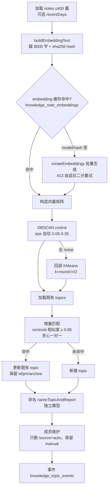

- **embedding 增量缓存**：仅 model/content_hash 变才重算；存 `knowledge_note_embeddings.embedding`（JSONB）。
- **手动状态保留机制**：archived topic 不参与匹配（不会被自动复活）；pinned 在匹配排序优先；既有 topic id 复用 → pin/archive/标题保留；成员重建只删 `source='auto'`。
- env：`KNOWLEDGE_EMBEDDING_*`（回退 `OPENAI_*`，默认 `text-embedding-3-small`，`baseUrl=local` 或 404 时降级 384 维 sha256 hashing，仅 demo）、`KNOWLEDGE_TOPIC_NAMING_*`、`KNOWLEDGE_TOPIC_MATCH_THRESHOLD(0.85)`。
- **`nightly-refresh`**：鉴权 `KNOWLEDGE_CRON_SECRET`（`Authorization: Bearer` 或 `x-cron-secret`）+ service role；按近期活跃用户逐个 rebuild + 自动归档 30 天无新增的非置顶 topic。
- topics 操作 API：`[id]/members`（add/remove/confirm/exclude/set_time）、`pin`、`archive`、`merge`、`report`、`recluster`（= rebuild 别名）。⚠️ 仅 `topics`(GET) 接了 `requireAIMembership`，其余仅 `getUser`。

#### 4.9.4 知识图谱（最低成熟度）

`extractGraphFromText`（LLM 抽实体/关系，限定 `PERSON/ORG/GPE/EVENT/TECH/WORK_OF_ART`）→ 写 `knowledge_entities/relationships/note_entities`。⚠️ **rebuild API 无前端入口**（只能手动 POST，取最近 10 篇）；**UI 默认 mock 数据**（`KnowledgeGraphView` 「加载演示数据」）；relationships 无去重唯一键（重复 rebuild 产生重复边）；实体匹配用字符串拼接 `.or(name.eq..,aliases.cs..)` 有注入隐患。

#### 4.9.5 金句素材（已闭环）

- 表 `quote_materials`：`content_hash = md5(content)` **生成列** + 3 个部分唯一索引去重。
- `GET/POST/DELETE /api/quote-materials`（仅 `getUser`）+ `POST extract`（**`requireAIMembership`**，LLM 抽取 + `isVerifiedQuote()` 强校验：必须是原文连续子串，杜绝改写幻觉）。

### 4.10 Dashboard 工作台与内容库

#### 4.10.1 入口与门禁

`app/dashboard/page.tsx` → `DashboardAuthCheck`（**Server**）：`getUser` → `getMembershipStatus`，新用户（`plan_type==='none'`）`initializeTrialWithClient` 初始化 14 天试用，仍 inactive → `redirect("/pricing?reason=...")`。⚠️ 残留 `console.log` 打印 user.id + 完整会员 JSON。

#### 4.10.2 巨型组件 `dashboard-content.tsx`（⚠️ ~6000 行）

单文件承载全部工作台逻辑，60+ `useState`。⚠️ **技术债**：关注点混杂（导航/列表/标签树/收藏夹树/批量/弹窗/设置分发），建议按域拆分。

- **一级导航**：`collections / tags / annotations / archive / knowledge / settings`。
- **列表分类**：`uncategorized / folder / all / starred / today / smart`（计数并发 count + RPC `count_untagged_notes`）。
- **视图模式**（localStorage 持久）：`compact-card / detail-list / compact-list / title-list / detail-card`。
- **无限滚动**：两处 IntersectionObserver（笔记列表 / 标注列表）。
- **批量操作**：star / 移动 / 标签 / 归档（软删 `archived_at`，乐观更新）/ 删除（软删 `deleted_at`）/ 复制内容（TXT/MD/HTML）/ 导出（单文件直存，多文件 JSZip）/ 复制链接。
- **添加笔记弹窗**：3 Tab `url/quick/upload`（上传走 `video-upload-cred` → PUT COS）。
- **笔记关联**：`note_tags(tags(...))` / `folders(name)` / `highlights(count)` 嵌套 select，**不依赖 `/api/notes/[id]`**（该路由不存在）。
- **实时性**：标签/收藏夹不用 Realtime channel，各 CRUD 后命令式 `loadTags()` + `refreshTrigger` 重拉。
- **防盗链**：``。

#### 4.10.3 标签与目录 API

| 端点 | 行为 |
|---|---|
| `GET/POST /api/tags` | 列表（含 `note_tags(count)`，向后兼容 fallback）/ 创建（同父同名 409） |
| `PATCH/DELETE /api/tags/[id]` | 改名查重 + **循环引用检测** / 删除（有子或有关联 400，`force` 级联） |
| `POST /api/tags/[id]/archive` | 软归档 `archived_at` |
| `POST /api/tags/reorder` | 同级重排 |

⚠️ **确认 Bug（`tags/reorder`）**：siblings 查询 `.select("id, position")` **漏了 `parent_id`**，导致非根父级重排时 `s.parent_id` 恒 `undefined`，同级过滤恒按 `null` 比对 → position 串位。根级拖拽恰好不受影响掩盖了缺陷。修复：select 加 `parent_id`。

### 4.11 设置中心、会员与支付、管理后台

#### 4.11.1 设置中心 API

| 端点 | 内容 |
|---|---|
| `GET /api/settings/stats` | 9 项并发统计：入驻天数 / notes·folders·tags·annotations·visits 计数 / 内容类型分布 / 字数 / Top 域名 / **AI token 估算**（CJK×1.1 + 非CJK/4，递归遍历 `ai_outputs`+`ai_snapshots`） |
| `GET /api/settings/trash` + `[id]/restore` + `[id]/delete` | 回收站（`deleted_at` 非空），永久删除前校验「必须在回收站」 |
| `GET /api/settings/referral/me` + `POST redeem` | 邀请码（8 位去混淆字符），兑换：`GRANT_DAYS=7`，邀请人上限 `INVITE_CAP_DAYS=49`，每账号仅兑换一次（DB 唯一约束）。⚠️ 多步发放无事务 |

#### 4.11.2 支付会员链路（重点，z-pay）

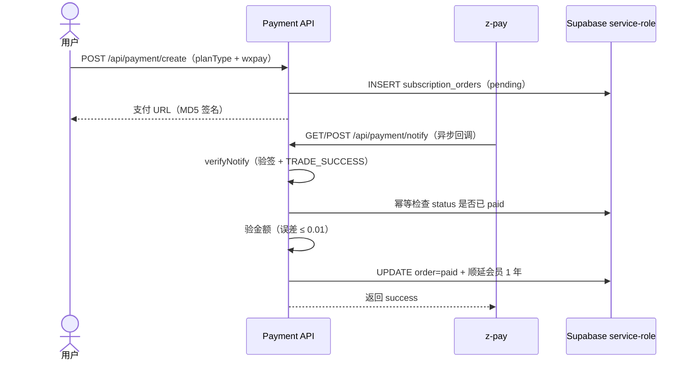

- **价格唯一来源** `lib/services/membership.ts`：`PLAN_PRICES={pro:9.9, ai:19.9}`，试用 14 天。
- **签名**（`lib/services/zpay.ts`）：参数 ASCII 升序、过滤 sign/空值 → `md5(signString + ZPAY_PKEY).toLowerCase()`。
- **`create`**：⚠️ **payType 仅允许 `wxpay`**；`out_trade_no = YYYYMMDDHHmmss + 6 位随机`。
- **`notify`**（service role）：验签 → 幂等（`status==paid` 直接 success）→ 验金额 → 更新订单 + 续期（未过期顺延 1 年，过期从 now+1 年）。失败返回文本 `"fail"` 触发 z-pay 重试。
- **`return`**：仅展示跳转，不写库（发卡只认 notify）。

⚠️ 风险：① **幂等仅靠「读后写」无行锁**，并发重复回调可能双发会员（建议 `UPDATE ... WHERE status='pending'` 原子 CAS）；② notify 用 `setFullYear(+1)` 而 `activateMembership` 用 `+365 天`，逻辑双份维护易漂移；③ migration 021 的 `subscription_orders` UPDATE RLS `USING(true)` 偏宽松。

#### 4.11.3 管理后台 `/api/admin/users`

全 service role 调 `auth.admin.*`，每 handler `verifyAdminAuth`。GET 列表 / POST 创建或重置（`email_confirm:true` + `ensureAdminCreatedUserDefaults` 初始化 profile+试用）/ DELETE。⚠️ 单组静态 ENV 凭据、明文等值比较、无限流/审计。自助注册已关闭，账号统一后台发号。

---

## 5. 数据模型设计

> 权威来源：`supabase/migrations/001–029`（DDL）+ `lib/supabase/database.types.ts`（TS 类型）。JSONB 内部结构来自 `lib/ai-analysis/types.ts`、`lib/workers/video-pipeline/types.ts`、`lib/storage/types.ts`。

### 5.1 数据库总览

| 项目 | 实际情况 |
|---|---|
| 数据库 | PostgreSQL（Supabase 托管），schema `public` |
| ORM | **无传统 ORM**，直接 `@supabase/supabase-js`（PostREST）；类型 CLI 生成 |
| UUID | `gen_random_uuid()`（PG13+ 内置）；`profiles.id` 引用 `auth.users(id)` |
| 扩展 | ⚠️ **无任何 `CREATE EXTENSION`**；**未启用 pgvector** |
| 向量检索 | ⚠️ `knowledge_note_embeddings.embedding` 存 **JSONB**，相似度在 Node 层算 |
| 全文检索 | 仅 `notes` 一处 GIN，⚠️ 用 `to_tsvector('english', ...)`（**对中文分词不友好**） |
| RLS | **所有 public 表均启用**，策略统一 `auth.uid() = user_id` |
| 触发器 | 全局 `update_updated_at_column()` + 视频专用 `trigger_set_video_jobs_timestamp()` |

共 **31 张业务表**，按域：

| 域 | 表 |
|---|---|
| 用户基础 | `profiles` |
| 内容库 | `notes` |
| 组织 | `folders`、`tags`、`note_tags` |
| 阅读互动 | `highlights`、`annotations`、`reading_progress`、`quote_materials`、`transcript_markers` |
| AI 输出 | `ai_outputs`、`ai_snapshots`、`ai_snapshot_renders` |
| 媒体·视频 | `web_archives`、`video_chapters`、`transcripts`、`video_jobs` |
| 知识库 | `knowledge_conversations`、`knowledge_messages`、`knowledge_note_embeddings`、`knowledge_topics`、`knowledge_topic_members`、`knowledge_topic_events` |
| 知识图谱 | `knowledge_entities`、`knowledge_relationships`、`knowledge_note_entities` |
| 设置 | `user_settings` |
| 会员支付 | `user_memberships`、`subscription_orders`、`user_referral_codes`、`referral_redemptions` |
| 通知/埋点 | `user_notifications`、`note_visit_events` |

> 约定：`id` 均 `UUID PK DEFAULT gen_random_uuid()`；`user_id` 均 `NOT NULL REFERENCES auth.users(id) ON DELETE CASCADE`；RLS 若无特殊说明为 4 条标准策略 `(auth.uid() = user_id)`。

### 5.2 核心表（重点）

#### `notes` — 内容主表（跨 9 个迁移累积）

| 字段 | 类型 | 约束 | 来源 |
|---|---|---|---|
| folder_id | UUID | FK folders **ON DELETE SET NULL** | 001 |
| source_url | TEXT | **可空**（003） | 001 |
| content_type | enum | NOT NULL DEFAULT `article` | 001 |
| title/author/site_name/excerpt/cover_image_url/content_html/content_text/media_url | TEXT | | 001 |
| published_at/captured_at | TIMESTAMPTZ | captured_at DEFAULT NOW() | 001/003 |
| media_duration | INTEGER | 秒 | 001 |
| status | enum | DEFAULT `unread` | 001 |
| is_starred | BOOLEAN | DEFAULT FALSE | 003 |
| source_type | enum | DEFAULT `url` | 003 |
| file_url/file_name/file_type/file_size | | 上传文件 | 003 |
| archived_at | TIMESTAMPTZ | 归档 | 005 |
| reading_position/read_percentage/estimated_read_time/reader_preferences | | 阅读器（⚠️ 部分已建未用） | 008 |
| last_accessed_at | TIMESTAMPTZ | DEFAULT NOW() | 012 |
| deleted_at | TIMESTAMPTZ | 软删除（回收站） | 017 |
| video_job_id | UUID | FK video_jobs | 024 |
| video_ready_at | TIMESTAMPTZ | | 024 |
| video_overall_status | TEXT | CHECK ∈ {processing,media_ready,fully_ready,failed,need_browser_fallback} | 024 |
| user_notes | JSONB | **Tiptap JSON**（≠content） | 026 |
| user_notes_updated_at | TIMESTAMPTZ | 乐观锁时间戳 | 026 |

- **UNIQUE**：`(user_id, source_url) WHERE source_url IS NOT NULL`（部分唯一索引，允许 manual/upload 无 URL）。
- **索引**：~15 个，含全文 GIN `gin(to_tsvector('english', title||' '||content_text))`、`(user_id,created_at DESC)`、`(video_overall_status) WHERE != 'fully_ready'` 等。

#### `video_jobs` — 视频流水线状态机（023/025/028/029）

| 字段 | 取值/类型 | 说明 |
|---|---|---|
| note_id | FK notes CASCADE（可空） | |
| source_url / platform / source_video_url | TEXT NOT NULL | |
| request_headers | JSONB | 下载请求头 |
| download_strategy | CHECK {server, browser} | |
| download_status | CHECK {pending,in_progress,done,failed,**need_browser_fallback**} | |
| cos_key/cos_url/size_bytes/download_error | | 下载产物 |
| probe_status/cover_status/transcode_status/frame_status/visual_status | CHECK {pending,in_progress,done,failed,**skipped**} | |
| audio_status | CHECK {pending,in_progress,done,failed}（⚠️ **无 skipped**） | |
| probe_data/frames/audio_result/visual_result | JSONB | 见下 JSONB 结构 |
| transcode_job_id/transcoded_key/transcoded_url/transcode_error | | 转码产物（不覆盖 cos_key） |
| audio_task_id/audio_error/cover_url/frame_error/visual_error | | |
| source_audio_url/audio_cos_key/audio_cos_url | TEXT（028） | B 站 DASH 分轨 |
| retry_count | INT DEFAULT 0 | **job 级全局计数** |
| next_retry_at | TIMESTAMPTZ | 指数退避 |

- 部分索引 `WHERE 任一 *_status ∈ {pending,in_progress}`（worker 扫表）；专用触发器 `set_video_jobs_timestamp`。
- **JSONB 结构**：`probe_data={durationSec,width,height,videoCodec,audioCodec,sizeBytes}`；`frames=[{timestamp,key,url}]`；`audio_result=AudioAnalysisResult`（transcript/chapters/summary/keyPoints/qaPairs/speakers?/keywords?/speakerSummaries?）；`visual_result=[{timestamp,sceneDescription,entities[],onScreenText?}]`。

#### `ai_outputs` — AI 摘要（UNIQUE note_id，一对一）

`summary(NOT NULL)` / `key_questions(JSONB)` / `transcript(TEXT，视频侧写)` / `journalist_view(JSONB，含 fast_read+deep_read+key_questions_missing)` / `timeline(JSONB)` / `visual_summary` / `deepfake_warning`（⚠️ 无写入方）/ `model_name·provider·model_version`（⚠️ 从不填充）。

#### `highlights` / `annotations`

- `highlights`：`quote(NOT NULL)` / `range_start·range_end(INT)` / `range_data(JSONB)` / `color(DEFAULT '#FFEB3B')` / `timecode·screenshot_url`（视频）。
- `annotations`：`highlight_id(FK CASCADE)` / `content(NOT NULL)` / `timecode·screenshot_url·is_floating`。

#### 知识库表

- `knowledge_note_embeddings`：**PK = note_id**（一对一），`embedding(JSONB)` + `model` + `content_hash`。
- `knowledge_topics`：`keywords(TEXT[])` / `summary_markdown` / `member_count` / `config(JSONB)` / `pinned·archived·last_ingested_at·stats`。
- `knowledge_topic_members`：**PK = (topic_id, note_id)**，`score·source('auto'|'manual')·manual_state·event_time·event_fingerprint·evidence_rank`。
- `knowledge_topic_events`：UNIQUE `(topic_id, fingerprint)`，事件时间轴。
- 图谱三表（`FOR ALL` RLS）：`knowledge_entities(name·type·aliases[])` / `knowledge_relationships(source/target_entity_id·relation·source_note_id·evidence_snippet·confidence)` / `knowledge_note_entities(note_id·entity_id·mention_count)`。⚠️ relationships 无去重唯一键。

#### 会员支付表

- `user_memberships`：**PK = user_id**（一用户一行），`plan_type·expires_at·trial_started_at·last_payment_at·invite_rewarded_days`。⚠️ 无 created_at。
- `subscription_orders`：`out_trade_no(UNIQUE)·trade_no·plan_type·amount DECIMAL(10,2)·status·pay_type·paid_at`。RLS 含 `Service role can update orders (USING true)`。
- `quote_materials`：`content_hash = md5(content)` **生成列** + 3 个部分唯一索引。

### 5.3 数据库函数 / RPC

| 函数 | 用途 | 来源 |
|---|---|---|
| `update_updated_at_column()` | 通用 updated_at 触发器（~16 表） | 001 |
| `trigger_set_video_jobs_timestamp()` | video_jobs 专用 | 023 |
| `count_untagged_notes()` | 未打标签笔记数 | 007 |
| `get_or_create_user_settings(uuid)` | 取或建用户设置 | 008 |
| `upsert_reading_progress(...)` | 阅读进度 upsert（累加 read_count）⚠️ 未被调用 | 008 |
| `get_membership_status(uuid)` | 会员综合状态（试用硬编码 14 天） | 021 |
| `seed_sample_data()` | 测试数据 | 002 |

> ⚠️ CLAUDE.md 提及的 `handle_new_user()`（注册自动建 profile）**在迁移中不存在**——profiles 不会随注册自动创建（由 admin 创建用户时 `ensureAdminCreatedUserDefaults` 补）。

### 5.4 枚举与状态字段

- **PG 原生 ENUM**（3 个）：`content_type{article,video,audio}`、`note_status{unread,reading,archived}`、`note_source_type{url,manual,upload}`。
- **CHECK 约束状态**：`video_jobs` 各 step（见上）、`notes.video_overall_status`、`knowledge_messages.role/rating`、`transcript_markers.marker_kind{important,question,todo}/target_type{transcript,qa,speaker}`。
- **约定字符串（DB 不强制）**：`user_memberships.plan_type{trial,pro,ai,expired,none}`、`subscription_orders.status{pending,paid,failed,refunded}`、`transcripts.status/provider`、`ai_snapshots.status`。

### 5.5 迁移演进史（001 → 029）

| # | 引入 |
|---|---|
| 001 | 基础 8 表 + 2 枚举 + RLS + updated_at 触发器 + notes 全文 GIN |
| 002 | `seed_sample_data()` 测试数据 |
| 003 | notes 增 is_starred/captured_at/source_type/file_*；source_url 可空 |
| 004 | folders 层级（parent_id）+ icon + archived_at |
| 005 | notes archived_at + 排序索引 |
| 006 | tags 层级 + position + archived_at + 防自引用 |
| 007 | `count_untagged_notes()` |
| 008 | 5 表（web_archives/video_chapters/transcripts/reading_progress/user_settings）+ 阅读器扩列 |
| 009-011 | Storage bucket RLS（桶硬编码 `'zhuyu'`，三次迭代） |
| 012 | notes/folders/tags 加 last_accessed_at |
| 013 | 知识对话历史（conversations/messages） |
| 014 | 智能专题 P1（embeddings/topics/members） |
| 015a/015b | ⚠️ **同号两文件**：pinned conversations + 专题 P2（事件/置顶/归档） |
| 016 | knowledge_messages.rating（赞/踩） |
| 017 | notes.deleted_at（回收站）+ 埋点 + 会员/邀请三表 |
| 018 | 知识图谱三表 |
| 019 | AI 快照持久化（snapshots/renders） |
| 020 | quote_materials（md5 生成列） |
| 021 | 订阅支付（orders/notifications + get_membership_status）|
| 022 | 幂等补会员列 + 兜底重建 orders |
| 023 | video_jobs 状态机 |
| 024 | notes 视频字段 |
| 025 | 转码列 |
| 026 | notes.user_notes（Tiptap） |
| 027 | transcript_markers |
| 028 | DASH 分轨音频列 |
| 029 | frame_error/transcode_error + `NOTIFY pgrst` |

### 5.6 ER 关系图

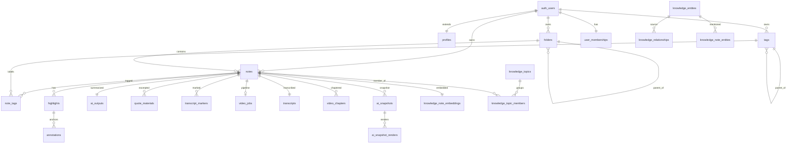

### 5.7 ⚠️ DDL 实测 vs 文档的关键偏差

1. **Storage 桶名不一致**：migrations 009-011 硬编码 `'zhuyu'`，而 `.env.example`/CLAUDE.md 写 `user-files`（运行时由 `NEXT_PUBLIC_SUPABASE_STORAGE_BUCKET` 决定）。
2. `handle_new_user` 触发器**不存在**。
3. migration 015 **重复编号**（pinned + P2 两文件）。
4. **pgvector 未启用**，embedding 为 JSONB + 应用层算相似度。
5. 全文检索用 `english` 配置，中文分词受限。

---

## 6. 关键配置与环境

### 6.1 环境变量全表

| 变量 | 必需 | 说明 |
|---|---|---|
| **`NEXT_PUBLIC_SUPABASE_URL`** | ✅ | Supabase 项目 URL |
| **`NEXT_PUBLIC_SUPABASE_PUBLISHABLE_KEY`** | ✅ | 浏览器匿名 key |
| `SUPABASE_SERVICE_ROLE_KEY` | 后台必需 | 绕 RLS：Worker / 支付回调 / Admin / 定时刷新 |
| `DATABASE_URL` | 脚本/迁移 | Postgres 直连串 |
| `DB_EXPORT_DATABASE_URL` | 导出脚本 | 导出源库串（自托管后区别于 DATABASE_URL） |
| `ADMIN_USER` / `ADMIN_PASS` | Admin 必需 | `/admin/*` Basic Auth；未配则 `/api/admin/*` 一律 503 |
| `OPENAI_API_KEY` | AI 必需 | OpenAI 兼容 key |
| `OPENAI_API_BASE_URL` | 可选 | 默认 `https://api.openai.com/v1` |
| `OPENAI_MODEL` | 可选 | ⚠️ `.env.example` 写 `gpt-4o-mini`，**代码兜底 `gpt-4o`** |
| `KNOWLEDGE_EMBEDDING_API_KEY/BASE_URL/MODEL` | 智能专题 | 回退 `OPENAI_*`，默认 `text-embedding-3-small` |
| `KNOWLEDGE_TOPIC_NAMING_API_KEY/BASE_URL/MODEL` | 智能专题 | 主题命名模型 |
| `KNOWLEDGE_TOPIC_MATCH_THRESHOLD` | 可选 | 增量匹配阈值，默认 `0.85` |
| `KNOWLEDGE_CRON_SECRET` | nightly 必需 | 定时刷新鉴权（Bearer / x-cron-secret） |
| `SMART_TOPICS_REFRESH_URL` | 可选 | 外部触发 URL |
| `JINA_API_KEY` | 文章抓取 | Jina Reader |
| `TENCENT_SECRET_ID` / `TENCENT_SECRET_KEY` | 旧 ASR | tencent-asr（逐步被听悟替代） |
| `NEXT_PUBLIC_SUPABASE_STORAGE_BUCKET` | 可选 | 默认 `user-files`（⚠️ 与 SQL 策略中 `'zhuyu'` 不一致） |
| `STORAGE_PROVIDER` | 可选 | `supabase`/`tencent-cos`/`volcengine-tos`(stub) |
| `TENCENT_COS_SECRET_ID/SECRET_KEY/REGION/BUCKET/CUSTOM_DOMAIN` | COS 必需 | 视频处理走 COS |
| `AUDIO_ANALYSIS_PROVIDER` | 视频转写 | 默认 `tingwu` |
| `ALI_TINGWU_APPKEY` / `ALIBABA_CLOUD_ACCESS_KEY_ID/SECRET/REGION` | 听悟必需 | 音频分析 |
| `VISUAL_ANALYSIS_PROVIDER` | 可选 | `qwen-vl` / `none` |
| `DASHSCOPE_API_KEY` / `DASHSCOPE_TEXT_MODEL` / `DASHSCOPE_VISION_MODEL` | 视觉/视频问答 | 默认 `qwen-plus` / `qwen-vl-max` |
| `VIDEO_WORKER_ENABLED` | 视频处理 | `true` 才启动 worker，默认 `false` |
| `VIDEO_WORKER_INTERVAL_MS` / `VIDEO_WORKER_BATCH_SIZE` | 可选 | 默认 `10000` / `5` |
| ⚠️ `ZPAY_PID` / `ZPAY_PKEY` / `NEXT_PUBLIC_BASE_URL` | 支付必需 | **未在 `.env.example` 中**，上线前需补 |

### 6.2 核心配置文件

- **`next.config.ts`**：`cacheComponents:true`；全站 CSP（dev/prod 分支）。⚠️ CSP 含全局 `'unsafe-inline' 'unsafe-eval'`（Turbopack 现实约束，削弱 XSS 防护）。
- **`tsconfig.json`**：`strict:true`，path alias `@/* → ./*`，exclude `extension/**`、`supabase/functions/**`、`database.types.ts`。
- **`tailwind.config.ts`**：`darkMode:["class"]`，颜色全 token 化（`hsl(var(--*))`），plugins `tailwindcss-animate` + `@tailwindcss/typography`。
- **`eslint.config.mjs`**：⚠️ **UI 守卫 error 级**——禁止硬编码 `bg-[#hex]`/`text-[#hex]`/`rounded-[Npx]`，强制语义 token（会阻断 `npm run lint`）。
- **`vitest.config.ts`**：`environment:'node'`，`coverage.include:['lib/**/*.ts']`（仅覆盖 lib）。
- **`package.json`**：⚠️ `dev` = `next dev -p 3001 --hostname 127.0.0.1` 并剥离 `OPENAI_*`（防开发误调 AI）。

### 6.3 开发命令

```bash
npm install
npm run dev      # 127.0.0.1:3001，剥离 OPENAI_*
npm run lint     # eslint（UI token 守卫会阻断）
npm test         # vitest run
npm run build    # NODE_ENV=production next build
```

---

## 7. 潜在改进与风险清单

> 下表汇总各子系统分析中确认的真实风险，按主题分组。**🔴 高 / 🟡 中 / ⚪ 低**。

### 7.1 安全与权限（🔴 优先收口）

| 级别 | 风险 | 位置 | 建议 |
|---|---|---|---|
| 🔴 | **视频 AI 全链路无会员门禁** | `/api/ai/video/*`、`/api/ai/analyze` | 补 `requireAIMembership`，否则任何登录用户可触发最烧钱链路 |
| 🔴 | **支付回调幂等无行锁** | `/api/payment/notify` | 改 `UPDATE ... WHERE status='pending'` 原子 CAS，防并发双发会员 |
| 🟡 | `/notes/[id]`、`/knowledge` 不在 `protectedPaths` | `lib/supabase/proxy.ts` | 仅靠 RLS 兜底，与文档描述不符；建议加保护或写明 |
| 🟡 | 旧 `/api/snapshot/route.tsx`、`/api/ai/analyze` 缺会员门禁 | | 删除死代码或补门禁 |
| 🟡 | knowledge/chat dev helper 读 `.env.local` 回显 key 末 4 位 | `/api/knowledge/chat` | 仅 dev，但建议移除 |
| 🟡 | `/api/ai/read` 顶部 `console.log` 打印 key 元信息 | | 上线前移除 |
| ⚪ | Admin 单组静态凭据、明文比较、无限流/审计 | `lib/admin-auth.ts` | 补失败限流 + 操作审计 |
| ⚪ | CSP 全局 `unsafe-inline/eval` + admin token 存 sessionStorage | | XSS 面，依赖 HTTPS |

### 7.2 数据一致性与正确性

| 级别 | 风险 | 位置 |
|---|---|---|
| 🟡 | **`tags/reorder` 漏 select `parent_id`**，非根重排 position 串位 | `/api/tags/reorder` |
| 🟡 | **`audio_status` CHECK 缺 `skipped`** 但代码写 `skipped` → 约束违反 | migration 023 + `step-analyze-audio.ts` |
| 🟡 | read/analyze 对 `journalist_view` 结构不兼容、`onConflict` 互相覆盖 | `ai_outputs` |
| 🟡 | 邀请兑换/会员续期多步无事务 | referral/redeem、payment/notify |
| ⚪ | `knowledge_relationships` 无去重唯一键，重复 rebuild 产生重复边 | migration 018 |
| ⚪ | `ai_outputs` 审计列（model_*）从不填充 | |

### 7.3 性能

| 级别 | 风险 | 位置 |
|---|---|---|
| 🟡 | **阅读页双重大查询**（Server 查完丢弃，Client 再查） | `NoteDetailAuthCheck` → `ReaderPageWrapper` |
| 🟡 | 高亮回显每次对整篇 `content_html` 重新 DOMParser + TreeWalker | `ArticleReader` |
| 🟡 | 阅读器滚动监听未节流、未 passive | `ReaderLayout` |
| ⚪ | 知识检索 ilike 全表扫，无全文/向量索引 | `/api/knowledge/search` |
| ⚪ | 智能专题 rebuild 硬上限 400 篇，embedding 在应用层 | |

### 7.4 架构与可维护性

| 级别 | 风险 | 建议 |
|---|---|---|
| 🟡 | **`dashboard-content.tsx` ~6000 行巨型组件** | 按「数据 hook / 导航 / 列表 / 弹窗 / 批量 / 设置」拆分 |
| 🟡 | **视频 worker 多实例无强锁** | 多副本部署需 `FOR UPDATE SKIP LOCKED` / lease；或限单实例 |
| 🟡 | `retry_count` job 级全局计数（非 per-step） | 改 per-step 计数 |
| 🟡 | 高亮/批注/笔记自动保存绕 API 直连 Supabase | 资源访问契约分散，仅靠 RLS |
| ⚪ | Volcengine TOS adapter 全 stub | 选用会直接抛错 |
| ⚪ | 知识图谱 rebuild 无 UI 入口、默认 mock | 标注为探索能力 |
| ⚪ | 多处 window 事件总线裸字符串、无类型约束 | 重命名无编译保护 |

### 7.5 与现有文档/CLAUDE.md 的偏差（需同步更新）

- Next.js 实测 **16.1.1**（用 `proxy.ts` 非 `middleware.ts`）；dev 端口 **3001**（非 3000）。
- `OPENAI_MODEL` 代码默认 **`gpt-4o`**（`.env.example` 写 `gpt-4o-mini`）。
- Storage 桶 SQL 硬编码 **`'zhuyu'`**（文档写 `user-files`）。
- 视频详情自定义 Tiptap 节点 **4 个**（CLAUDE.md 写 3 个），`AnnotationReference` **已实现**（CLAUDE.md 写 P1 未实现）。
- `transcripts`/`video_chapters` 表存在，但视频流水线实际把逐字稿/章节序列化在 `video_jobs.audio_result` JSONB（独立表当前为旧阅读器路径）。

---

## 8. 接口文档（API Reference）

> 共 **60+ 路由**。鉴权列：`cookie`=`createClient().getUser()`；`Bearer/cookie`=`verifyAuth`；`AI 会员`=`requireAIMembership`；`service`=service role（回调/定时）；`Basic`=Admin Basic Auth；`cron`=`KNOWLEDGE_CRON_SECRET`。

### 8.1 采集与上传

| 方法 | 路径 | 鉴权 | 说明 |
|---|---|---|---|
| POST | `/api/capture` | cookie | URL 抓取（平台 crawler → Jina → fetch） |
| POST | `/api/upload` | cookie | 服务端中转上传（小文件） |
| POST | `/api/upload-cred` | cookie | 签名直传凭证（大文件 PUT COS） |
| POST | `/api/extension/save` | Bearer/cookie | 扩展保存图文（upsert by user_id+source_url） |
| GET | `/api/extension/meta` | Bearer/cookie | 拉 folders/tags |
| POST | `/api/extension/save-video` | cookie | 扩展保存视频（A 路径，建 video_jobs） |
| POST | `/api/extension/video-upload-cred` | cookie | 视频直传凭证（B 路径，双轨 DASH） |
| POST | `/api/extension/video-upload-done` | cookie | 上传完成回报（50KB+exists 校验） |
| GET | `/api/extension/download/[target]` | 无 | 插件包下载 |

### 8.2 AI（文本 + 视频）

| 方法 | 路径 | 鉴权 | 说明 |
|---|---|---|---|
| POST | `/api/ai/read` | **AI 会员** | SSE 三阶段（fast_read/key_questions/deep_analysis） |
| POST | `/api/ai/analyze` | ⚠️ cookie | 旧入口（死代码，缺会员门禁） |
| POST | `/api/ai/chat` | **AI 会员** | 笔记内对话（透传 OpenAI SSE，不持久化） |
| GET | `/api/ai/snapshot` | **AI 会员** | 查快照是否存在 |
| POST | `/api/ai/snapshot/ensure` | **AI 会员** | 确保快照（三步状态机 + 渲染 3 模板） |
| GET/POST | `/api/snapshot` | ⚠️ cookie | 旧快照（孤儿，307 重定向到 PNG） |
| GET | `/api/ai/video/[jobId]/status` | cookie | 7 step 状态 |
| POST | `/api/ai/video/[jobId]/retry[?step=]` | cookie | 单步/批量重试 |
| POST | `/api/ai/video/[jobId]/enrich[?fields=]` | cookie | LLM 补全 keywords/qa/speakers |
| POST | `/api/ai/video/ask` | ⚠️ cookie | 视频问答（基于 transcript） |
| POST | `/api/ai/video/rewrite` | ⚠️ cookie | 笔记改写（4 风格） |
| POST | `/api/ai/video/translate` | ⚠️ cookie | 字幕批量翻译 |
| POST | `/api/ai/video/note/[noteId]/init-pipeline` | cookie | 补建流水线 |

### 8.3 阅读、批注、导出

| 方法 | 路径 | 鉴权 | 说明 |
|---|---|---|---|
| GET/POST/PUT/DELETE | `/api/highlights` | cookie | 高亮 CRUD（POST 校验归属 403；PUT 仅改 color） |
| GET/POST | `/api/notes/[id]/markers` | cookie | 视频标记（transcript_markers，表缺降级 503） |
| DELETE | `/api/notes/[id]/markers/[markerId]` | cookie | 删标记（id+note_id+user_id 三重校验） |
| GET | `/api/notes/[id]/export?format=md\|srt\|json` | cookie | 导出 |
| GET/POST/DELETE | `/api/quote-materials` | cookie | 金句 CRUD |
| POST | `/api/quote-materials/extract` | **AI 会员** | LLM 抽金句（逐字校验） |

### 8.4 知识库

| 方法 | 路径 | 鉴权 | 说明 |
|---|---|---|---|
| POST | `/api/knowledge/search` | ⚠️ cookie | 5 源 ilike 检索（无 UI 接入） |
| POST | `/api/knowledge/chat` | ⚠️ cookie | RAG 问答（透传 SSE，前端落库） |
| GET | `/api/knowledge/topics` | **AI 会员** | 专题列表 |
| GET | `/api/knowledge/topics/[id]` | cookie | 专题详情（members/timeline/events） |
| POST | `/api/knowledge/topics/[id]/{members,pin,archive,merge,report}` | cookie | 专题操作 |
| POST | `/api/knowledge/topics/{rebuild,recluster}` | cookie | 重建聚类 |
| POST | `/api/knowledge/topics/nightly-refresh` | **cron**+service | 定时刷新 + 自动归档 |
| POST | `/api/knowledge/graph/rebuild` | cookie | 图谱抽取（无 UI 入口） |

### 8.5 标签、设置、支付、会员、管理

| 方法 | 路径 | 鉴权 | 说明 |
|---|---|---|---|
| GET/POST | `/api/tags` | cookie | 标签列表/创建 |
| PATCH/DELETE | `/api/tags/[id]` | cookie | 更新（循环检测）/删除 |
| POST | `/api/tags/[id]/archive`、`/api/tags/reorder` | cookie | 归档 / 排序（⚠️ reorder Bug） |
| GET | `/api/settings/stats` | cookie | 用量统计（含 AI token 估算） |
| GET | `/api/settings/trash` + `[id]/restore` + `[id]/delete` | cookie | 回收站 |
| GET/POST | `/api/settings/referral/me` + `redeem` | cookie | 邀请码 |
| POST | `/api/payment/create` | cookie | 创建订单（仅 wxpay） |
| GET/POST | `/api/payment/notify` | **service** | 异步回调（验签+幂等+验金额） |
| GET | `/api/payment/return` | 无 | 同步跳转页 |
| GET | `/api/membership/status` | cookie | 会员状态 + 价目 |
| GET/POST/DELETE | `/api/admin/users` | **Basic**+service | 用户管理 |

### 8.6 接口契约样例（高频端点）

**`POST /api/highlights`**
```jsonc
// Request
{ "note_id": "uuid", "quote": "高亮文本", "color": "yellow",
  "range_data": { "globalStart": 120, "globalEnd": 180, "quote": "...", "startOffset": 0, "endOffset": 60 },
  "range_start": 120, "range_end": 180 }       // range_start/end/timecode 仅 number 时写入
// Response 200: { "success": true, "highlight": {...} }
// 错误: 400(缺 note_id/quote/color) / 401 / 403(笔记不属于用户) / 500
```

**`POST /api/ai/read`**（SSE）
```
event: meta\ndata: {"noteId":"...","estimatedReadTimeMinutes":5}
event: fast_read\ndata: {"hook":"...","takeaways":["..."],"sentiment":"客观中立"}
event: key_questions\ndata: {"questions":[{"q":"","a":"","evidence":""}],"missing":[]}
event: deep_analysis\ndata: {"overview":"","background":[],"stakeholders":[],"timeline":[]}
event: done\ndata: {"ok":true,"cached":false}
```

**`POST /api/payment/notify`**（z-pay 回调，返回纯文本）
```
Request(query): pid, name, money, out_trade_no, trade_no, trade_status, sign, sign_type, param
Response: "success"（成功）| "fail"（验签/金额/状态失败，触发 z-pay 重试）
```

---

## 9. 测试与质量保障

### 9.1 框架与配置

- **Vitest 4.1.6**（⚠️ 非 Jest）。`environment:'node'`（需 DOM 的文件用 `// @vitest-environment jsdom/happy-dom` 逐文件覆盖）；`coverage.include:['lib/**/*.ts']`（仅覆盖 lib）；**无 setup 文件**（mock 就地 `vi.mock`）。
- 命令：`npm test`（`vitest run`）/ `test:watch` / `test:ui`。

### 9.2 测试清单

**41 个测试文件 / ~260 用例**，两种风格：真单元/行为测试 + **源码文本护栏**（`readFileSync` 断言 `.tsx` 含/不含某片段）。

| 域 | 覆盖 |
|---|---|
| 存储 | provider 工厂/缓存、key 生成（防穿越）、url 识别、supabase/COS adapter、COS CI 媒体处理 |
| 视频流水线 | db 层、reconcile（**12 场景**）、scheduler（步骤顺序/并发锁）、各 step（download/probe/transcode/audio/frame/visual）|
| AI 分析 | 听悟 adapter、Qwen-VL、视频 QA |
| 阅读/设置 | 大纲模型、右栏 Tab、改密校验、token 估算、marker（本地兜底/表缺失） |
| 视频详情 | useAutoSave（冲突检测）、useVideoSeek、TimeReference 节点 |
| 扩展 | 下载映射、5 个视频提取器（bilibili 16 用例） |
| 脚本 | DB 导出护栏、URL 解析 |
| 组件护栏 | dashboard/video-detail 源码断言 |

### 9.3 ⚠️ 当前状态：`npm test` 未全绿（实测 23/260 失败）

绝大多数是**测试陈旧**（实现演进、用例未跟），非产品缺陷：
- `step-transcode.test.ts`(6) + `step-download.test.ts`(1)：实现 `markStep` 现在多传 `{incrementRetry:true}`，测试仍断言旧 4 参签名。
- `step-analyze-audio.test.ts`(6) + `step-extract-frames.test.ts`(7)：实现新增前置门 `transcode_status ∈ {done,skipped}`，测试夹具未设 → 步骤早退。
- `normalize-database-url.test.ts`(2)：**本机 Python 3.14 签名策略**问题，非代码缺陷。
- `bilibili.test.ts`(1)：单个超时用例。

**需要一次「测试对齐」修复才能让 `npm test` 全绿。**

### 9.4 覆盖盲区

大型 Dashboard/Reader UI 交互、真实 Supabase+RLS、支付回调 E2E、扩展真实运行链路、知识库聚类质量、AI 内容质量、认证/中间件、E2E/性能/可访问性。

### 9.5 ⚠️ `docs/test/` QA 文档与现状脱节

`docs/test/` 4 份文档假设 **Jest + Playwright + pgTAP + k6**，与实际 **Vitest** 不符；`QA-Audit-Report-Executed.md` 标「0 个测试」是早期基线（此后已建 41 文件套件）。这些文档应作为「规划/目标态蓝图」看待，需更新工具栈口径。

### 9.6 调试脚本（`scripts/`）

`npx tsx` 运行，内联读 `.env.local` + service role。视频调试：`seed-test-video-job` / `reset-job(-full)` / `re-poll-audio` / `show-{audio-result,transcode,note}` / `probe-tingwu-*`。Admin：`invite-user` / `reset-password`。DB 导出/迁移：`db-export-full.sh` / `db-export-incremental.sh`（仅 schema）/ `migrate-supabase/01-08-*.sh`（Cloud→自托管全套）。

### 9.7 推荐流程

```bash
npm test && npm run lint && npm run build     # 完成前三连
# 按改动定向：
npx vitest run tests/lib/storage
npx vitest run tests/lib/workers/video-pipeline   # 改 step 签名/前置门须同步改测试夹具
npx vitest run tests/lib/ai-analysis
npx vitest run tests/video-detail tests/components
```

---

## 10. 新人上手路线图

### 10.1 前端工程师
`app/dashboard/page.tsx` → `components/dashboard/dashboard-content.tsx`（先理解导航/列表/弹窗）→ `app/notes/[id]/page.tsx` → `components/reader/*` → `components/video-detail/*`（Zustand + 事件总线 + Tiptap）。

### 10.2 后端工程师
`lib/supabase/{server,server-service}.ts` → `supabase/migrations/*`（先懂 RLS + notes 主表）→ `app/api/capture` → `app/api/ai/read` → `app/api/knowledge/*` → `app/api/payment/*`。

### 10.3 AI / 视频工程师
`lib/workers/index.ts` → `lib/workers/video-pipeline/*`（状态机 + 幂等）→ `lib/storage/*` → `lib/ai-analysis/*` → `app/api/ai/video/*` → `tests/lib/workers/video-pipeline/*`。**任何 step 改动都要考虑失败重试、跳过策略、转码产物与原始文件保留、并对应更新测试夹具。**

### 10.4 测试工程师
重点补：URL 收藏成功/失败/平台差异、扩展三路径、note 权限隔离、标签/目录排序归档、AI 会员门禁与试用、视频任务全状态流转、**支付回调幂等**、回收站恢复/永久删除。

### 10.5 变更流程
涉及新能力/架构/破坏性/性能安全大改 → 先读 `openspec/AGENTS.md` 创建 change proposal。普通 bugfix/文档无需。

---

---

## 11. 代码注释与命名规范

### 11.1 现有规范分析

- **TypeScript**：`strict: true`，偏好类型推断（少写显式类型）；接口/类型定义集中在各模块 `types.ts`（如 `lib/ai-analysis/types.ts`、`lib/workers/video-pipeline/types.ts`、`lib/storage/types.ts`）。
- **注释风格**：以**中文行内注释解释「为什么」而非「是什么」**为主，质量较高。典型范例：
  - `lib/supabase/proxy.ts`：注释解释「**必须用 `getClaims()` 而非 `getUser()`**，否则 token 不刷新导致随机登出」。
  - `lib/workers/video-pipeline/step-transcode.ts`：注释解释「为什么**只写 `transcoded_url` 不覆盖 `cos_key`**——CI 假成功会导致原始文件不可逆丢失」。
  - `lib/storage/mime.ts`：注释解释「兜底 MIME 是为了防 COS 把视频存成 octet-stream 导致只下载不内嵌播放」。
  - 大量 API route 顶部有「为什么用 service role / 为什么双重鉴权（防 CVE-2025-29927）」等设计意图注释。
- **命名约定**（与 `CLAUDE.md` 一致）：
  | 类别 | 约定 | 示例 |
  |---|---|---|
  | 组件文件 | PascalCase | `ReaderLayout.tsx`、`VideoDetailLayout.tsx` |
  | 工具/服务文件 | kebab-case | `platform-crawlers.ts`、`html-sanitizer.ts` |
  | 页面文件 | 小写 | `page.tsx`、`route.ts` |
  | 函数 | camelCase 动词开头 | `generateFlashRead`、`buildStorageKey`、`reconcileJob` |
  | 类型/接口 | PascalCase | `AudioAnalysisResult`、`StorageProvider` |
  | 自定义事件 | 冒号命名空间 | `video:seek`、`reader:refresh-content` |
  | 数据库表/列 | snake_case | `video_jobs`、`download_status` |
- **导入**：统一用 `@/` 绝对路径别名（`tsconfig` paths）。

### 11.2 优化建议

| 建议 | 理由 |
|---|---|
| 为 window 事件总线建立**类型化常量 + payload 类型** | 当前事件名是裸字符串、`e.detail` 多为 `any`，重命名无编译保护 |
| 移除生产环境调试 `console.log` | `ai/read`、`knowledge/chat`、`DashboardAuthCheck` 等处残留打印（含 key 元信息/会员 JSON） |
| 巨型组件 `dashboard-content.tsx` 顶部增加「分区导航注释」并逐步拆分 | ~6000 行，新人难以定位 |
| 为关键 JSONB 字段（`audio_result`/`journalist_view`）补 TSDoc | 结构 schema-less，跨模块消费易漂移 |

---

## 12. 编译、部署与运维

### 12.1 环境要求

| 项 | 要求 |
|---|---|
| Node.js | ⚠️ **`package.json` 无 `engines` 字段**；Next.js 16 要求 Node ≥ 18.18（推荐 20 LTS+），本地实测环境 v24 |
| 包管理 | npm（含 `package-lock.json`） |
| 数据库 | PostgreSQL（Supabase Cloud 或自托管） |
| 对象存储 | 视频处理需腾讯云 COS（数据万象 CI） |

### 12.2 构建与启动

```bash
npm install
npm run dev      # 开发：127.0.0.1:3001，剥离 OPENAI_*
npm run build    # 构建：NODE_ENV=production next build（含类型检查）
npm start        # 生产：next start
npm run lint     # ESLint（UI token 守卫为 error 级，会阻断）
npm test         # Vitest
```

打包产物为 Next.js 标准 `.next/` 输出（Server + 静态资源）。

### 12.3 部署形态

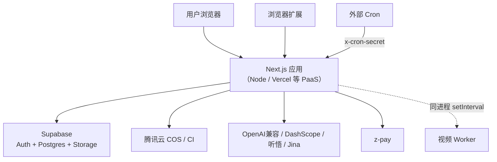

- ⚠️ **应用本身无 Dockerfile**——以标准 Next.js Node 服务部署（Vercel / 自建 Node）。
- **视频 Worker 与 Web 同进程**（`instrumentation.ts`）。⚠️ **多实例部署有重复消费风险**（见 §7.4），建议视频处理用**单实例**或后续拆独立 worker。
- **定时任务**：智能专题 nightly-refresh 由外部 Cron 触发 `POST /api/knowledge/topics/nightly-refresh`，鉴权 `KNOWLEDGE_CRON_SECRET`（`Authorization: Bearer` 或 `x-cron-secret`）。

### 12.4 自托管 Supabase（`docker/supabase/docker-compose.yml`）

项目提供了一套裁剪版自托管 Supabase（基于官方栈）：

| 服务 | 镜像 | 作用 |
|---|---|---|
| kong | `kong:2.8.1` | API 网关（对外唯一入口 8000/8443） |
| auth | `supabase/gotrue:v2.158.1` | 认证（邮箱密码 + 可选 Google/GitHub OAuth） |
| rest | `postgrest/postgrest:v12.2.0` | 数据库 REST API |
| storage | `supabase/storage-api:v1.11.13` | 文件存储（**FILE_SIZE_LIMIT 500MB**，本地 file backend） |
| imgproxy | `darthsim/imgproxy:v3.8.0` | 图片处理 |
| meta | `supabase/postgres-meta:v0.84.2` | Studio 用 schema 检查器 |
| functions | `supabase/edge-runtime:v1.58.4` | Edge Functions（Deno，挂载 `supabase/functions`） |
| db | `supabase/postgres:15.6.1.143` | **Postgres 15.6**（仅内网/跳板暴露 15432） |
| studio | `supabase/studio:...` | 管理后台 UI |
| analytics | `supabase/logflare:1.4.0` | 日志（可选） |

⚠️ **故意关闭的服务**：`realtime`（项目无 `supabase.channel()` 调用）、`vector`、`supavisor`（单机连接数低）。

**Cloud → 自托管迁移**：`scripts/migrate-supabase/01-08-*.sh` 整套（dump schema → 跑 migrations → dump/import 数据 → 迁 auth.users → 迁 Storage 文件 → 行数核对）。

### 12.5 监控重点

`/api/capture` 抓取失败率、`video_jobs.video_overall_status` 分布、`retry_count`/`need_browser_fallback` 数量、AI 接口耗时与失败率、RLS 错误、**支付重复回调与金额校验失败**、COS/CI 任务失败。

---

## 13. 第三方依赖与 License 风险

### 13.1 核心运行时依赖

| 依赖 | 版本 | 用途 | License | 风险 |
|---|---|---|---|---|
| next / react / react-dom | 16.x / 19.x | 框架 | MIT | 低 |
| @supabase/supabase-js · ssr | 2.x | 数据库/认证 | MIT | 低 |
| @alicloud/tingwu20230930 等 | 2.x | 听悟 ASR | Apache-2.0 | 低 |
| cos-nodejs-sdk-v5 | 2.x | 腾讯 COS | MIT | 低 |
| tencentcloud-sdk-nodejs-asr | 4.x | 腾讯 ASR | MIT/Apache | 低 |
| @tiptap/* | 3.x | 富文本编辑器 | MIT | 低 |
| video.js | 8.x | 视频播放 | Apache-2.0 | 低 |
| @antv/g6 | 5.x | 图谱可视化 | MIT | 低 |
| framer-motion / zustand / swr | — | 动效/状态/数据 | MIT | 低 |
| cheerio / turndown / marked | — | HTML/MD 处理 | MIT | 低（marked 注意 XSS，已二次 sanitize） |
| jszip / nanoid / @vercel/og | — | 导出/ID/OG 图 | MIT | 低 |

### 13.2 评估结论

- **整体 License 风险低**：依赖基本为 **MIT / Apache-2.0**，无 GPL/AGPL 传染性强 copyleft 许可。
- **外部服务依赖**是真正的「依赖风险」来源（成本 + 可用性）：OpenAI 兼容 API、Jina Reader、腾讯 COS/CI、阿里听悟、DashScope/Qwen-VL、z-pay。建议为每个外部服务建立**降级与熔断策略**（当前 AI 调用无超时/重试，是薄弱点）。
- ⚠️ `volcengine-tos` adapter 为占位 stub，依赖未真正落地。

---

## 14. 版本与分支策略

- **主干**：`main`（受保护，PR 合入）。
- **分支命名**：`feat/*`、`fix/*`、`docs/*`（如 `feat/video-detail-page`、`fix/video-pipeline-hardening`、`feat/db-migration-admin-users`）——**功能分支工作流**（feature branch → PR → main）。
- **提交规范**：**Conventional Commits**（`feat(scope): ...`、`fix(scope): ...`、`docs: ...`），常带 issue 引用 `(#N)`。部分提交用中文描述。
- **规格驱动**：仓库使用 **OpenSpec**（`openspec/`）管理变更提案——新增能力/架构调整/破坏性改动前应先创建 change proposal（`openspec/AGENTS.md`），完成后归档到 `openspec/changes/archive/`。
- **建议**：补 `package.json` 的 `engines` 字段锁 Node 版本；统一提交语言（全中文或全英文）；及时归档已部署的 OpenSpec change（当前 `openspec/changes` 有多个未归档提案，易混淆真实实现边界）。

---

## 15. FAQ / 开发者指南

> 收录代码中**晦涩/反直觉**的逻辑，避免新人踩坑。

**Q1：为什么改完会员/视频代码后 `npm test` 有一堆失败？**
当前 23/260 失败多为**测试陈旧**（实现演进未同步），不是你改坏了。改 `step-*.ts` 的 `markStep` 签名或前置门时，**必须同步更新对应 `step-*.test.ts` 的 mock 期望与 `transcode_status` 夹具**。详见 §9.3。

**Q2：为什么本地视频不处理？**
视频 Worker 默认**关闭**，需 `VIDEO_WORKER_ENABLED=true`。且必须 `NEXT_RUNTIME=nodejs`（Edge 不启动）。

**Q3：为什么开发时 AI 不工作？**
`npm run dev` **故意剥离 `OPENAI_*`** 防误调。需在 `.env.local` 配置并用非 dev 方式，或临时去掉 dev 脚本的 `env -u`。

**Q4：为什么进入 `/notes/[id]` 有两次相同查询？**
`NoteDetailAuthCheck`（Server）查完 note 后丢弃，`ReaderPageWrapper`（Client）又查一遍——已知性能问题（§4.5.1），`initialNote` 传递是死代码待接。

**Q5：转码为什么不覆盖 `cos_key`？**
COS CI 偶发「返回成功但产物缺失」，覆盖原始文件会导致不可逆自损。下游一律「优先 `transcoded_*`，缺失回退 `cos_*`」。

**Q6：为什么 `audio` 步骤要等 `transcode` 完成？**
B 站 DASH 原始 m4s 无音轨，必须等 COS CI `<AudioMix>` 合流后才有音频，否则听悟会把 audio 永久打成 failed。

**Q7：高亮位置为什么有时会漂移？**
高亮基于「整篇正文纯文本的全局字符偏移」定位，正文被重新抓取/改写会整体错位，仅靠 `quote indexOf` 部分兜底。

**Q8：知识库「搜索」入口在哪？**
`/api/knowledge/search` 后端可用但**无前端入口**，知识库走「问答」。

**Q9：向量检索用的是 pgvector 吗？**
不是。embedding 存 JSONB，相似度在 Node 层算（rebuild 上限 400 篇）。

**Q10：为什么阅读页「删除/归档」点了没反应？**
阅读页内这两个菜单是 TODO 占位，真正软删除在 Dashboard。

---

## 16. 交付总结与整体评价

### 16.1 整体评价

NewsBox 是一个**功能密度高、数据模型完整、工程实现扎实**的 AI 阅读与知识管理产品。核心亮点：

- ✅ **RLS + Service Role 边界清晰**，多租户隔离到位。
- ✅ **存储抽象层迁移彻底**（无直连 `supabase.storage`），多后端可切换。
- ✅ **视频流水线状态机设计成熟**：错误隔离、幂等守卫、防腐三重保护、原始文件保留策略，注释解释设计意图，测试覆盖 12 个 reconcile 场景。
- ✅ **智能专题、金句素材**已闭环（增量 embedding 缓存、人工状态保留、逐字校验防幻觉）。
- ✅ **代码注释质量高**（解释 why），命名规范统一。

### 16.2 后续维护重点（按优先级）

1. 🔴 **统一 AI/视频会员门禁**（视频 AI 全链路当前无门禁，影响成本与商业模式）。
2. 🔴 **加固支付回调幂等**（资损向）。
3. 🟡 **测试对齐**（让 `npm test` 全绿）。
4. 🟡 **巨型组件拆分**（`dashboard-content.tsx`）。
5. 🟡 **视频 Worker 部署稳定性**（多实例锁 / 独立 worker）。
6. 🟡 **修复 `tags/reorder`、`audio_status` CHECK、阅读页双查询**等确认缺陷。
7. ⚪ 收口探索功能边界（网页存档/阅读进度/知识图谱/公开分享），同步更新对外措辞。

### 16.3 文档完整度

本文覆盖了 code-analyze + project-analyze 两套交付要求的全部章节：项目概览 / 技术栈 / 架构 / 核心模块 / 数据模型 / 配置 / 风险 / 接口 / 测试 / 上手 / 代码规范 / 部署 / 依赖 License / 分支策略 / FAQ / 交付总结。所有结论可追溯到具体文件路径，可作为研发交接与甲方验收依据。

---

> **文档维护说明**：本文基于 2026-06-04 的 `main` 分支代码生成。代码演进后，请同步更新「⚠️ 偏差」与「风险清单」两节。配套产品文档见 [PRODUCT_FUNCTIONAL_REFERENCE.md](PRODUCT_FUNCTIONAL_REFERENCE.md)；炫酷可视化版见 [NewsBox-技术架构总览.html](NewsBox-技术架构总览.html)。
