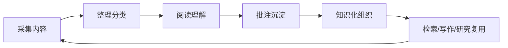
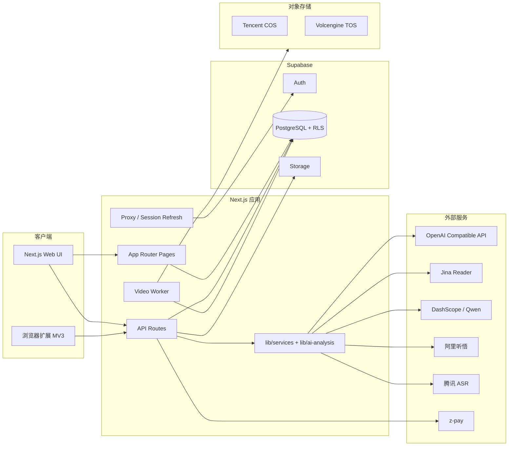
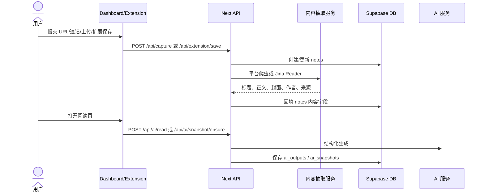
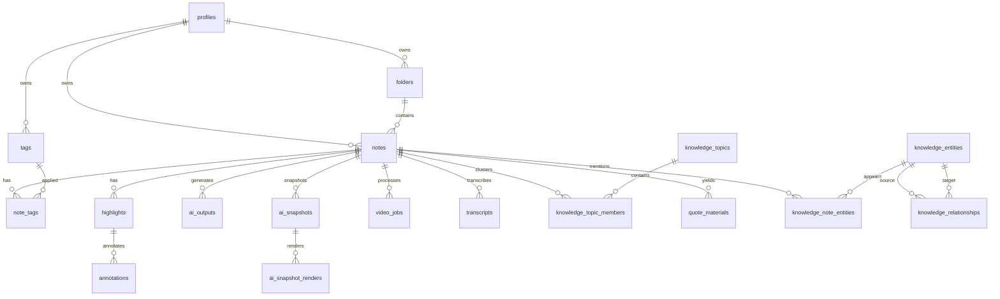
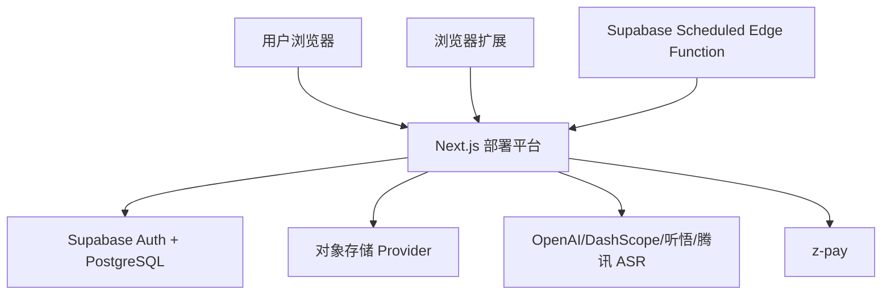

# NewsBox 产品功能、业务场景与核心技术参数梳理

> 分析日期：2026-05-21  
> 分析范围：当前仓库代码、`package-lock.json`、`supabase/migrations`、`openspec/specs`、`docs/TECHNICAL_ARCHITECTURE.md`、核心 API 与组件实现。  
> 说明：本文优先从产品定位、用户场景和功能价值出发，再补充当前实现中的技术参数。OpenSpec 中存在多个未归档变更提案，本文以当前代码和已存在迁移文件为主要依据，提案内容仅作辅助理解。

## 一、系统定位与产品设计

### 1.1 产品定位

NewsBox 是一款面向新闻记者、编辑、研究员、内容创作者和深度阅读用户的 AI 稍后阅读与知识管理产品。它的核心定位不是“保存链接的收藏夹”，而是一个围绕新闻内容全生命周期设计的个人阅读与研究工作台。

产品希望解决的核心问题是：用户每天看到大量有价值的文章、视频、观点和数据，但真正能读完、理解、记住并在后续写作或研究中复用的内容很少。传统收藏夹只完成“存起来”，NewsBox 进一步覆盖“收集、筛选、阅读、理解、批注、沉淀、检索、复用”整个链路。

一句话定位：

> NewsBox 让用户收藏过的新闻内容真正读得懂、记得住、找得到、用得上。

### 1.2 目标用户

| 用户类型 | 典型需求 | NewsBox 提供的价值 |
| --- | --- | --- |
| 新闻记者/编辑 | 快速筛选报道线索、保存事实依据、沉淀金句素材 | AI 快读、批注、金句素材、网页快照、知识库检索 |
| 行业研究员/分析师 | 持续跟踪行业动态，按主题整理资料 | 智能专题、知识图谱、时间线、全库问答 |
| 内容创作者 | 收藏选题、提炼观点、积累表达素材 | 多端采集、AI 摘要、标签/收藏夹、批注复用 |
| 深度阅读用户 | 稍后阅读、避免收藏夹吃灰、重访历史内容 | 工作台筛选、沉浸阅读、阅读进度、AI 快照 |
| 视频信息消费者 | 想检索视频观点，不想反复拖进度条 | 视频转写、关键帧、视频问答、章节导航 |

### 1.3 核心用户价值

| 用户痛点 | 系统设计 |
| --- | --- |
| 收藏过多，难以筛选 | 工作台提供收藏夹、标签、星标、今日、智能列表、搜索、排序和多视图列表 |
| 长文没有时间读 | AI 快读、关键问题、深度解读、时间线、AI 快照 |
| 好句子和观点难复用 | 划词高亮、批注、金句素材库、批注总览 |
| 视频内容不可检索 | 视频抓取流水线、音频转写、关键帧、视觉分析、视频问答 |
| 旧内容找不到 | 知识库搜索、RAG 问答、智能专题、知识图谱 |
| 多平台内容分散 | 浏览器扩展、网页采集、速记、文件上传、视频平台采集 |

### 1.4 典型使用场景

| 场景 | 用户问题 | 使用方式 | 产出结果 |
| --- | --- | --- | --- |
| 通勤或碎片时间看到一篇好文章 | 当下没时间读，但担心之后找不到 | 通过浏览器扩展或工作台添加 URL | 文章进入收藏库，并抓取标题、正文、封面、来源 |
| 面对大量未读收藏 | 不知道哪些值得细读 | 在工作台按今日、星标、标签、智能列表筛选，并查看 AI 快读 | 快速判断价值，决定精读、归档或删除 |
| 深度阅读一篇报道 | 需要理解背景、利益相关方、风险和后续观察点 | 打开阅读页，使用 AI 解读、关键问题和时间线 | 从“读原文”升级为“结构化理解” |
| 做选题或写稿 | 想保存原文里可引用的好句子 | 选中文本高亮并添加批注，必要时提取为金句素材 | 后续可在批注总览和素材库中复用 |
| 跟踪一个长期事件 | 相关内容散落在多篇文章中 | 使用智能专题和知识图谱自动聚合 | 形成主题视图、事件时间线和实体关系 |
| 回忆历史资料 | 只记得大概意思，不记得标题或来源 | 在知识库问答里自然语言提问 | 系统从收藏、批注、转写、AI 输出中找证据并回答 |
| 保存视频内容 | 视频太长，不方便回看和搜索 | 扩展保存视频，后台转写和抽帧 | 得到可检索逐字稿、关键帧和视频问答能力 |
| 需要保留证据 | 原网页可能失效或内容变化 | 生成快照/存档，保留关键内容 | 后续可追溯来源与当时内容状态 |

### 1.5 产品信息架构

```mermaid
flowchart TD
  Landing[公开落地页] --> Auth[登录/注册/找回密码]
  Auth --> Dashboard[收藏工作台]
  Dashboard --> Collections[收藏夹/列表视图]
  Dashboard --> Tags[标签体系]
  Dashboard --> Annotations[批注总览]
  Dashboard --> Archive[归档/最近删除]
  Dashboard --> Knowledge[知识库]
  Dashboard --> Settings[设置中心]
  Collections --> Reader[笔记阅读页]
  Tags --> Reader
  Reader --> AIRead[AI 解读]
  Reader --> Snapshot[AI 快照]
  Reader --> Highlight[高亮与批注]
  Reader --> Video[视频播放/转写/问答]
  Knowledge --> Chat[知识库问答]
  Knowledge --> Topics[智能专题]
  Knowledge --> Graph[知识图谱]
  Knowledge --> Quotes[金句素材]
  Extension[浏览器扩展] --> Dashboard
```

### 1.6 主要交互设计

| 场景 | 设计描述 | 关键实现 |
| --- | --- | --- |
| 内容入库 | URL、速记、上传、浏览器扩展、视频平台保存 | `components/dashboard/dashboard-content.tsx`、`app/api/capture/route.ts`、`extension/src/*` |
| 阅读消费 | 三栏阅读页：左侧大纲/章节，中间内容舞台，右侧 AI/批注/逐字稿 | `components/reader/ReaderLayout.tsx`、`components/reader/ContentStage/*` |
| 知识沉淀 | 高亮、批注、浮顶卡片、金句提取、素材库 | `app/api/highlights/route.ts`、`app/api/quote-materials/*` |
| AI 辅助阅读 | 快读、关键问题、深度分析、AI 快照卡片 | `app/api/ai/read/route.ts`、`lib/services/openai.ts`、`app/api/ai/snapshot/ensure/route.ts` |
| 视频理解 | 视频保存、上传、转码、封面、关键帧、音频/视觉分析、视频问答 | `lib/workers/video-pipeline/*`、`app/api/ai/video/*` |
| 二次检索 | 关键词检索、知识库问答、智能专题、知识图谱 | `app/api/knowledge/*`、`components/dashboard/knowledge-view.tsx` |

## 二、产品功能总览

### 2.1 功能分层

NewsBox 的产品能力可以分为五层：

| 功能层 | 核心问题 | 代表功能 |
| --- | --- | --- |
| 内容采集层 | 如何低成本把内容保存进来？ | 浏览器扩展、URL 采集、速记、文件上传、视频保存 |
| 内容组织层 | 如何让收藏不混乱？ | 收藏夹、标签、星标、归档、搜索、批量操作 |
| 阅读理解层 | 如何快速判断和深入理解内容？ | 沉浸阅读、原网页、AI 解读、AI 快照、阅读器设置 |
| 知识沉淀层 | 如何把阅读变成可复用资产？ | 高亮、批注、浮顶卡片、金句素材、网页存档 |
| 知识再利用层 | 如何从历史收藏中重新找回价值？ | 知识库问答、智能专题、知识图谱、视频问答 |

### 2.2 核心产品闭环

这个闭环表达了 NewsBox 的产品思路：不是一次性阅读工具，而是一个长期积累型的信息资产系统。用户每一次收藏、阅读、批注和提问，都会让个人知识库更有价值。

### 2.3 与传统收藏夹的区别

| 传统收藏夹 | NewsBox |
| --- | --- |
| 保存链接 | 保存内容、正文、媒体、来源和元数据 |
| 靠用户手动分类 | 支持标签/收藏夹，也支持智能专题聚类 |
| 打开后仍要从头读 | AI 先给摘要、关键问题、时间线和快照 |
| 收藏后很难找回 | 支持全文检索、知识库问答和引用返回 |
| 无法处理视频信息 | 支持视频保存、转写、关键帧和问答 |
| 读完即结束 | 支持批注、金句素材和长期复用 |

## 三、核心功能模块说明（产品/业务视角）

### 3.1 内容采集模块

**这个功能是什么：**  
内容采集是 NewsBox 的入口能力，负责把用户在不同平台看到的文章、网页、视频、音频、文件和临时想法保存到个人内容库。

**使用场景：**  
用户在浏览公众号文章、新闻网站、B 站/抖音等视频平台或其他网页时，发现内容有价值但当下没时间处理，可以一键保存；也可以直接在工作台里添加网址、写速记、上传文件。

**解决的问题：**  
传统收藏通常只保存链接，后续容易失效、标题不清晰、内容不可检索。采集模块会尽量保存标题、正文、封面、来源、作者、发布时间和内容类型，让一条收藏从“一个 URL”变成“可阅读、可搜索、可分析的内容资产”。

**用户价值：**
- 降低保存成本，看到好内容时不用打断当前工作。
- 支持多来源内容统一进入 NewsBox，减少信息分散。
- 为后续 AI 解读、批注、搜索、专题聚类提供基础数据。

**当前主要入口：** 浏览器扩展保存、工作台添加网址、速记、上传文件、视频平台保存。

### 3.2 收藏工作台模块

**这个功能是什么：**  
收藏工作台是用户进入系统后的主界面，用来集中管理所有收藏内容。它相当于用户的信息收件箱、资料库和内容清理台。

**使用场景：**  
用户每天保存大量内容后，需要快速查看“今天收了什么”“哪些还没读”“哪些值得保留”“哪些已经可以归档”。工作台通过列表、卡片、紧凑视图、筛选和批量操作帮助用户处理这些内容。

**解决的问题：**  
收藏过多之后，最大的问题不是保存，而是管理成本上升。工作台通过分类导航、搜索、内容类型过滤、星标、归档、批量操作等方式，让用户可以像处理任务一样处理收藏库。

**用户价值：**
- 快速掌握收藏库状态，避免内容沉积。
- 支持批量整理，提高内容清理效率。
- 把“收藏夹”从静态列表变成可操作的工作区。

**典型操作：** 搜索笔记、筛选文章/视频/音频、切换视图、批量打标签、移动收藏夹、归档、删除、复制链接、导出内容。

### 3.3 分类组织模块：收藏夹、标签、星标与归档

**这个功能是什么：**  
分类组织模块帮助用户建立自己的内容秩序。收藏夹更适合“项目/主题/长期资料库”，标签更适合“属性/关键词/交叉分类”，星标用于标记高价值内容，归档用于清理已处理内容。

**使用场景：**  
记者可以按“选题项目”建立收藏夹，按“政策/公司/人物/地区”打标签；研究员可以按行业方向建收藏夹，并用标签记录观点类型、风险类型或数据来源。

**解决的问题：**  
单一文件夹无法表达复杂内容关系，而纯标签又容易失控。NewsBox 同时提供收藏夹和标签，让用户既能按项目管理，也能按内容属性横向检索。

**用户价值：**
- 支持长期资料沉淀，不只服务当天阅读。
- 支持一个内容被多个标签关联，方便多角度复用。
- 通过归档和最近删除区分“处理完成”和“误删恢复”。

### 3.4 沉浸式阅读器模块

**这个功能是什么：**  
沉浸式阅读器是单篇内容的核心消费页面。它把文章、原网页、AI 速览、网页存档、批注、标签、阅读样式等能力集中在一个阅读环境中。

**使用场景：**  
当用户决定精读一篇重要报道时，可以进入阅读页：左侧看大纲或视频章节，中间阅读正文或播放视频，右侧查看 AI 解读、批注和逐字稿。

**解决的问题：**  
新闻内容通常结构长、信息密度高，用户容易在阅读中迷失重点。阅读器通过大纲、视图切换、阅读进度、样式调节和侧边栏信息，把长内容拆成更容易理解和操作的阅读体验。

**用户价值：**
- 让用户从“打开网页”进入“专注阅读”。
- 支持文章、原网页、快照/存档等不同阅读视角。
- 将阅读、理解、批注和整理放在同一个工作流里。

**典型能力：** 文章视图、原网页视图、AI 速览、网页存档、阅读器样式、星标、移动、标签、编辑信息、归档、删除。

### 3.5 AI 阅读与解读模块

**这个功能是什么：**  
AI 阅读模块帮助用户快速理解一篇内容的核心信息，包括一句话判断、关键要点、文章试图回答的问题、未回答的问题、深度解读、利益相关方、风险和时间线。

**使用场景：**  
用户面对一篇长文时，可以先看 AI 快读判断是否值得精读；如果是重要内容，再看深度解读和时间线，辅助形成判断。

**解决的问题：**  
新闻和研究内容往往篇幅长、背景复杂，用户需要先判断价值，再决定投入多少时间。AI 阅读把“从头读完才能知道值不值得”的流程提前为“先结构化判断，再选择性精读”。

**用户价值：**
- 提高信息筛选效率，减少无效阅读。
- 帮助用户从标题党、冗长叙述中提取事实和观点。
- 为记者、分析师提供更接近研究提纲的阅读结果。

**典型输出：** 快读结论、3-5 条要点、关键问题、缺失信息、背景、影响、风险、观察点、事件时间线。

### 3.6 AI 快照与分享模块

**这个功能是什么：**  
AI 快照把一篇长文章压缩为一张适合快速浏览和分享的卡片，强调“5 秒理解核心价值”。它更像新闻里的简讯快照或内容摘要海报。

**使用场景：**  
用户想快速回顾一篇文章、给同事分享一篇报道重点，或把内容作为选题线索保存时，可以生成快照。

**解决的问题：**  
长文不适合快速传播和复盘。AI 快照把长内容转成短句、要点、情绪标签和关键数据，使内容更适合在收藏库中快速识别，也更适合外部沟通。

**用户价值：**
- 快速复盘已收藏内容。
- 把复杂内容转成可传播、可展示的摘要卡片。
- 支持不同模板，适配业务、深度阅读和社交分享场景。

### 3.7 高亮、批注与金句素材模块

**这个功能是什么：**  
高亮和批注模块让用户把阅读中有价值的片段保存下来，并添加自己的理解、判断或备注。金句素材模块进一步把这些片段沉淀成可复用的写作素材。

**使用场景：**  
记者看到一段适合作为标题、导语或引用的表达，可以直接高亮并批注；研究员看到重要政策表述或数据，可以标注颜色并写下解读；内容创作者可以把好句子沉淀到素材库。

**解决的问题：**  
阅读的价值常常不在整篇文章，而在某几个关键句、事实、数据和观点。传统收藏只能保存整篇内容，后续复用时还要重新查找。批注模块把“重要位置”和“用户自己的理解”同时保存下来。

**用户价值：**
- 把阅读过程中的瞬间判断沉淀下来。
- 让好句子、重要事实和观点可以被再次找到。
- 支持批注总览和素材库，方便写作、复盘和引用。

**典型能力：** 划词高亮、颜色标注、添加批注、右侧批注列表、复制、删除、浮顶卡片、金句提取。

### 3.8 视频理解模块

**这个功能是什么：**  
视频理解模块把视频内容转化为可阅读、可检索、可问答的信息资产。系统可以保存视频、处理媒体文件、生成封面和关键帧，并对音频和画面进行分析。

**使用场景：**  
用户收藏一条采访、发布会、短视频或讲座后，不想反复拖动进度条寻找观点，可以通过逐字稿、章节、关键帧和视频问答快速定位信息。

**解决的问题：**  
视频的信息密度高，但检索效率低。用户通常只记得“视频里提过某个观点”，却很难快速找到具体时间点。视频理解模块将视频转为结构化文本和视觉摘要，降低回看成本。

**用户价值：**
- 把视频变成可搜索的资料。
- 支持基于逐字稿的问答，快速找到观点和时间点。
- 适合处理新闻发布会、访谈、短视频线索和行业内容。

### 3.9 知识库问答模块

**这个功能是什么：**  
知识库问答允许用户用自然语言向自己的收藏库提问。系统会从笔记正文、高亮、批注、转写和 AI 输出中检索证据，再生成带引用的回答。

**使用场景：**  
用户想找“之前收藏过关于某家公司裁员的报道”“哪几篇文章提到某项政策影响”“我标注过哪些关于 AI 视频的观点”，可以直接提问，而不是手动翻找。

**解决的问题：**  
传统搜索依赖精确关键词，用户常常只记得大概意思。知识库问答把“找标题/找链接”升级为“问内容/问观点/问记忆”。

**用户价值：**
- 从历史收藏中找回被遗忘的信息。
- 回答带来源引用，适合研究和写作场景。
- 同时利用原文、批注、转写和 AI 摘要，提高召回范围。

### 3.10 智能专题模块

**这个功能是什么：**  
智能专题模块会把用户收藏库中的相关内容自动聚合成主题，例如某个长期事件、行业方向、公司动态或政策议题。

**使用场景：**  
当用户连续收藏多篇关于同一事件或行业的报道时，系统可以自动形成专题，展示相关内容、关键词、摘要、时间线和报告。

**解决的问题：**  
用户收藏内容是逐条进入系统的，但真实研究往往按主题展开。智能专题把零散内容自动组织成“议题集合”，帮助用户看到一组内容之间的关系。

**用户价值：**
- 自动发现收藏库中的长期关注方向。
- 适合跟踪事件演进和行业动态。
- 减少手动整理专题资料的成本。

### 3.11 知识图谱模块

**这个功能是什么：**  
知识图谱模块从收藏内容中抽取人物、组织、地点、事件、技术等实体，并展示它们之间的关系。

**使用场景：**  
研究复杂事件时，用户需要知道“谁和谁有关”“某家公司关联了哪些人物和事件”“一个政策影响了哪些主体”。图谱能把这些关系可视化。

**解决的问题：**  
文字阅读适合线性理解，但复杂新闻事件往往是网状关系。知识图谱帮助用户从“读一篇文章”进入“理解一张关系网络”。

**用户价值：**
- 发现内容之间不容易被注意到的关联。
- 支持按实体继续探索资料。
- 适合调查报道、行业研究和事件复盘。

### 3.12 设置、会员与后台管理模块

**这个功能是什么：**  
这些模块提供产品运行所需的用户账户、会员权益、用量统计、回收站、主题外观、邀请奖励和后台用户管理能力。

**使用场景：**  
普通用户可以查看会员状态、管理账号、恢复删除内容、调整外观；运营或管理员可以通过后台创建和管理用户。

**解决的问题：**  
当产品从个人工具走向可运营系统时，需要账号生命周期、权限控制、订阅付费和基础运营能力支撑。

**用户价值：**
- 用户能管理自己的账号、数据和会员状态。
- 回收站降低误删风险。
- 会员机制为 AI 能力和高级能力提供商业化边界。

## 四、核心技术参数（技术支撑）

### 4.1 应用技术栈

| 分类 | 技术/版本 | 用途 | 代码依据 |
| --- | --- | --- | --- |
| Web 框架 | Next.js `16.1.1`（lockfile），App Router | 页面、服务端组件、API Routes、中间件/Proxy | `package-lock.json`、`app/*`、`proxy.ts` |
| UI 框架 | React `19.2.3`（主应用），React `19.2.5`（扩展 lockfile） | Web UI 与扩展 Popup | `package-lock.json`、`extension/package-lock.json` |
| 语言 | TypeScript `5.9.3`，`strict: true` | 类型约束与工程开发 | `tsconfig.json` |
| 样式 | Tailwind CSS `3.4.19`、shadcn/ui new-york、Radix UI、lucide-react | UI 组件、主题、图标 | `tailwind.config.ts`、`components.json` |
| 动效 | framer-motion | 页面/卡片动画 | `package.json` |
| 数据库/认证 | Supabase JS `2.89.0`、Supabase SSR、PostgreSQL、RLS | 用户认证、数据存储、多租户隔离 | `lib/supabase/*`、`supabase/migrations/*` |
| 对象存储 | Supabase Storage、Tencent COS、Volcengine TOS 抽象 | 图片、视频、快照、关键帧文件 | `lib/storage/*` |
| 浏览器扩展 | Manifest V3、Vite `6.4.2`、Chrome APIs | 一键保存网页、选中文本、视频采集 | `extension/manifest.json`、`extension/src/*` |
| AI 服务 | OpenAI 兼容 Chat Completions、DashScope Qwen、阿里听悟、腾讯 ASR | 摘要、快读、知识问答、视觉/音频分析 | `lib/services/openai.ts`、`lib/ai-analysis/*`、`lib/services/tencent-asr.ts` |
| 图谱可视化 | AntV G6 `5.0.51` | 知识图谱节点/关系展示 | `components/dashboard/knowledge-graph/*` |
| 视频播放 | video.js `8.23.4` | 视频阅读页播放 | `components/reader/ContentStage/VideoPlayer.tsx` |
| 测试 | Vitest `4.1.6`、jsdom | 单元测试与模块测试 | `vitest.config.ts`、`tests/**/*.test.ts` |

### 4.2 运行与构建参数

| 项目 | 参数 |
| --- | --- |
| 主应用开发命令 | `npm run dev`，实际执行 `next dev -p 3001 --hostname 127.0.0.1`，并清除 `OPENAI_*` 环境变量 |
| 主应用构建命令 | `npm run build`，实际执行 `NODE_ENV=production next build` |
| 主应用启动命令 | `npm start`，实际执行 `next start` |
| 扩展开发命令 | `cd extension && npm run dev`，Vite watch 构建 |
| 扩展构建命令 | `cd extension && npm run build`，输出 Chrome/Firefox/Safari 相关 dist |
| 测试命令 | `npm run test`，Vitest 扫描 `tests/**/*.test.ts` |
| 本机 Node 版本 | 当前环境为 `v24.10.0`；仓库未声明 `engines` |

### 4.3 关键环境变量

| 环境变量 | 作用 | 默认/备注 |
| --- | --- | --- |
| `NEXT_PUBLIC_SUPABASE_URL` | Supabase 项目 URL | 必需 |
| `NEXT_PUBLIC_SUPABASE_PUBLISHABLE_KEY` | Supabase publishable/anon key | 必需 |
| `SUPABASE_SERVICE_ROLE_KEY` | 服务端绕过 RLS，用于 worker、支付回调、Admin | 必需但只能服务端使用 |
| `OPENAI_API_KEY` | OpenAI 兼容模型 API Key | AI 解读、知识库问答、AI 快照 |
| `OPENAI_API_BASE_URL` | OpenAI 兼容接口地址 | 默认 `https://api.openai.com/v1` |
| `OPENAI_MODEL` | Chat Completions 模型 | 默认 `gpt-4o`，部分知识图谱默认 `gpt-4o-mini` |
| `STORAGE_PROVIDER` | 存储后端选择 | 默认 `supabase`，可选 `tencent-cos`、`volcengine-tos` |
| `NEXT_PUBLIC_SUPABASE_STORAGE_BUCKET` | Supabase Storage bucket | 默认 `user-files` |
| `TENCENT_COS_*` | 腾讯 COS 配置 | COS 上传、转码、视频探测 |
| `DASHSCOPE_API_KEY` | 阿里云百炼/Qwen API Key | 视频问答、视觉分析 |
| `ALI_TINGWU_APPKEY`、`ALIBABA_CLOUD_*` | 阿里听悟音频分析配置 | 视频音频转写与结构化分析 |
| `TENCENT_SECRET_ID`、`TENCENT_SECRET_KEY` | 腾讯 ASR 配置 | 旧 ASR 服务 |
| `VIDEO_WORKER_ENABLED` | 是否启动视频 worker | 仅为 `true` 时启动 |
| `VIDEO_WORKER_INTERVAL_MS` | 视频 worker 扫描周期 | 默认 `10000` |
| `VIDEO_WORKER_BATCH_SIZE` | 每轮处理 job 数 | 默认 `5` |
| `KNOWLEDGE_CRON_SECRET` | 智能专题定时刷新鉴权 | API 与 Supabase Edge Function 共用 |
| `ZPAY_PID`、`ZPAY_PKEY` | z-pay 支付配置 | 会员订阅支付 |
| `ADMIN_USER`、`ADMIN_PASS` | Admin API Basic Auth | `/api/admin/*` |

### 4.4 安全与隔离参数

| 能力 | 当前实现 |
| --- | --- |
| 用户认证 | Supabase Auth，服务端通过 `@supabase/ssr` 创建 request-scoped client |
| 会话刷新 | `proxy.ts` 调用 `lib/supabase/proxy.ts`，使用 `auth.getClaims()` 刷新 session |
| 路由保护 | Proxy 保护 `/dashboard`、`/protected`；阅读页由 `NoteDetailAuthCheck` 服务端校验 |
| 多租户隔离 | 数据库迁移对核心表启用 RLS，按 `auth.uid() = user_id` 隔离 |
| Admin API | Proxy 和 API Route 内部双层 Basic Auth，后端使用 service role |
| AI 会员权限 | `requireAIMembership()` 对 `/api/ai/read`、AI 快照等能力做门禁 |
| CSP | `next.config.ts` 设置全站 Content-Security-Policy，开发环境放开 HMR/WebSocket |
| 存储访问 | 当前存储抽象偏公开 URL 模式，路径按用户前缀生成；代码注释说明暂不支持私有签名 URL |

## 五、系统架构

### 5.1 架构风格

当前系统是“模块化单体 + BaaS + 后台 worker + 浏览器扩展”的架构：

- Web 主体采用 Next.js 单体应用，页面、API、服务层和 UI 组件在同一仓库内。
- 数据、认证和 RLS 交给 Supabase PostgreSQL/Auth。
- 长任务和视频处理以 Node 进程内 worker 调度，启动点是 `instrumentation.ts`。
- 浏览器扩展作为独立 Vite 子项目，复用主应用 API 完成内容入库。
- OpenSpec 用于规格与变更管理，但当前 `openspec/project.md` 仍为模板内容。

### 5.2 分层结构

| 层级 | 目录/文件 | 职责 |
| --- | --- | --- |
| 页面层 | `app/*/page.tsx` | 页面入口、路由布局、认证包裹 |
| API 层 | `app/api/**/route.ts` | REST/SSE 接口、请求鉴权、服务编排 |
| 组件层 | `components/*` | Dashboard、Reader、Knowledge、Settings、UI primitives |
| 服务层 | `lib/services/*`、`lib/ai-analysis/*` | OpenAI、Jina、ASR、知识聚类、支付、快照、平台爬虫 |
| 数据访问层 | `lib/supabase/*`、`lib/storage/*` | Supabase client、service role client、存储 provider |
| Worker 层 | `lib/workers/video-pipeline/*` | 视频 job 状态机、下载、探测、转码、音频/视觉分析 |
| 扩展端 | `extension/src/*` | 内容脚本、后台脚本、Popup、视频提取器 |
| 规格/文档 | `openspec/*`、`docs/*` | 产品文档、变更提案、测试文档、技术设计 |

### 5.3 系统架构图

### 5.4 核心采集链路

## 六、数据模型概要

### 6.1 数据库类型

- 数据库：Supabase PostgreSQL。
- ORM：未使用传统 ORM，主要通过 `@supabase/supabase-js` 查询。
- 类型来源：`lib/supabase/database.types.ts`。
- 数据隔离：核心业务表启用 RLS。

### 6.2 核心表分类

| 分类 | 表 | 描述 |
| --- | --- | --- |
| 用户基础 | `profiles` | 用户资料扩展 |
| 内容库 | `notes` | 收藏条目，支持 article/video/audio、URL/手动/上传来源、星标、归档、删除、视频状态 |
| 组织体系 | `folders`、`tags`、`note_tags` | 收藏夹层级、标签层级、多对多关联 |
| 阅读互动 | `highlights`、`annotations`、`reading_progress`、`user_settings` | 高亮、批注、阅读进度、阅读器偏好 |
| AI 输出 | `ai_outputs`、`ai_snapshots`、`ai_snapshot_renders` | 摘要/问题/深度分析、快照数据与渲染图 |
| 网页/媒体 | `web_archives`、`video_chapters`、`transcripts`、`video_jobs` | 存档、视频章节、ASR 转写、视频处理状态机 |
| 知识库 | `knowledge_conversations`、`knowledge_messages`、`knowledge_note_embeddings`、`knowledge_topics`、`knowledge_topic_members`、`knowledge_topic_events` | 聊天历史、embedding、智能专题与事件 |
| 知识图谱 | `knowledge_entities`、`knowledge_relationships`、`knowledge_note_entities` | 实体、关系、笔记实体关联 |
| 素材库 | `quote_materials` | 金句素材，关联笔记/高亮/批注 |
| 会员支付 | `user_memberships`、`subscription_orders`、`user_notifications`、`user_referral_codes`、`referral_redemptions` | 试用、订阅订单、通知、邀请码奖励 |
| 统计 | `note_visit_events` | 阅读访问事件与用量统计 |

### 6.3 核心 ER 关系

## 七、功能模块技术实现索引

本节保留面向研发交接的技术索引。更完整的产品与业务描述见“第三章：核心功能模块说明”。

| 功能模块 | 主要实现位置 | 关键数据/接口 |
| --- | --- | --- |
| 内容采集 | `app/api/capture/route.ts`、`lib/services/jina-reader.ts`、`lib/services/platform-crawlers.ts` | `notes`、`POST /api/capture` |
| 浏览器扩展 | `extension/src/*`、`app/api/extension/*` | `POST /api/extension/save`、`POST /api/extension/save-video` |
| 收藏工作台 | `components/dashboard/dashboard-content.tsx`、`app/dashboard/page.tsx` | `notes`、`folders`、`tags`、`note_tags` |
| 阅读器 | `components/reader/*`、`app/notes/[id]/page.tsx` | `notes`、`reading_progress`、`note_visit_events` |
| 高亮批注 | `components/reader/SelectionMenu.tsx`、`components/reader/RightSidebar/AnnotationList.tsx` | `highlights`、`annotations`、`/api/highlights` |
| AI 阅读 | `app/api/ai/read/route.ts`、`lib/services/openai.ts` | `ai_outputs`、`POST /api/ai/read` |
| AI 快照 | `app/api/ai/snapshot/ensure/route.ts`、`lib/ai-snapshot/*` | `ai_snapshots`、`ai_snapshot_renders` |
| 视频理解 | `lib/workers/video-pipeline/*`、`app/api/ai/video/*` | `video_jobs`、`transcripts` |
| 知识库问答 | `components/dashboard/knowledge-view.tsx`、`app/api/knowledge/chat/route.ts` | `knowledge_conversations`、`knowledge_messages` |
| 智能专题 | `app/api/knowledge/topics/*`、`lib/services/knowledge-topics.ts` | `knowledge_topics`、`knowledge_topic_members` |
| 知识图谱 | `components/dashboard/knowledge-graph/*`、`app/api/knowledge/graph/rebuild/route.ts` | `knowledge_entities`、`knowledge_relationships` |
| 金句素材 | `app/api/quote-materials/*` | `quote_materials` |
| 设置与会员 | `components/settings/sections/*`、`app/api/membership/*`、`app/api/payment/*` | `user_memberships`、`subscription_orders` |

## 八、接口概览

| 分组 | 主要接口 |
| --- | --- |
| 内容采集 | `POST /api/capture`、`POST /api/upload`、`POST /api/upload-cred` |
| 扩展端 | `POST /api/extension/save`、`POST /api/extension/save-video`、`POST /api/extension/video-upload-cred`、`POST /api/extension/video-upload-done`、`GET /api/extension/download/[target]` |
| AI 阅读 | `POST /api/ai/read`、`POST /api/ai/analyze`、`POST /api/ai/chat`、`GET/POST /api/ai/snapshot`、`POST /api/ai/snapshot/ensure` |
| 视频 AI | `GET /api/ai/video/[jobId]/status`、`POST /api/ai/video/[jobId]/retry`、`POST /api/ai/video/ask`、`POST /api/ai/video/note/[noteId]/init-pipeline` |
| 批注高亮 | `GET/POST/PUT/DELETE /api/highlights`、`GET/POST/DELETE /api/quote-materials`、`POST /api/quote-materials/extract` |
| 标签 | `GET/POST /api/tags`、`PATCH/DELETE /api/tags/[id]`、`POST /api/tags/[id]/archive`、`POST /api/tags/reorder` |
| 知识库 | `POST /api/knowledge/chat`、`POST /api/knowledge/search`、`GET /api/knowledge/topics`、`POST /api/knowledge/topics/rebuild`、`POST /api/knowledge/graph/rebuild` |
| 设置 | `GET /api/settings/stats`、`GET /api/settings/trash`、`POST /api/settings/trash/[id]/restore`、`POST /api/settings/trash/[id]/delete`、`GET /api/settings/referral/me`、`POST /api/settings/referral/redeem` |
| 会员支付 | `GET /api/membership/status`、`POST /api/payment/create`、`GET/POST /api/payment/notify`、`GET /api/payment/return` |
| Admin | `GET/POST/DELETE /api/admin/users` |

## 九、测试与质量现状

| 项目 | 当前状态 |
| --- | --- |
| 测试框架 | Vitest，Node 环境，覆盖 `tests/**/*.test.ts` |
| 覆盖重点 | 视频提取器、视频 pipeline、存储 provider、AI 分析适配器、阅读器大纲、设置工具、会员错误处理 |
| 配置 | `vitest.config.ts` 设置 alias `@` 到仓库根，coverage include `lib/**/*.ts` |
| 未覆盖明显区域 | 大型 Dashboard UI、阅读器交互、真实 Supabase 集成、支付回调端到端、浏览器扩展真实运行链路 |
| 文档现状 | `docs/TECHNICAL_ARCHITECTURE.md` 较完整；`openspec/project.md` 仍为模板，需要补充项目约定 |

## 十、部署与外部依赖

### 10.1 推荐部署拓扑

### 10.2 关键外部服务

| 服务 | 用途 |
| --- | --- |
| Supabase | Auth、PostgreSQL、RLS、Storage、Scheduled Edge Function |
| OpenAI 兼容 API | AI 快读、关键问题、深度解读、知识库问答、快照数据 |
| Jina Reader | URL 内容提取回退 |
| Tencent COS | 公开对象存储、视频探测、封面、关键帧、转码 |
| DashScope / Qwen | 视频视觉分析、视频问答 |
| 阿里听悟 | 视频音频转写与结构化结果 |
| 腾讯 ASR | 旧语音识别能力 |
| z-pay | 微信支付订单与回调 |

## 十一、核心风险与建议

| 风险/缺口 | 说明 | 建议 |
| --- | --- | --- |
| OpenSpec 项目约定为空 | `openspec/project.md` 仍是模板，无法作为工程规范来源 | 补充 Purpose、Tech Stack、Architecture、Testing Strategy |
| 活跃变更提案较多 | `openspec/changes` 中存在多个未归档 change，真实实现边界容易混淆 | 定期归档已完成变更，校准 `openspec/specs` |
| Dashboard 组件过大 | `components/dashboard/dashboard-content.tsx` 聚合列表、标签、文件夹、设置、批注、导出等大量逻辑 | 按一级导航和业务动作拆分 hook/子组件 |
| 视频 worker 依赖进程常驻 | 当前由 Next instrumentation 启动，部署平台若不保证常驻进程会影响长任务 | 长期建议迁移到独立 worker/队列/定时任务 |
| 存储公开 URL 模式 | 当前注释说明暂不支持私有签名 URL | 对敏感资料建议改为私有 bucket + 短期签名 |
| 大量 AI/外部服务缺降级矩阵 | 不同 AI 服务、ASR、COS CI 失败时体验不一致 | 为 AI、抓取、视频处理建立统一错误码和重试策略 |
| E2E 覆盖不足 | 核心用户旅程跨 UI、API、Supabase、扩展和外部服务 | 增加 Playwright/集成测试，至少覆盖采集、阅读、批注、AI 生成、上传 |

## 十二、交付总结

当前 NewsBox 已具备一个较完整的 AI 阅读与知识管理产品形态：以 Next.js + Supabase 为主应用底座，浏览器扩展负责低摩擦采集，阅读器承载深度消费，AI 与视频流水线提升内容理解，知识库/专题/图谱负责长期沉淀，会员支付形成商业闭环。

从工程角度看，系统功能密度较高，数据模型覆盖充分，RLS 和 service role 边界已有明确区分；主要后续工作应集中在规格归档、模块拆分、长任务部署稳定性、存储权限升级和端到端质量验证。
