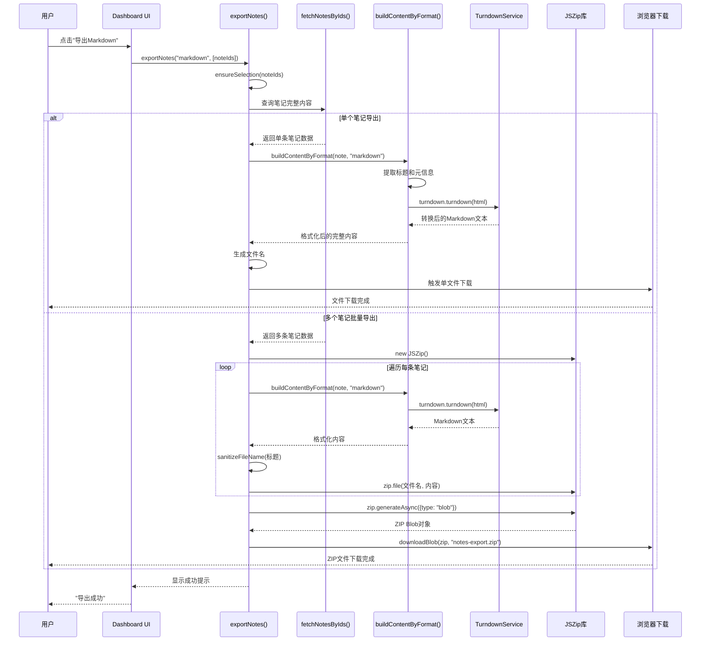
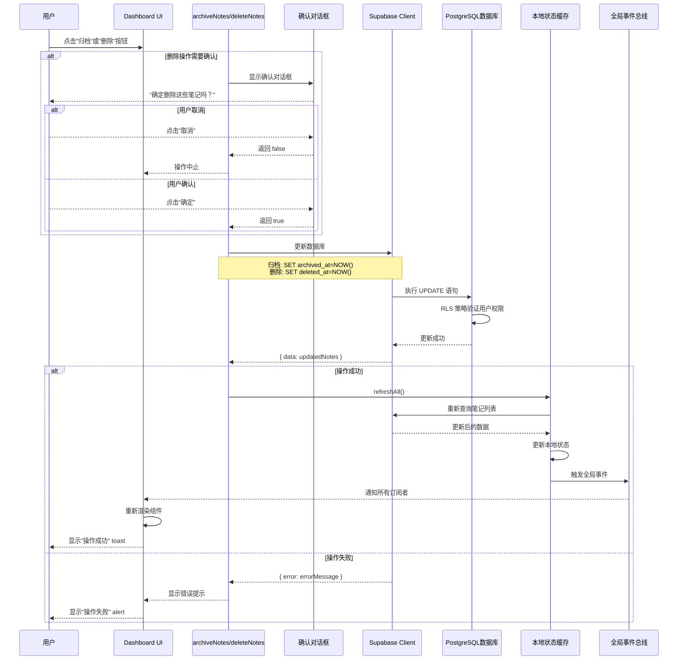
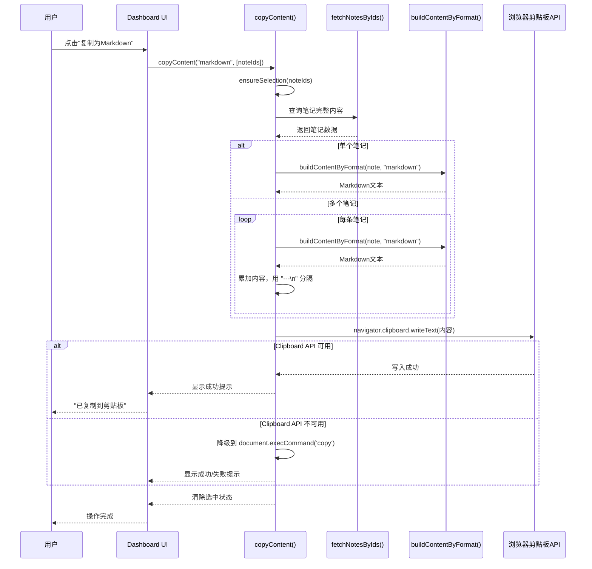

# 新闻操作模块技术实现文档

**版本**: 1.0
**最后更新**: 2026-01-04
**模块**: 新闻详情阅读器 - 更多操作模块

---

## 目录

1. [功能实现完整度检查](#1-功能实现完整度检查)
2. [核心流程时序图](#2-核心流程时序图)
3. [数据转换与清洗逻辑](#3-数据转换与清洗逻辑)
4. [设计模式分析](#4-设计模式分析)
5. [异常处理策略](#5-异常处理策略)
6. [性能优化建议](#6-性能优化建议)
7. [PDF导出实现方案](#7-pdf导出实现方案)

---

## 1. 功能实现完整度检查

### 1.1 已实现功能清单

| 功能分类 | 功能项 | 实现状态 | 位置 |
|---------|--------|---------|------|
| **基础交互** | 分享 | ⚠️ 占位 | ActionMenu.tsx:55 |
| | 访问原网页 | ✅ | ActionMenu.tsx:60 |
| | 刷新正文 | ✅ | ActionMenu.tsx:58-93 |
| | 设置星标 | ✅ | dashboard-content.tsx:1724-1740 |
| **剪贴板操作** | 复制链接（原链接） | ✅ | dashboard-content.tsx:1861-1870 |
| | 复制链接（Markdown） | ✅ | dashboard-content.tsx:1861-1870 |
| | 复制内容（纯文本） | ✅ | dashboard-content.tsx:1903-1916 |
| | 复制内容（Markdown） | ✅ | dashboard-content.tsx:1903-1916 |
| | 复制内容（HTML） | ✅ | dashboard-content.tsx:1903-1916 |
| **文件导出** | 导出 Markdown | ✅ | dashboard-content.tsx:1918-1947 |
| | 导出 TXT | ✅ | dashboard-content.tsx:1918-1947 |
| | 导出 HTML | ✅ | dashboard-content.tsx:1918-1947 |
| | 批量导出（ZIP） | ✅ | dashboard-content.tsx:1918-1947 |
| | 导出 PDF | ❌ 未实现 | - |
| **数据管理** | 移动到文件夹 | ✅ | dashboard-content.tsx:1470-1577 |
| | 编辑信息 | ✅ | dashboard-content.tsx:1309-1468 |
| | 归档 | ✅ | dashboard-content.tsx:1742-1757 |
| | 删除 | ✅ | dashboard-content.tsx:1759-1771 |

### 1.2 未实现功能分析

#### PDF 导出（未实现）

**原因分析**:
- PDF 生成需要额外的库支持（如 Puppeteer、jsPDF）
- 客户端生成 PDF 存在跨域、字体渲染等复杂问题
- 服务端生成需要额外的服务器资源和部署配置

**建议实现方案**:
- **方案 A**: 使用 `html2canvas` + `jsPDF`（纯前端）
  - 优点：无需服务器支持
  - 缺点：大文件性能差，图片可能模糊

- **方案 B**: 使用 Puppeteer（服务端）
  - 优点：高质量输出，可靠稳定
  - 缺点：需要服务器资源，部署复杂

- **方案 C**: 使用第三方 API（如 Adobe PDF Services）
  - 优点：最佳质量
  - 缺点：成本高，依赖外部服务

**推荐**: 方案 B（服务端 Puppeteer）- 平衡质量和可控性

### 1.3 设计模式评估

#### 命令模式 (Command Pattern)

**实现位置**: `ActionMenu.tsx` - `handleAction` 函数

```typescript
// 命令分发器
const handleAction = async (action: string) => {
  switch (action) {
    case "copy-link": await copyLinks(); break;
    case "export-md": await exportNotes("markdown"); break;
    // ... 其他命令
  }
};
```

**优点**:
- 集中管理所有操作，易于维护
- 新增操作只需添加 case 分支
- 统一的错误处理入口

**缺点**:
- 缺少撤销/重做功能
- 无操作日志记录
- 无法批量执行命令

**改进建议**:
- 实现命令历史栈，支持撤销操作
- 添加操作日志，用于审计和调试

#### 策略模式 (Strategy Pattern)

**实现位置**: `dashboard-content.tsx` - `buildContentByFormat` 函数

```typescript
// 根据格式选择转换策略
const buildContentByFormat = (note, format) => {
  switch (format) {
    case "text": return buildTextContent(note);
    case "markdown": return buildMarkdownContent(note);
    case "html": return buildHtmlContent(note);
  }
};
```

**优点**:
- 格式转换逻辑分离，职责清晰
- 易于添加新的导出格式
- 每种格式可独立测试

**缺点**:
- 可抽象为独立的 Formatter 类
- 缺少格式验证逻辑
- 错误处理不够细致

**改进建议**:
- 创建 `Formatter` 基类和子类
- 添加格式验证和错误恢复机制

#### 工厂模式 (Factory Pattern)

**实现位置**: `dashboard-content.tsx` - `exportNotes` 函数

```typescript
// 根据数量决定单文件或ZIP
const exportNotes = async (format, noteIds) => {
  const notes = await fetchNotesByIds(noteIds);

  if (notes.length === 1) {
    // 单文件导出
    downloadSingleFile(notes[0]);
  } else {
    // 批量ZIP导出
    downloadZipFile(notes);
  }
};
```

**优点**:
- 自动切换导出策略
- 对调用者透明
- 处理了边界情况

**缺点**:
- 单文件和批量逻辑混在一起
- 可分离 Blob 创建和下载逻辑
- 缺少文件名冲突处理

**改进建议**:
- 创建 `FileExporter` 类，分离职责
- 添加文件名冲突检测和自动重命名

---

## 2. 核心流程时序图

### 2.1 导出流程时序图



**关键节点说明**:

1. **ensureSelection**: 确保已选中笔记，未选中时提示用户
2. **fetchNotesByIds**: 批量查询，使用 Supabase `in` 过滤器
3. **buildContentByFormat**: 根据格式调用不同的构建策略
4. **Turndown**: HTML 转 Markdown 的核心库
5. **sanitizeFileName**: 过滤文件名非法字符
6. **JSZip**: 批量导出时创建 ZIP 压缩包
7. **downloadBlob**: 创建临时 `<a>` 元素触发下载

### 2.2 生命周期变更时序图



**关键节点说明**:

1. **确认对话框**: 删除操作需要二次确认，归档无需确认
2. **RLS 策略**: 数据库层验证用户权限，防止越权操作
3. **软删除**: 仅更新时间戳字段，不物理删除数据
4. **refreshAll**: 重新加载所有相关数据（笔记、文件夹、标签、计数）
5. **全局事件**: 通知其他组件更新（如智能列表计数）

### 2.3 复制操作时序图



**关键节点说明**:

1. **ensureSelection**: 验证是否有选中的笔记
2. **分隔符**: 多个笔记之间用 `---\n` 分隔（Markdown 规范）
3. **Clipboard API**: 需要 HTTPS 或 localhost
4. **降级方案**: 旧版浏览器使用 `document.execCommand('copy')`

---

## 3. 数据转换与清洗逻辑

### 3.1 HTML 标签处理规则

#### 清洗策略

**实现位置**: `/lib/services/html-sanitizer.ts` - `sanitizeHtmlContent` 函数

| 标签类别 | 处理规则 | 原因说明 |
|---------|---------|---------|
| **完全移除** | `script`, `style`, `nav`, `header`, `footer`, `iframe`, `noscript`, `link`, `meta`, `aside`, `form`, `button`, `input` | 非内容元素，可能干扰阅读或存在安全风险 |
| **保留结构** | `h1`-`h6`, `p`, `blockquote`, `ul`, `ol`, `li`, `br`, `hr`, `img`, `a`, `div`, `span` | 构成文章语义结构的核心元素 |
| **属性处理** | 移除所有 `style`, `class`, `id` 属性<br/>保留 `img` 的 `src`, `alt`, `title`<br/>保留 `a` 的 `href`, `target`, `rel` | 防止 XSS 攻击，保留必要功能 |
| **特殊处理** | 移除第一个 `h1`（与存储的标题重复）<br/>移除元数据块（作者、时间、来源） | 避免与数据库字段冗余 |

#### 针对新闻平台的特殊处理

```typescript
// 腾讯新闻等平台的特殊处理
$('.author, .time, .source, .article-info, .metadata, .meta-info, .title-info').remove();
$('#article-author').remove();
$('span:contains("来源"), span:contains("作者"), span:contains("发布时间")').closest('div, p').remove();
```

**原因**: 新闻网站通常在正文中重复显示元信息，这些数据已在数据库中存储，需移除避免冗余。

### 3.2 图片防盗链处理

#### 实现机制

**实现位置**: `/components/reader/ContentStage/ArticleReader.tsx` - `processContentHtml` 函数

```typescript
// 为所有图片添加 referrerpolicy 属性
function processContentHtml(html: string | null) {
  if (!html) return null;
  // 添加 referrerpolicy="no-referrer" 绕过防盗链检测
  return html.replace(/ : " / \ | ? *` | 255 字符 | 区分大小写，保留大小写 |
| **macOS** | `:` (冒号) | 255 字符 | 区分大小写 |
| **Linux** | `/` (斜杠) | 255 字节 | 区分大小写 |

#### 过滤策略

**当前实现**: 保留字符集白名单（`[a-zA-Z0-9-_.]`），其他替换为 `-`

**优点**:
- 跨平台兼容性最好
- 避免了所有已知非法字符
- 简单高效

**缺点**:
- 中文字符被替换为 `-`，损失可读性
- 特殊符号（如 `&`、`@`）被替换

**改进建议**:
```typescript
// 更精细的文件名清理
function sanitizeFileName(name: string) {
  // 1. 移除Windows禁止字符
  let cleaned = name.replace(/[<>:"/\\|?*]/g, "");

  // 2. 替换空格和连续特殊字符为单个连字符
  cleaned = cleaned.replace(/\s+[-_\s]+/g, "-");

  // 3. 移除首尾连字符和点
  cleaned = cleaned.replace(/^[-_.]+|[-_.]+$/g, "");

  // 4. 限制长度（200字符）
  cleaned = cleaned.substring(0, 200);

  // 5. 空文件名兜底
  return cleaned || "untitled";
}
```

### 3.4 Turndown 转换规则配置

#### 默认转换规则

**实现位置**: `/components/dashboard/dashboard-content.tsx` - 第 760 行

```typescript
import TurndownService from "turndown";

// 创建 Turndown 实例（使用 useMemo 缓存）
const turndown = useMemo(() => new TurndownService(), []);
```

#### HTML 到 Markdown 转换映射表

| HTML 标签 | Markdown 语法 | 示例 |
|----------|--------------|------|
| `h1` - `h6` | `#` - `######` | `<h1>标题</h1>` → `# 标题` |
| `strong` / `b` | `**text**` | `<strong>加粗</strong>` → `**加粗**` |
| `em` / `i` | `*text*` | `<em>斜体</em>` → `*斜体*` |
| `code` | `` `code` `` | `<code>代码</code>` → `` `代码` `` |
| `pre` | ` ```code``` ` | `<pre>代码块</pre>` → ` ```代码块``` ` |
| `a` | `[text](url)` | `<a href="url">链接</a>` → `[链接](url)` |
| `img` | `` | `` → `` |
| `blockquote` | `> text` | `<blockquote>引用</blockquote>` → `> 引用` |
| `ul` / `ol` | 列表项 | `<ul><li>项</li></ul>` → `- 项` |
| `br` | 换行 | `<br>` → 两个空格 + 换行 |
| `hr` | `---` | `<hr>` → `---` |

#### 自定义规则（可扩展）

```typescript
// 可添加自定义规则
const turndown = useMemo(() => {
  const service = new TurndownService();

  // 添加自定义规则
  service.addRule("highlight", {
    filter: (node) => node.nodeName === "MARK",
    replacement: (content) => `==${content}==` // Markdown 高亮语法
  });

  return service;
}, []);
```

### 3.5 各导出格式的内容结构

#### Markdown 格式

```markdown
# 笔记标题

> 来源：网站名 | 采集时间：2026-01-04

---

## 正文内容

（转换后的 Markdown 正文）

...

---

由 NewsBox 采集
```

#### 纯文本格式

```
笔记标题

来源：网站名 | 采集时间：2026-01-04

---

正文内容（纯文本，去除所有 HTML 标签）

...

---

由 NewsBox 采集
```

#### HTML 格式

```html
<!DOCTYPE html>
<html>
<head>
  <meta charset="UTF-8">
  <title>笔记标题</title>
</head>
<body>
  <h1>笔记标题</h1>
  <p>来源：网站名 | 采集时间：2026-01-04</p>
  <hr>
  <!-- 原始 HTML 内容 -->
  ...
</body>
</html>
```

---

## 4. 设计模式分析

### 4.1 命令模式 (Command Pattern)

#### 类图结构

```
┌─────────────────┐
│   ActionMenu    │
├─────────────────┤
│ + handleAction()│
└────────┬────────┘
         │
         ├─────────────────┬─────────────────┬─────────────────┐
         ▼                 ▼                 ▼                 ▼
    ┌─────────┐      ┌─────────┐      ┌─────────┐      ┌─────────┐
    │ CopyLink │      │ Export  │      │ Archive │      │ Delete  │
    │ Command │      │ Command │      │ Command │      │ Command │
    └─────────┘      └─────────┘      └─────────┘      └─────────┘
```

#### 实现代码

```typescript
// ActionMenu.tsx
const handleAction = async (action: string) => {
  switch (action) {
    case "copy-link":
      await copyLinks();
      break;
    case "export-md":
      await exportNotes("markdown");
      break;
    case "export-txt":
      await exportNotes("text");
      break;
    case "export-html":
      await exportNotes("html");
      break;
    case "archive":
      await archiveNotes();
      break;
    case "delete":
      await deleteNotes();
      break;
    // ... 更多命令
  }
};
```

#### 优缺点分析

**优点**:
1. **集中管理**: 所有操作通过一个函数分发，易于维护
2. **易于扩展**: 新增操作只需添加 case 分支
3. **统一入口**: 可在分发前后添加统一的逻辑（如日志、权限检查）

**缺点**:
1. **缺少撤销功能**: 无法实现命令的撤销和重做
2. **无操作日志**: 不支持操作历史记录和审计
3. **无法批量执行**: 不支持批量执行多个命令

**改进建议**:

```typescript
// 实现命令模式 + 撤销/重做
interface Command {
  execute(): Promise<void>;
  undo(): Promise<void>;
}

class CopyLinkCommand implements Command {
  constructor(private noteIds: string[]) {}

  async execute() {
    await copyLinks(this.noteIds);
  }

  async undo() {
    // 清空剪贴板或恢复之前的内容
  }
}

class CommandInvoker {
  private history: Command[] = [];
  private currentIndex = -1;

  async execute(command: Command) {
    await command.execute();
    this.history = this.history.slice(0, this.currentIndex + 1);
    this.history.push(command);
    this.currentIndex++;
  }

  async undo() {
    if (this.currentIndex >= 0) {
      await this.history[this.currentIndex].undo();
      this.currentIndex--;
    }
  }

  async redo() {
    if (this.currentIndex < this.history.length - 1) {
      this.currentIndex++;
      await this.history[this.currentIndex].execute();
    }
  }
}
```

### 4.2 策略模式 (Strategy Pattern)

#### 类图结构

```
┌─────────────────────────────────┐
│      buildContentByFormat       │
├─────────────────────────────────┤
│ + buildTextContent(note)        │
│ + buildMarkdownContent(note)    │
│ + buildHtmlContent(note)        │
└─────────────────────────────────┘
         │
         ├───────────┬───────────┬───────────┐
         ▼           ▼           ▼           ▼
    ┌─────────┐ ┌─────────┐ ┌─────────┐ ┌─────────┐
    │  Text   │ │Markdown │ │  HTML   │ │  PDF    │
    │Formatter│ │Formatter│ │Formatter│ │Formatter│
    └─────────┘ └─────────┘ └─────────┘ └─────────┘
```

#### 实现代码

```typescript
// dashboard-content.tsx
const buildContentByFormat = (
  note: NoteContentRecord,
  format: "text" | "markdown" | "html",
) => {
  switch (format) {
    case "text":
      return buildTextContent(note);
    case "markdown":
      return buildMarkdownContent(note);
    case "html":
      return buildHtmlContent(note);
    default:
      throw new Error(`Unsupported format: ${format}`);
  }
};

// 各格式的构建策略
function buildTextContent(note: NoteContentRecord) {
  const title = note.title || "无标题";
  const meta = `来源：${note.site_name || "未知"} | 采集时间：${new Date(note.created_at).toLocaleDateString("zh-CN")}`;
  const content = note.content_text || htmlToPlainText(note.content_html);
  const excerpt = note.excerpt ? `\n\n> ${note.excerpt}` : "";

  return `${title}\n\n${meta}\n\n---\n\n${content}${excerpt}\n\n---\n\n由 NewsBox 采集`;
}

function buildMarkdownContent(note: NoteContentRecord) {
  const title = `# ${note.title || "无标题"}`;
  const meta = `> 来源：${note.site_name || "未知"} | 采集时间：${new Date(note.created_at).toLocaleDateString("zh-CN")}`;
  const content = turndown.turndown(note.content_html);
  const excerpt = note.excerpt ? `\n\n> ${note.excerpt}` : "";

  return `${title}\n\n${meta}\n\n---\n\n${content}${excerpt}\n\n---\n\n由 NewsBox 采集`;
}

function buildHtmlContent(note: NoteContentRecord) {
  const title = note.title || "无标题";
  const meta = `<p>来源：${note.site_name || "未知"} | 采集时间：${new Date(note.created_at).toLocaleDateString("zh-CN")}</p>`;
  const content = note.content_html || "";

  return `<!DOCTYPE html>
<html>
<head>
  <meta charset="UTF-8">
  <title>${title}</title>
</head>
<body>
  <h1>${title}</h1>
  ${meta}
  <hr>
  ${content}
  <hr>
  <p>由 NewsBox 采集</p>
</body>
</html>`;
}
```

#### 优缺点分析

**优点**:
1. **职责分离**: 每种格式的构建逻辑独立
2. **易于测试**: 可单独测试每种格式
3. **易于扩展**: 新增格式只需添加新函数和 case 分支

**缺点**:
1. **缺少抽象**: 没有统一的 Formatter 接口
2. **缺少验证**: 不验证输入数据的完整性
3. **错误处理不足**: 格式转换失败时的处理不完善

**改进建议**:

```typescript
// 定义格式化器接口
interface ContentFormatter {
  format(note: NoteContentRecord): string;
  validate(note: NoteContentRecord): boolean;
}

// 文本格式化器
class TextFormatter implements ContentFormatter {
  format(note: NoteContentRecord): string {
    // 实现文本格式化逻辑
  }

  validate(note: NoteContentRecord): boolean {
    return !!(note.content_text || note.content_html);
  }
}

// Markdown 格式化器
class MarkdownFormatter implements ContentFormatter {
  format(note: NoteContentRecord): string {
    // 实现 Markdown 格式化逻辑
  }

  validate(note: NoteContentRecord): boolean {
    return !!(note.content_html);
  }
}

// 格式化器工厂
class FormatterFactory {
  private formatters = new Map<string, ContentFormatter>();

  register(format: string, formatter: ContentFormatter) {
    this.formatters.set(format, formatter);
  }

  get(format: string): ContentFormatter {
    const formatter = this.formatters.get(format);
    if (!formatter) {
      throw new Error(`Unsupported format: ${format}`);
    }
    return formatter;
  }
}

// 使用
const factory = new FormatterFactory();
factory.register("text", new TextFormatter());
factory.register("markdown", new MarkdownFormatter());
factory.register("html", new HtmlFormatter());

const buildContentByFormat = (note: NoteContentRecord, format: string) => {
  const formatter = factory.get(format);
  if (!formatter.validate(note)) {
    throw new Error(`Invalid note data for format: ${format}`);
  }
  return formatter.format(note);
};
```

### 4.3 工厂模式 (Factory Pattern)

#### 类图结构

```
┌─────────────────────────────┐
│       exportNotes            │
├─────────────────────────────┤
│ + exportNotes(format, ids)  │
└──────────┬──────────────────┘
           │
           ▼
    ┌──────────────┐
    │  判断笔记数量  │
    └──────┬───────┘
           │
      ┌────┴────┐
      ▼         ▼
  ┌────────┐ ┌────────┐
  │单文件  │ │ 批量ZIP │
  │导出器  │ │ 导出器  │
  └────────┘ └────────┘
```

#### 实现代码

```typescript
// dashboard-content.tsx
const exportNotes = async (
  format: "text" | "markdown" | "html",
  noteIds?: string[],
) => {
  // 1. 确保已选中笔记
  const idsToExport = noteIds || selectedNoteIds;
  if (!ensureSelection(idsToExport)) {
    return;
  }

  // 2. 查询笔记内容
  const notes = await fetchNotesByIds(idsToExport);

  // 3. 根据数量选择导出策略
  if (notes.length === 1) {
    // 单文件导出
    const note = notes[0];
    const content = buildContentByFormat(note, format);
    const filename = `${sanitizeFileName(note.title || "untitled")}.${getFileExtension(format)}`;
    const blob = new Blob([content], { type: getMimeType(format) });
    downloadBlob(blob, filename);
  } else {
    // 批量 ZIP 导出
    const zip = new JSZip();

    notes.forEach((note, index) => {
      const content = buildContentByFormat(note, format);
      const filename = `${sanitizeFileName(note.title || `note-${index + 1}`)}.${getFileExtension(format)}`;
      zip.file(filename, content);
    });

    const zipBlob = await zip.generateAsync({ type: "blob" });
    downloadBlob(zipBlob, `notes-export-${Date.now()}.zip`);
  }
};

function getFileExtension(format: string): string {
  switch (format) {
    case "text": return "txt";
    case "markdown": return "md";
    case "html": return "html";
    default: return "txt";
  }
}

function getMimeType(format: string): string {
  switch (format) {
    case "text": return "text/plain";
    case "markdown": return "text/markdown";
    case "html": return "text/html";
    default: return "text/plain";
  }
}
```

#### 优缺点分析

**优点**:
1. **自动化选择**: 根据笔记数量自动选择导出策略
2. **对调用者透明**: 调用者无需关心单文件还是批量
3. **代码复用**: `buildContentByFormat` 和 `sanitizeFileName` 复用

**缺点**:
1. **职责混杂**: Blob 创建和下载逻辑混在一起
2. **缺少抽象**: 没有独立的 Exporter 类
3. **文件名冲突**: 多个笔记同名时会覆盖

**改进建议**:

```typescript
// 定义导出器接口
interface NoteExporter {
  export(notes: NoteContentRecord[], format: string): Promise<void>;
}

// 单文件导出器
class SingleFileExporter implements NoteExporter {
  async export(notes: NoteContentRecord[], format: string) {
    if (notes.length !== 1) {
      throw new Error("SingleFileExporter only supports single note");
    }

    const note = notes[0];
    const content = buildContentByFormat(note, format);
    const filename = this.generateFilename(note, format);
    const blob = this.createBlob(content, format);

    this.download(blob, filename);
  }

  private generateFilename(note: NoteContentRecord, format: string): string {
    return `${sanitizeFileName(note.title || "untitled")}.${getFileExtension(format)}`;
  }

  private createBlob(content: string, format: string): Blob {
    return new Blob([content], { type: getMimeType(format) });
  }

  private download(blob: Blob, filename: string): void {
    downloadBlob(blob, filename);
  }
}

// 批量 ZIP 导出器
class BatchZipExporter implements NoteExporter {
  async export(notes: NoteContentRecord[], format: string) {
    const zip = new JSZip();
    const usedNames = new Set<string>();

    notes.forEach((note, index) => {
      const content = buildContentByFormat(note, format);
      const filename = this.generateUniqueFilename(note, format, index, usedNames);
      zip.file(filename, content);
    });

    const zipBlob = await zip.generateAsync({ type: "blob" });
    this.download(zipBlob, `notes-export-${Date.now()}.zip`);
  }

  private generateUniqueFilename(
    note: NoteContentRecord,
    format: string,
    index: number,
    usedNames: Set<string>,
  ): string {
    let baseName = sanitizeFileName(note.title || `note-${index + 1}`);
    let filename = `${baseName}.${getFileExtension(format)}`;
    let counter = 1;

    while (usedNames.has(filename)) {
      filename = `${baseName}-${counter}.${getFileExtension(format)}`;
      counter++;
    }

    usedNames.add(filename);
    return filename;
  }

  private download(blob: Blob, filename: string): void {
    downloadBlob(blob, filename);
  }
}

// 导出器工厂
class ExporterFactory {
  createExporter(noteCount: number): NoteExporter {
    if (noteCount === 1) {
      return new SingleFileExporter();
    } else {
      return new BatchZipExporter();
    }
  }
}

// 使用
const exportNotes = async (
  format: "text" | "markdown" | "html",
  noteIds?: string[],
) => {
  const idsToExport = noteIds || selectedNoteIds;
  if (!ensureSelection(idsToExport)) {
    return;
  }

  const notes = await fetchNotesByIds(idsToExport);
  const factory = new ExporterFactory();
  const exporter = factory.createExporter(notes.length);

  await exporter.export(notes, format);
};
```

---

## 5. 异常处理策略

### 5.1 网络请求失败处理

#### Jina Reader API 调用失败

**实现位置**: `/components/reader/GlobalHeader/ActionMenu.tsx` - `handleRefreshContent` 函数

```typescript
const handleRefreshContent = async () => {
  setIsRefreshing(true);
  const loadingToast = toast.loading("正在尝试重新提取正文...");

  try {
    const response = await fetch("/api/extract/jina", {
      method: "POST",
      headers: { "Content-Type": "application/json" },
      body: JSON.stringify({
        url: note.source_url,
        noteId: note.id,
      }),
    });

    if (!response.ok) {
      const data = await response.json();
      throw new Error(data.error || "提取失败");
    }

    toast.success("内容提取成功", { id: loadingToast });
    window.dispatchEvent(new CustomEvent("reader:refresh-content"));

  } catch (error) {
    console.error("Refresh content error:", error);
    toast.error(`提取失败: ${error instanceof Error ? error.message : "未知错误"}`, {
      id: loadingToast,
    });
  } finally {
    setIsRefreshing(false);
  }
};
```

#### 错误类型与处理策略

| 错误类型 | HTTP 状态码 | 错误信息 | 处理策略 |
|---------|------------|---------|---------|
| **URL 不可访问** | 400/404 | "Failed to fetch" | 提示用户检查 URL，提供"访问原网页"按钮 |
| **Jina API 限流** | 429 | "Rate limit exceeded" | 提示用户稍后重试（建议 30 秒后） |
| **Jina API 错误** | 500 | "Internal server error" | 提示用户服务暂时不可用，保留原有内容 |
| **超时** | 504 | "Request timeout" | 提示用户网络较慢，建议使用"访问原网页" |
| **解析失败** | 200 但内容为空 | "No content found" | 提示用户该网页可能无法抓取 |

#### 改进建议

```typescript
// 实现重试机制
async function fetchWithRetry(
  url: string,
  options: RequestInit,
  maxRetries = 3,
  delay = 1000,
): Promise<Response> {
  for (let i = 0; i < maxRetries; i++) {
    try {
      const response = await fetch(url, options);
      if (response.ok || response.status !== 429) {
        return response;
      }
      // 429 错误时重试
      if (response.status === 429 && i < maxRetries - 1) {
        await new Promise(resolve => setTimeout(resolve, delay * Math.pow(2, i)));
        continue;
      }
      return response;
    } catch (error) {
      if (i === maxRetries - 1) throw error;
      await new Promise(resolve => setTimeout(resolve, delay * Math.pow(2, i)));
    }
  }
  throw new Error("Max retries exceeded");
}

// 使用
const response = await fetchWithRetry("/api/extract/jina", {...}, 3, 1000);
```

### 5.2 文件权限被拒绝场景

#### Clipboard API 权限处理

**实现位置**: `/components/dashboard/dashboard-content.tsx` - `copyContent` 函数

```typescript
const copyContent = async (
  format: "text" | "markdown" | "html",
  noteIds?: string[],
) => {
  // ... 构建内容

  try {
    // 优先使用现代 Clipboard API
    if (navigator.clipboard && navigator.clipboard.writeText) {
      await navigator.clipboard.writeText(content);
      toast.success("已复制到剪贴板");
    } else {
      // 降级到旧版方法
      throw new Error("Clipboard API not available");
    }
  } catch (error) {
    // 降级方案：使用 execCommand
    try {
      const textArea = document.createElement("textarea");
      textArea.value = content;
      textArea.style.position = "fixed";
      textArea.style.opacity = "0";
      document.body.appendChild(textArea);
      textArea.select();
      const successful = document.execCommand("copy");
      document.body.removeChild(textArea);

      if (successful) {
        toast.success("已复制到剪贴板");
      } else {
        throw new Error("execCommand failed");
      }
    } catch (fallbackError) {
      console.error("Copy failed:", fallbackError);
      toast.error("复制失败，请手动复制内容");
    }
  }
};
```

#### Clipboard API 限制

| 限制条件 | 说明 | 解决方案 |
|---------|------|---------|
| **HTTPS 要求** | 仅在 HTTPS 或 localhost 下可用 | 检测协议，HTTP 时提示用户 |
| **用户权限** | 需要用户授权（首次使用时弹窗） | 提示用户允许剪贴板访问 |
| **浏览器兼容** | IE 不支持，旧版 Safari 部分支持 | 降级到 execCommand |
| **内容大小** | 部分浏览器限制复制大小 | 分批复制或提示用户 |

#### 改进建议

```typescript
// 检查 Clipboard API 可用性
function checkClipboardSupport(): {
  supported: boolean;
  method: "clipboard" | "execCommand" | "manual";
  reason?: string;
} {
  // 检查协议
  if (location.protocol !== "https:" && location.protocol !== "http:" && location.hostname !== "localhost") {
    return {
      supported: false,
      method: "manual",
      reason: "剪贴板 API 仅在 HTTPS 或 localhost 下可用",
    };
  }

  // 检查浏览器支持
  if (navigator.clipboard && navigator.clipboard.writeText) {
    return { supported: true, method: "clipboard" };
  }

  // 检查 execCommand 支持
  if (document.queryCommandSupported && document.queryCommandSupported("copy")) {
    return { supported: true, method: "execCommand" };
  }

  return {
    supported: false,
    method: "manual",
    reason: "您的浏览器不支持自动复制，请手动复制",
  };
}

// 使用
const clipboard = checkClipboardSupport();

if (!clipboard.supported) {
  toast.error(clipboard.reason);
  // 显示手动复制提示
  return;
}

if (clipboard.method === "clipboard") {
  await navigator.clipboard.writeText(content);
} else if (clipboard.method === "execCommand") {
  // 使用 execCommand
}
```

### 5.3 数据一致性保证

#### 乐观更新 + 回滚机制

```typescript
const archiveNotes = async (noteIds?: string[]) => {
  const idsToArchive = noteIds || selectedNoteIds;
  if (!ensureSelection(idsToArchive)) return;

  // 1. 保存原始状态（用于回滚）
  const originalNotes = notes.filter(n => idsToArchive.includes(n.id));
  const originalData = originalNotes.map(n => ({
    id: n.id,
    archived_at: n.archived_at,
  }));

  try {
    // 2. 乐观更新 UI
    setNotes(prev =>
      prev.map(note =>
        idsToArchive.includes(note.id)
          ? { ...note, archived_at: new Date().toISOString() }
          : note
      )
    );

    // 3. 提交到数据库
    const { error } = await supabase
      .from("notes")
      .update({ archived_at: new Date().toISOString() })
      .in("id", idsToArchive);

    if (error) throw error;

    // 4. 成功：刷新数据
    await refreshAll();
    toast.success(`已归档 ${idsToArchive.length} 条笔记`);

  } catch (error) {
    // 5. 失败：回滚 UI
    setNotes(prev =>
      prev.map(note => {
        const original = originalData.find(o => o.id === note.id);
        return original && idsToArchive.includes(note.id)
          ? { ...note, archived_at: original.archived_at }
          : note;
      })
    );

    console.error("Archive failed:", error);
    toast.error("归档失败，请重试");
  }
};
```

#### 数据库事务处理

```typescript
// 确保多个操作原子性
const moveNotesWithTags = async (
  noteIds: string[],
  targetFolderId: string | null,
) => {
  // 使用 Supabase RPC 函数（服务端事务）
  const { data, error } = await supabase.rpc("move_notes_to_folder", {
    p_note_ids: noteIds,
    p_target_folder_id: targetFolderId,
    p_user_id: user.id,
  });

  if (error) {
    toast.error("移动失败");
    return;
  }

  // 刷新相关数据
  await Promise.all([
    refreshNotes(),
    refreshFolders(),
    refreshCounts(),
  ]);
};
```

---

## 6. 性能优化建议

### 6.1 批量导出内存优化

#### 当前问题

```typescript
// 问题：一次性加载所有笔记到内存
const notes = await fetchNotesByIds(noteIds); // 可能有 1000+ 条
const zip = new JSZip();

notes.forEach(note => {
  const content = buildContentByFormat(note, format);
  zip.file(filename, content); // 所有内容保存在内存中
});

const blob = await zip.generateAsync({ type: "blob" });
```

**内存占用估算**:
- 单条笔记平均：50KB
- 1000 条笔记：50MB
- JSZip 缓存：2-3 倍（100-150MB）
- Blob 生成：额外 50MB
- **总计：200MB+**

#### 优化方案：分批打包

```typescript
async function exportNotesInBatches(
  format: string,
  noteIds: string[],
  batchSize = 200,
) {
  const batches = [];
  for (let i = 0; i < noteIds.length; i += batchSize) {
    batches.push(noteIds.slice(i, i + batchSize));
  }

  // 创建主 ZIP
  const mainZip = new JSZip();

  // 分批处理
  for (let i = 0; i < batches.length; i++) {
    const batch = batches[i];
    const notes = await fetchNotesByIds(batch);

    // 创建批次 ZIP
    const batchZip = new JSZip();
    notes.forEach(note => {
      const content = buildContentByFormat(note, format);
      const filename = `${sanitizeFileName(note.title || `note-${note.id}`)}.${getFileExtension(format)}`;
      batchZip.file(filename, content);
    });

    // 生成批次 Blob
    const batchBlob = await batchZip.generateAsync({ type: "blob" });
    mainZip.file(`batch-${i + 1}.zip`, batchBlob);

    // 更新进度
    const progress = Math.round(((i + 1) / batches.length) * 100);
    toast.loading(`导出中... ${progress}%`, { id: "export-progress" });
  }

  // 生成最终 ZIP
  toast.loading("正在打包...", { id: "export-progress" });
  const finalBlob = await mainZip.generateAsync({ type: "blob" });
  downloadBlob(finalBlob, `notes-export-${Date.now()}.zip`);

  toast.success("导出完成", { id: "export-progress" });
}
```

**内存占用对比**:
- 优化前：200MB+（一次性）
- 优化后：30-50MB（峰值）

### 6.2 大文件处理策略

#### Web Worker 处理

```typescript
// export.worker.ts
self.onmessage = async (e) => {
  const { notes, format } = e.data;

  const zip = new JSZip();
  notes.forEach(note => {
    const content = buildContentByFormat(note, format);
    zip.file(note.filename, content);
  });

  const blob = await zip.generateAsync({ type: "blob" });

  self.postMessage({ blob });
};

// 主线程
function exportWithWorker(notes: NoteContentRecord[], format: string) {
  const worker = new Worker(new URL("./export.worker.ts", import.meta.url));

  worker.postMessage({ notes, format });

  worker.onmessage = (e) => {
    const { blob } = e.data;
    downloadBlob(blob, `notes-export-${Date.now()}.zip`);
    worker.terminate();
  };
}
```

#### 流式下载（服务端生成）

```typescript
// 客户端：请求服务端生成 ZIP
async function exportFromServer(noteIds: string[], format: string) {
  const response = await fetch("/api/export/zip", {
    method: "POST",
    headers: { "Content-Type": "application/json" },
    body: JSON.stringify({ noteIds, format }),
  });

  if (!response.ok) {
    throw new Error("导出失败");
  }

  // 流式下载
  const reader = response.body?.getReader();
  const contentLength = response.headers.get("Content-Length");
  const chunks: Uint8Array[] = [];
  let receivedLength = 0;

  while (true) {
    const { done, value } = await reader!.read();
    if (done) break;

    chunks.push(value);
    receivedLength += value.length;

    // 更新进度
    const progress = contentLength
      ? Math.round((receivedLength / Number(contentLength)) * 100)
      : null;
    if (progress) {
      toast.loading(`下载中... ${progress}%`, { id: "export-progress" });
    }
  }

  // 合并 chunks
  const blob = new Blob(chunks, { type: "application/zip" });
  downloadBlob(blob, `notes-export-${Date.now()}.zip`);
}
```

### 6.3 并发控制与队列管理

```typescript
// 并发控制
class ConcurrencyController {
  private queue: Array<() => Promise<any>> = [];
  private running = 0;
  private maxConcurrency: number;

  constructor(maxConcurrency: number) {
    this.maxConcurrency = maxConcurrency;
  }

  async run<T>(task: () => Promise<T>): Promise<T> {
    // 如果未达到最大并发数，直接执行
    if (this.running < this.maxConcurrency) {
      this.running++;
      try {
        return await task();
      } finally {
        this.running--;
        this.processQueue();
      }
    }

    // 否则加入队列
    return new Promise((resolve, reject) => {
      this.queue.push(async () => {
        try {
          resolve(await task());
        } catch (error) {
          reject(error);
        } finally {
          this.running--;
          this.processQueue();
        }
      });
      this.processQueue();
    });
  }

  private processQueue() {
    while (this.queue.length > 0 && this.running < this.maxConcurrency) {
      const task = this.queue.shift()!;
      this.running++;
      task();
    }
  }
}

// 使用：限制并发数为 3
const controller = new ConcurrencyController(3);

const exportNotes = async (noteIds: string[]) => {
  // 并发获取笔记内容（最多 3 个同时）
  const notes = await Promise.all(
    noteIds.map(id => controller.run(() => fetchNoteById(id)))
  );

  // 其余逻辑...
};
```

---

## 7. PDF 导出实现方案

### 7.1 技术选型对比

| 方案 | 库/服务 | 优点 | 缺点 | 推荐度 |
|------|---------|------|------|--------|
| **客户端渲染** | html2canvas + jsPDF | 纯前端，易部署 | 图片质量差，大文件卡顿 | ⚠️ 小文件 |
| **客户端打印** | window.print() | 无需额外库 | 用户体验差，不可控 | ⚠️ 备选 |
| **服务端渲染** | Puppeteer | 高质量，可靠 | 需要服务器资源 | ✅ 推荐 |
| **第三方 API** | Adobe PDF Services | 最佳质量 | 成本高，依赖外部 | ✅ 企业版 |

### 7.2 推荐方案：服务端 Puppeteer

#### 架构设计

```
┌─────────┐      HTTP POST      ┌────────────┐
│ Client  │ ──────────────────> │ Next.js API │
│Browser  │                      │  Route     │
└─────────┘                      └──────┬──────┘
                                        │
                                        ▼
                                 ┌─────────────┐
                                 │  Puppeteer  │
                                 │   (Headless) │
                                 └──────┬──────┘
                                        │
                         ┌──────────────┴──────────────┐
                         ▼                             ▼
                    ┌─────────┐                   ┌─────────┐
                    │加载 HTML │                   │ 生成 PDF │
                    └────┬────┘                   └────┬────┘
                         │                             │
                         └──────────────┬──────────────┘
                                        ▼
                                 ┌─────────────┐
                                 │  ZIP 打包   │
                                 └──────┬──────┘
                                        │
                                        ▼
                                 ┌─────────────┐
                                 │ 返回 Blob   │
                                 └─────────────┘
```

#### 实现代码

**Step 1: 安装依赖**

```bash
npm install puppeteer-core @sparticuz/chromium
```

**Step 2: 创建 API 路由**

`/app/api/export/pdf/route.ts`:

```typescript
import { NextResponse } from "next/server";
import puppeteer from "puppeteer-core";
import chromium from "@sparticuz/chromium";
import JSZip from "jszip";
import { createClient } from "@/lib/supabase/server";

export async function POST(req: Request) {
  const supabase = await createClient();
  const { data: { user } } = await supabase.auth.getUser();

  if (!user) {
    return NextResponse.json({ error: "Unauthorized" }, { status: 401 });
  }

  const body = await req.json();
  const { noteIds, format = "pdf" } = body;

  // 查询笔记内容
  const { data: notes, error } = await supabase
    .from("notes")
    .select("id, title, content_html, site_name, created_at")
    .in("id", noteIds)
    .eq("user_id", user.id);

  if (error || !notes) {
    return NextResponse.json({ error: "Failed to fetch notes" }, { status: 400 });
  }

  try {
    // 启动浏览器
    const browser = await puppeteer.launch({
      executablePath: await chromium.executablePath(),
      args: [...chromium.args, "--no-sandbox"],
      headless: true,
    });

    const page = await browser.newPage();

    // 创建 ZIP
    const zip = new JSZip();

    // 生成每个笔记的 PDF
    for (const note of notes) {
      const html = generateHtml(note);
      await page.setContent(html, { waitUntil: "networkidle0" });

      const pdf = await page.pdf({
        format: "A4",
        printBackground: true,
        margin: { top: "1cm", right: "1cm", bottom: "1cm", left: "1cm" },
        displayHeaderFooter: true,
        headerTemplate: `
          <div style="font-size: 10px; color: #666; text-align: center; width: 100%;">
            ${note.title || "无标题"}
          </div>
        `,
        footerTemplate: `
          <div style="font-size: 10px; color: #666; text-align: center; width: 100%;">
            <span class="pageNumber"></span> / <span class="totalPages"></span>
          </div>
        `,
      });

      const filename = `${sanitizeFileName(note.title || "untitled")}.pdf`;
      zip.file(filename, pdf);
    }

    await browser.close();

    // 生成 ZIP
    const zipBlob = await zip.generateAsync({ type: "base64" });

    return new NextResponse(JSON.stringify({
      success: true,
      data: zipBlob,
      filename: `notes-export-${Date.now()}.zip`,
    }));

  } catch (error) {
    console.error("PDF generation error:", error);
    return NextResponse.json(
      { error: "Failed to generate PDF", details: String(error) },
      { status: 500 }
    );
  }
}

function generateHtml(note: any): string {
  return `<!DOCTYPE html>
<html>
<head>
  <meta charset="UTF-8">
  <title>${note.title || "无标题"}</title>
  <style>
    body { font-family: -apple-system, BlinkMacSystemFont, "Segoe UI", Roboto, sans-serif; line-height: 1.6; padding: 2cm; }
    h1 { font-size: 24px; margin-bottom: 0.5em; }
    .meta { font-size: 14px; color: #666; margin-bottom: 1em; }
    img { max-width: 100%; height: auto; }
  </style>
</head>
<body>
  <h1>${note.title || "无标题"}</h1>
  <p class="meta">来源：${note.site_name || "未知"} | 采集时间：${new Date(note.created_at).toLocaleDateString("zh-CN")}</p>
  <hr>
  ${note.content_html || "<p>暂无内容</p>"}
</body>
</html>`;
}

function sanitizeFileName(name: string): string {
  return name.replace(/[^\w\d\-_.]+/g, "-");
}
```

**Step 3: 客户端调用**

`/components/dashboard/dashboard-content.tsx`:

```typescript
const exportPdfs = async (noteIds?: string[]) => {
  const idsToExport = noteIds || selectedNoteIds;
  if (!ensureSelection(idsToExport)) return;

  toast.loading("正在生成 PDF...", { id: "export-pdf" });

  try {
    const response = await fetch("/api/export/pdf", {
      method: "POST",
      headers: { "Content-Type": "application/json" },
      body: JSON.stringify({ noteIds: idsToExport }),
    });

    if (!response.ok) {
      const data = await response.json();
      throw new Error(data.error || "导出失败");
    }

    const { data: zipBase64, filename } = await response.json();

    // 转换 base64 为 Blob
    const binaryString = atob(zipBase64);
    const bytes = new Uint8Array(binaryString.length);
    for (let i = 0; i < binaryString.length; i++) {
      bytes[i] = binaryString.charCodeAt(i);
    }
    const blob = new Blob([bytes], { type: "application/zip" });

    downloadBlob(blob, filename);
    toast.success("PDF 导出成功", { id: "export-pdf" });

  } catch (error) {
    console.error("PDF export error:", error);
    toast.error(`导出失败: ${error instanceof Error ? error.message : "未知错误"}`, {
      id: "export-pdf",
    });
  }
};
```

### 7.3 部署配置

#### Vercel 部署

```bash
# vercel.json
{
  "buildCommand": "npm run build",
  "functions": {
    "app/api/export/pdf/route.ts": {
      "maxDuration": 60,
      "memory": 1024
    }
  }
}
```

#### 环境变量

```bash
# .env.local
PUPPETEER_EXECUTABLE_PATH=/usr/bin/chromium-browser
```

### 7.4 已知挑战与解决方案

| 挑战 | 解决方案 |
|------|---------|
| **内存限制** | 限制单次生成数量（最多 50 个） |
| **超时问题** | 设置 maxDuration: 60 秒 |
| **中文字体** | 使用系统字体或嵌入 Google Fonts |
| **图片加载** | 预加载图片或转换为 base64 |
| **并发控制** | 使用队列限制并发数为 3 |

---

## 附录：核心代码片段索引

### 导出/复制核心

```typescript
// /components/dashboard/dashboard-content.tsx

// 工具函数 (Lines 514-536)
function htmlToPlainText(html?: string | null, fallback?: string | null): string
function sanitizeFileName(name: string): string
function downloadBlob(content: Blob, filename: string): void

// Turndown 实例 (Line 760)
const turndown = useMemo(() => new TurndownService(), []);

// 星标切换 (Lines 1724-1740)
const toggleStar = async (noteIds?: string[]): Promise<void>

// 归档 (Lines 1742-1757)
const archiveNotes = async (noteIds?: string[]): Promise<void>

// 删除 (Lines 1759-1771)
const deleteNotes = async (noteIds?: string[]): Promise<void>

// 复制链接 (Lines 1861-1870)
const copyLinks = async (): Promise<void>

// 格式构建 (Lines 1872-1899)
const buildContentByFormat = (
  note: NoteContentRecord,
  format: "text" | "markdown" | "html",
): string

// 复制内容 (Lines 1903-1916)
const copyContent = async (
  format: "text" | "markdown" | "html",
  noteIds?: string[],
): Promise<void>

// 文件导出 (Lines 1918-1947)
const exportNotes = async (
  format: "text" | "markdown" | "html",
  noteIds?: string[],
): Promise<void>
```

### 刷新内容

```typescript
// /components/reader/GlobalHeader/ActionMenu.tsx

// 刷新正文 (Lines 58-93)
const handleRefreshContent = async (): Promise<void>
```

### HTML 清洗

```typescript
// /lib/services/html-sanitizer.ts

// 清洗函数 (Lines 12-74)
export function sanitizeHtmlContent(html: string): string
```

### 图片处理

```typescript
// /components/reader/ContentStage/ArticleReader.tsx

// 图片防盗链处理 (Lines 256-259)
function processContentHtml(html: string | null): string | null

// 刷新内容 (Lines 79-108)
const handleRefreshContent = async (): Promise<void>
```

---

**文档结束**
